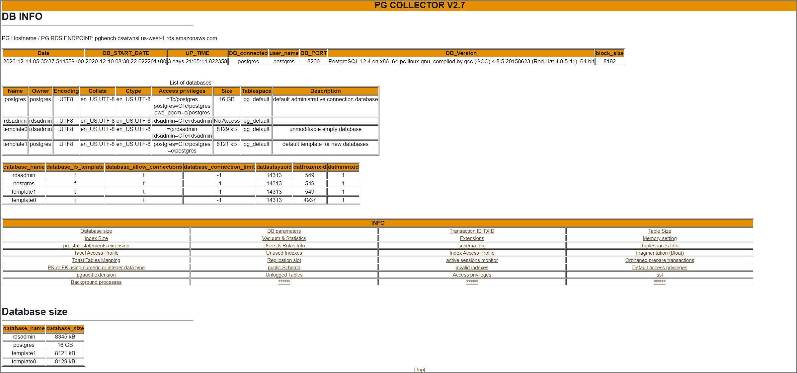

AWS環境のPostgreSQLベースのRDS、Auroraから主に静的情報を抽出する時に手軽に実施出来るのでメモ。

> GitHub - awslabs/pg-collector https://github.com/awslabs/pg-collector

### pg_stat_statementsを有効化

※pg_stat_statements自体は必須ではない。インストールしないとレポート内にエラーが記録される

```sql
CREATE EXTENSION pg_stat_statements;
```

既にpg_stat_statementsが導入済で稼働統計が溜まっている際に性能試験を実施する場合には、事前にpg_stat_statementsの統計値をリセットした上で実施した方が良い。

```sql
postgres=# SELECT pg_stat_statements_reset();
 pg_stat_statements_reset 
--------------------------
```

### スクリプトを実行

```sh
git clone https://github.com/awslabs/pg-collector.git
cd pg-collector
psql -h aurorapgsqlv1.cluster-xxxxx.ap-northeast-1.rds.amazonaws.com -U postgres -d postgres
\i pg_collector.sql
```

### 実行イメージ

```sh
postgres=> \i pg_collector.sql
Output format is aligned.
Report name and location: /tmp/pg_collector_postgres-2021-06-10_154014.html
postgres=> 
```

### 出力レポートイメージ

http://pg-collector.s3-website-us-west-2.amazonaws.com/pg_collector_postgres-2020-12-14_053537.html



この辺のテーブル情報を取得する。様々なpg_catalogから抽出してくれるのでぱっと情報を取得して眺めたい時にはいいかもしれない

- Database size
- Configuration parameters
- Installed extensions
- Vacuum & Statistics
- Unused Indexes & invalid indexes
- Users & Roles Info
- Toast Tables Mapping
- Database schemas
- Fragmentation (Bloat)
- Tablespaces Info
- Memory setting
- Tables and Indexes Size and info
- Transaction ID
- Replication slots
- public Schema info
- Unlogged Tables