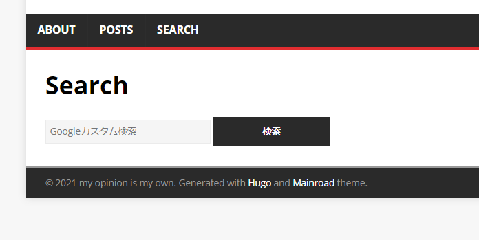

### 前提条件

- カスタムエンジン側の設定が完了済なこと


### config.tomlの編集

メニューバーに追加したいので、下記を追加する

```
[[Menus.main]]
  Name = "search"
  URL = "/search/"
```

### content/search配下にindex.htmlを追加

```html
---
title: "Search"
---

<form action="https://cse.google.com/cse">
  <div class="searchBox">
    <input type="hidden" name="cx" value="1ef1df26a465b967e" />
    <input type="hidden" name="ie" value="UTF-8" />
    <input type="search" name="q" placeholder="Googleカスタム検索" size="30" autocomplete="off" />
    <input type="submit" value="検索" />
  </div>
</form>
```

### 結果

メニューバー、及び検索ボックスが準備できた



このようなURL形式になるのでコマンドラインランチャー等から検索できるのも良い

```html
https://cse.google.com/cse?cx=<検索エンジンID>=UTF-8&q=<検索文字列>
```

