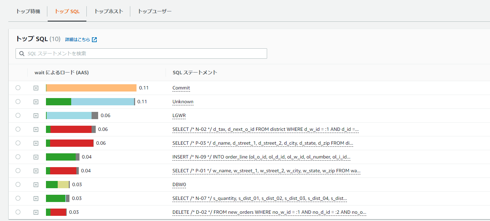

# 概要図

図にするまでも無かったが、EC2上に配置したjdbcRunnerからRDS Oracle SE2に対してTPC-Cベースの負荷掛けを実施


jdbcRunnerを使用した負荷テストの流れや構成、動作については下記参照

> https://dbstudy.info/jdbcrunner/docs_ja/procedure.html

# jdbcRunnerのダウンロード

下記から`jdbcrunner-1.3.zip`をダウンロードしてEC2にアップロードする。

> https://dbstudy.info/jdbcrunner/

# jdbcRunnerのセットアップ、事前準備

### javaのインストール

```sh
sudo yum -y install java-1.8.0-openjdk.x86_64
```

### jdbcrunnerの配置

```sh
unzip jdbcrunner-1.3.zip
cd jdbcrunner-1.3
```

### クラスパスの設定

```sh
export CLASSPATH=/home/ec2-user/jdbcrunner-1.3/jdbcrunner-1.3.jar:/usr/lib/oracle/18.3/client64/lib/ojdbc8.jar
```

### tnsnames.oraの確認

適切に設定されていること

```sh
cat $ORACLE_HOME/network/admin/tnsnames.ora
```

### スクリプトの修正

```sh
cd /home/ec2-user/jdbcrunner-1.3/scripts
vi tpcc_load.js
vi tpcc.js
```

既存のjdbcurlを下記の通り修正

```sh
#var jdbcUrl = "jdbc:oracle:thin:@//サーバのパブリックIPアドレス:1521/サービス名";
var jdbcUrl = "jdbc:oracle:thin:@//ora19c-se2.xxxxx.ap-northeast-1.rds.amazonaws.com:1521/ora19c";
```

### 実行ユーザの作成

```sql
sqlplus oracle@ora19c
drop user tpcc cascade;
drop tablespace tpcc;
create tablespace tpcc datafile autoextend on next 1g maxsize unlimited;
CREATE USER tpcc DEFAULT TABLESPACE tpcc IDENTIFIED BY tpcc;
GRANT CREATE SESSION, CREATE TABLE, UNLIMITED TABLESPACE TO tpcc;
```

### jadcRunnerの実行

### テストデータのロード

```sh
cd /home/ec2-user/jdbcrunner-1.3/scripts
java JR tpcc_load.js
```

スケールファクターを指定しないデフォルトだとざっくりと1.5GB程度データが入る模様

```sh
NAME		STATUS	  TYPE			EXTMGT	   ALLOC	INIT_KB SEGMGT USED(MB)     TOTAL(MB)	 USED(%
--------------- --------- --------------------- ---------- --------- ---------- ------ ------------ ------------ ------
RDSADMIN	ONLINE	  PERMANENT		LOCAL	   SYSTEM	     64 AUTO		6.5	     7.0   92.9
SYSAUX		ONLINE	  PERMANENT		LOCAL	   SYSTEM	     64 AUTO	      375.7	   400.0   93.9
SYSTEM		ONLINE	  PERMANENT		LOCAL	   SYSTEM	     64 MANUAL	      493.7	   500.0   98.7
TEMP		ONLINE	  TEMPORARY		LOCAL	   UNIFORM	   1024 MANUAL	      164.0	   200.0   82.0
TPCC		ONLINE	  PERMANENT		LOCAL	   SYSTEM	     64 AUTO	    1,527.3	 2,148.0   71.1
UNDO_T1 	ONLINE	  UNDO			LOCAL	   SYSTEM	     64 MANUAL	    2,421.0	 2,430.0   99.6
USERS		ONLINE	  PERMANENT		LOCAL	   SYSTEM	     64 AUTO	       68.1	 1,980.6    3.4

7 rows selected.
```

スケールファクターを指定する場合は下記を参照。

> https://dbstudy.info/jdbcrunner/docs_ja/tpc-c.html
>
> -param0を指定することによって、スケールファクタを変更することが可能です。スケールファクタ1あたりwarehouseテーブルのレコード数が1増加し、その他のテーブルについてもレコード数が以下のように増加します。デフォルトのスケールファクタは16です。
>
> | Table      | Records                |
> | :--------- | :--------------------- |
> | warehouse  | sf x 1                 |
> | district   | sf x 10                |
> | customer   | sf x 30,000            |
> | history    | sf x 30,000            |
> | item       | 100,000                |
> | stock      | sf x 100,000           |
> | orders     | sf x 30,000            |
> | new_orders | sf x 9,000             |
> | order_line | sf x 300,000 (approx.) |

下記の例だと8並列でデータロードを実行して、スケールファクターは100となる。デフォルトと比べると約5倍のデータ量となる（はず）

```sh
java JR tpcc_load.js -nAgents 8 -param0 100
```

### 負荷テスト

```sh
cd /home/ec2-user/jdbcrunner-1.3/scripts
java -server JR tpcc.js
```

動作を変更したい場合は下記を参照しつつ、実行時のパラメータを変更する。tpccの場合、デフォルト値は、nAgentsは16、measurementTimeは15分（900秒）、warmupTimeは300秒となるので、変えるならばこのあたりかと思う。

> https://dbstudy.info/jdbcrunner/docs_ja/parameter.html

```sh
cd /home/ec2-user/jdbcrunner-1.3/scripts
java -server JR tpcc.js -warmupTime 5 -nAgents 10 -measurementTime 60 
```

> -warmupTime：ウォームアップ時間。バッファ上にキャッシュが溜まってから測定するようにする。
>
> -nAgents：並列度
>
> -measurementTime：測定時間

結果

```sh
22:13:07 [INFO ] [Progress] 898 sec, 263,277,28,27,27 tps, 237424,237414,23742,23744,23743 tx
22:13:08 [INFO ] [Progress] 899 sec, 274,264,25,28,26 tps, 237698,237678,23767,23772,23769 tx
22:13:09 [INFO ] [Progress] 900 sec, 260,277,27,22,30 tps, 237958,237955,23794,23794,23799 tx
22:13:09 [INFO ] [Total tx count] 237958,237955,23794,23794,23799 tx
22:13:09 [INFO ] [Throughput] 264.4,264.4,26.4,26.4,26.4 tps
22:13:09 [INFO ] [Response time (minimum)] 2,2,0,17,1 msec
22:13:09 [INFO ] [Response time (50%tile)] 38,7,3,81,9 msec
22:13:09 [INFO ] [Response time (90%tile)] 63,14,5,111,15 msec
22:13:09 [INFO ] [Response time (95%tile)] 70,23,6,132,17 msec
22:13:09 [INFO ] [Response time (99%tile)] 93,50,8,184,22 msec
22:13:09 [INFO ] [Response time (maximum)] 478,429,208,445,135 msec
22:13:09 [INFO ] < JdbcRunner SUCCESS
```

結果の見方

> https://dbstudy.info/jdbcrunner/docs_ja/tpc-c.html
>
> TPC-Cでは5種類のトランザクションが定義されており、結果は左からNew-Order、Payment、Order-Status、Delivery、Stock-Levelトランザクションのものとなっています。
>
> TPC-CのスコアにはNew-Orderトランザクションの1分あたりの実行回数を用いることが多いです。上記の例では15分間で42,727txですから、スコアは2,848.5tpmとなります。

実行時のPerformace Insigthsの画面。





