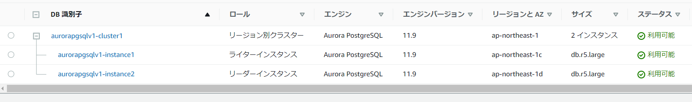

`create-db-cluster` →  `create-db-instance`で作成の流れな模様。1コマンドでは実行出来ないようなので複数回実行する必要がある。

### クラスタ作成

```sh
aws rds create-db-cluster \
    --db-cluster-identifier        aurorapgsqlv1-cluster1 \
    --engine                       aurora-postgresql \
    --engine-version               11.9 \
    --master-username              postgres \
    --master-user-password         postgres \
    --db-subnet-group-name         devvpc-db-sub-pvt \
    --vpc-security-group-ids       sg-01f24d968d81d144a \
    --availability-zones           "ap-northeast-1a" "ap-northeast-1c" "ap-northeast-1d" \
    --port                         5432 \
    --database-name                postgres
```

> create-db-cluster — AWS CLI1.20.3コマンドリファレンス https://docs.aws.amazon.com/cli/latest/reference/rds/create-db-cluster.html

### インスタンス作成

```sh
aws rds create-db-instance \
    --db-instance-identifier       aurorapgsqlv1-instance1 \
    --db-instance-class            db.r5.large \
    --engine                       aurora-postgresql \
    --engine-version               11.9 \
    --availability-zone            "ap-northeast-1c"  \
    --db-cluster-identifier        aurorapgsqlv1-cluster1 \
    --db-parameter-group-name      aurora-pgsql11
```

リードレプリカを作成する際にはもう一度同じコマンドを実行

```sh
aws rds create-db-instance \
    --db-instance-identifier       aurorapgsqlv1-instance2 \
    --db-instance-class            db.r5.large \
    --engine                       aurora-postgresql \
    --engine-version               11.9 \
    --availability-zone            "ap-northeast-1d" \
    --db-cluster-identifier        aurorapgsqlv1-cluster1 \
    --db-parameter-group-name      aurora-pgsql11
```

> create-db-instance — AWS CLI 1.20.3 Command Reference https://docs.aws.amazon.com/cli/latest/reference/rds/create-db-instance.html

### 結果

下記の通り、マネージドメントコンソール上からも確認が出来た。



