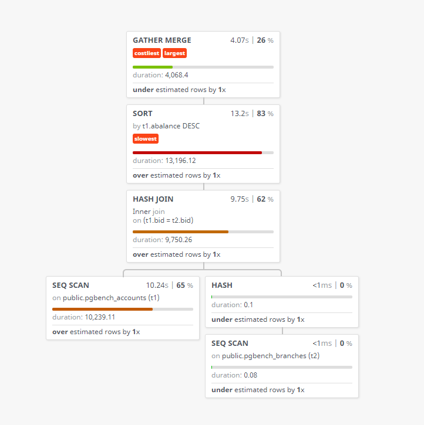

まずはgocmdpevを使ってみる

### goをインストール

```sh
[ec2-user@bastin ~]$ sudo yum -y install go
Loaded plugins: langpacks, priorities, update-motd
amzn2-core                                                                                                                                                                                        | 3.7 kB  00:00:00     
228 packages excluded due to repository priority protections
Resolving Dependencies
--> Running transaction check
~省略~

Installed:
  golang.x86_64 0:1.15.14-1.amzn2.0.1                                                                                                                                                                                    

Dependency Installed:
  apr.x86_64 0:1.6.3-5.amzn2.0.2        apr-util.x86_64 0:1.6.1-5.amzn2.0.2     apr-util-bdb.x86_64 0:1.6.1-5.amzn2.0.2     golang-bin.x86_64 0:1.15.14-1.amzn2.0.1     golang-src.noarch 0:1.15.14-1.amzn2.0.1         
  mercurial.x86_64 0:2.6.2-10.amzn2     neon.x86_64 0:0.30.0-3.amzn2.0.2        pakchois.x86_64 0:0.4-10.amzn2.0.2          subversion.x86_64 0:1.7.14-16.amzn2.0.1     subversion-libs.x86_64 0:1.7.14-16.amzn2.0.1    

Complete!
[ec2-user@bastin ~]$ 
[ec2-user@bastin ~]$ go version
go version go1.15.14 linux/amd64
```

```sh
[ec2-user@bastin ~]$ go get -u github.com/simon-engledew/gocmdpev
[ec2-user@bastin ~]$ echo $?
0
[ec2-user@bastin ~]$ ./go/bin/gocmdpev --version
1.0.0
```

### 可視化のためのテスト用のデータ生成

```sh
pgbench -i -s 100 -U postgres -h xxxx.cluster-xxxx.ap-northeast-1.rds.amazonaws.com pgbench
```

### テスト用のSQL

```sh
EXPLAIN (ANALYZE, COSTS, VERBOSE, BUFFERS, FORMAT JSON) SELECT t1.aid,t1.bid,t1.abalance,t2.bbalance FROM pgbench_accounts t1, pgbench_branches t2 where t1.bid=t2.bid ORDER BY t1.abalance DESC;
```

こんな感じのSQLになります。ソートやジョイン等で問題がありそうなSQLとなっている


FORMAT指定等があり、gocmdpevに渡すための実行計画を生成する。

```sh
vi explain.sql
```

下記SQLを`explain.sql`に記載する。`ANALYZE, COSTS, VERBOSE, BUFFERS, FORMAT JSON`をEXPLAINのオプションに指定する

```sql
EXPLAIN (ANALYZE, COSTS, VERBOSE, BUFFERS, FORMAT JSON) SELECT t1.aid,t1.bid,t1.abalance,t2.bbalance FROM pgbench_accounts t1, pgbench_branches t2 where t1.bid=t2.bid ORDER BY t1.abalance DESC;
```

SQLを実行して実行計画を`analyze.json`に出力する

```
psql -h auroraserverlessv1.cluster-cm678nkt5thr.ap-northeast-1.rds.amazonaws.com -U postgres -d pgbench -qAt -f explain.sql > analyze.json
```

出力された`analyze.json`をgocmdpevに渡す

```sh
cat analyze.json | gocmdpev
```

下記のような出力となる。どこに時間が掛かっているか等が色付きで表示されるので、解析しやすくなる。


```sh
[ec2-user@bastin ~]$ cat analyze.json | gocmdpev
○ Total Cost: 1,790,852.84
○ Planning Time: 53.45 ms
○ Execution Time: 7.92 s
┬
│
└─⌠ Gather Merge  costliest   largest 
  │ 
  │ ○ Duration: 2.03 s (26%)
  │ ○ Cost: 962,873.54 (54%)
  │ ○ Rows: 10,000,000
  │   rows Underestimated by 1.20x
  ├►  t1.aid + t1.bid + t1.abalance + t2.bbalance
  │
  └─⌠ Sort  slowest 
    │ Sorts a record set based on the specified sort key.
    │ ○ Duration: 6.60 s (83%)
    │ ○ Cost: 610,973.3400000001 (34%)
    │ ○ Rows: 3,333,333
    │   rows Overestimated by 1.25x
    ├►  t1.aid + t1.bid + t1.abalance + t2.bbalance
    │
    └─⌠ Hash Join 
      │ Joins to record sets by hashing one of them (using
      │ a Hash Scan).
      │ ○ Duration: 4.88 s (62%)
      │ ○ Cost: 11,402.289999999979 (1%)
      │ ○ Rows: 3,333,333
      │   Inner join
      │   on (t1.bid = t2.bid)
      │   rows Overestimated by 1.25x
      ├►  t1.aid + t1.bid + t1.abalance + t2.bbalance
      │
      ├─⌠ Seq Scan 
      │ │ Finds relevant records by sequentially
      │ │ scanning the input record set. When reading
      │ │ from a table, Seq Scans (unlike Index Scans)
      │ │ perform a single read operation (only the
      │ │ table is read).
      │ │ ○ Duration: 5.12 s (65%)
      │ │ ○ Cost: 205,601.67 (11%)
      │ │ ○ Rows: 3,333,333
      │ │   on public.pgbench_accounts
      │ │   rows Overestimated by 1.25x
      │ ⌡► t1.aid + t1.bid + t1.abalance
      │
      └─⌠ Hash 
        │ Generates a hash table from the records in the
        │ input recordset. Hash is used by Hash Join.
        │ ○ Duration: <1 ms (0%)
        │ ○ Cost: 0 (0%)
        │ ○ Rows: 100
        ├►  t2.bbalance + t2.bid
        │
        └─⌠ Seq Scan 
          │ Finds relevant records by sequentially
          │ scanning the input record set. When reading
          │ from a table, Seq Scans (unlike Index Scans)
          │ perform a single read operation (only the
          │ table is read).
          │ ○ Duration: <1 ms (0%)
          │ ○ Cost: 2 (0%)
          │ ○ Rows: 100
          │   on public.pgbench_branches
          ⌡► t2.bbalance + t2.bid

```

pevという実行計画の可視化ツールもある。こちらの方が直感的で見やすいかもしれない。CLIで確認したいのかGUIベースで確認したいのかで使い分けても良い。gocmdpevと同じで`ANALYZE, COSTS, VERBOSE, BUFFERS, FORMAT JSON`を読み込ませることで可視化が出来る。

> https://github.com/AlexTatiyants/pev
>
> http://tatiyants.com/pev/#/plans/new

下記の通り、ローカルで処理すると記載はしているが念の為に用心した方が良いかもしれない

> DISCLAIMER: Pev stores your plans locally (localStorage) and will not send them anywhere.




> pev, gocmdpevでPostgreSQLのEXPLAINを見やすくする | gocmdpev https://wonderwall.hatenablog.com/entry/2017/09/13/220000