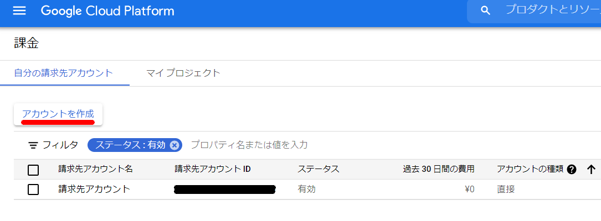
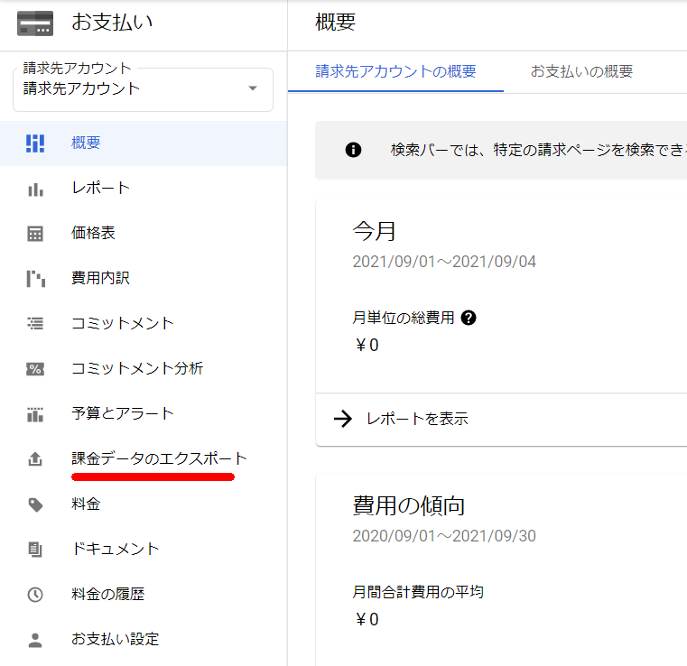

## はじめに

GCP Associate Cloud Engineerの受験に向けて試験ガイド記載のマニュアル確認と一部実機確認を行って、試験ガイドに沿った勉強を実施する。大項目レベルでは下記の5つが試験範囲。

1. クラウド ソリューション環境の設定
2. クラウド ソリューションの計画と構成
3. クラウド ソリューションのデプロイと実装
4. クラウド ソリューションの正常なオペレーションの確保
5. アクセスとセキュリティの構成

[認定試験ガイド](https://cloud.google.com/certification/guides/cloud-engineer?hl=ja)にはこの大項目が更に細分化されており、この一つ一つを掘り下げて下記のように具体的な出題項目が設定されているようだ。


まずは<u>クラウド ソリューション環境の設定</u>に対して確認を行う。

## 1. クラウド ソリューション環境の設定

### 1.1 クラウド プロジェクトとアカウントを設定する。以下のような作業を行います。

- #### プロジェクトを作成する

  > 参考：[プロジェクトの作成と管理  \| Resource Manager のドキュメント  \| Google Cloud](https://cloud.google.com/resource-manager/docs/creating-managing-projects?hl=ja&visit_id=637231726576722822-851915107&rd=1#creating_a_project)

Google Cloud プロジェクトは、API の管理、課金の有効化、共同編集者の追加と削除、Google Cloud リソースに対する権限の管理など、すべての Google Cloud サービスの作成、有効化、使用の基礎となる。例えば、本番環境、開発環境を分離したい場合はこのプロジェクトを分ける。AWSの場合はアカウント分割ということになり、それぞれにIAMユーザを作成する。環境(アカウント)の切り替えはIAMスイッチロールを利用することになる。個人的にはGCPの方がわかりやすい気がする。

##### コンソール画面


##### gcloudコマンド

```
gcloud projects create PROJECT_ID
```

- #### プロジェクト内で事前定義された IAM ロールにユーザーを割り当てる

  > 参考：[プロジェクト、フォルダ、組織へのアクセスを管理する  \| Cloud IAM のドキュメント  \| Google Cloud](https://cloud.google.com/iam/docs/granting-changing-revoking-access)
  - 「IAMと管理」-「IAM」から追加する事前定義されたロール等を選択する。

  

  - GCPのIAMの要素は次の通り。AWSと同じようなワードを使っているが、中身が全く異なることに注意が必要。

    - 参考：[よくある質問  \| Cloud IAM のドキュメント  \| Google Cloud](https://cloud.google.com/iam/docs/faq?hl=ja#roles_and_policies)

    - メンバー：権限を付与される対象のこと。Googleアカウント、サービスアカウント、Googleグループ、G Suite、Cloud Identityドメイン

    - ロール：権限のコレクション。メンバーにロールを付与すると、ロールに含まれる全ての権限が付与される。

      - 基本ロール、事前定義ロール、カスタムロールが存在する。基本ロールはオーナー、編集者、閲覧者のロールがあり、すべてのGCPサービスに影響する。事前定義ロールはGCP側が用意している権限セット。カスタムロールはユーザ側が設定する権限セットとなる。

      - 基本ロールにはこんな注意書きがマニュアルに。

        > **注意:** 基本ロールには、すべての Google Cloud サービスにかかわる何千もの権限が含まれます。本番環境では、他に選択肢がない限り、基本ロールを付与しないでください。代わりに、ニーズに合わせて最も制限された[事前定義ロール](https://cloud.google.com/iam/docs/understanding-roles?hl=ja#predefined_roles)または[カスタムロール](https://cloud.google.com/iam/docs/understanding-custom-roles?hl=ja)を付与します。

      - AWSユーザは勘違いしやすいと思うが、GCPのロールはAWSで言うところのIAMポリシー相当になるはず

    - ポリシー：誰（ユーザー）に、どのリソースに対する何（役割）の権限を付与するかを制御

      - AWSで言うところのバケットポリシーみたいなもの

      - https://cloud.google.com/iam/docs/faq?hl=ja#what_does_an_policy_look_like

        ```
        {
          "bindings": [
           {
             "role": "roles/owner",
             "members": [
               "user:jiwoo@example.com",
               "group:admins@example.com",
               "domain:google.com",
               "serviceAccount:my-other-app@appspot.gserviceaccount.com"]
              },
              {
                "role": "roles/compute.networkViewer",
                "members": ["user:luis@example.com"]
              }
            ]
        }
        ```

        

- #### Cloud Identity でユーザーを管理する（手動および自動）

  - GoogleのサービスなのでGCPのアカウントはGoogleアカウントが使用出来る。Googleアカウントを作れない組織、G Suiteを使っている組織等はこのCloud Identifyでアカウントを管理する

    > 参考：[GCP 管理者向けの設定手順 \- Cloud Identity ヘルプ](https://support.google.com/cloudidentity/topic/7555414)

    > Cloud Identity は IDaaS（Identity as a Service）ソリューションであり、企業向けモバイル管理（EMM）サービスです。Google Workspace で利用できる ID サービスとエンドポイント管理をスタンドアロン型のサービスとして提供します。Cloud Identity を利用することで、管理者は Google 管理コンソールからユーザー、アプリ、デバイスを一元管理できます。

  - よくあるMicrosoftのActive Directoryの連携についても対応している模様。 

    - [Google Cloud と Active Directory の連携: 概要  \| アーキテクチャ](https://cloud.google.com/solutions/federating-gcp-with-active-directory-introduction?hl=ja)

    

- #### プロジェクトで API を有効にする

  - GCPでは使用するサービスのAPIを有効化する必要がある。APIライブラリ画面から、もしくはgcloudから有効化する。

    - なぜGCPはAPI有効化を行うように設計されているのだろうか
      - こういうワンライナー出てきてしまうの必然…
      - [GCPのAPIを全部有効化するワンライナー \- Qiita](https://qiita.com/shiozaki/items/cd67c22c6408bc164dac)

    > 参考：[Google Cloud プロジェクトでの API の有効化  \| OpenAPI を使用した Cloud Endpoints](https://cloud.google.com/endpoints/docs/openapi/enable-api?hl=ja)

  - APIライブラリから

    

  - gcloudコマンド

    ```
    gcloud services enable SERVICE_NAME
    ```

- #### Stackdriver ワークスペースをプロビジョニングする

  - Stackdriverはオペレーション スイートに統合され、特にワークスペースをプロビジョニングするという作業は不要だと思われる
  - オペレーションスイートの概要
    - [Cloud Logging](https://cloud.google.com/logging?hl=ja)
      - リアルタイムでのログの管理と分析
      - アプリケーションとシステムのログデータのほか、GKE 環境、VM、Google Cloud サービスからのカスタム ログデータも取り込み可能
    - [Cloud Monitoring](https://cloud.google.com/monitoring?hl=ja)
      - 組み込みの大規模な指標オブザーバビリティ
      - クラウドで実行されるアプリケーションのパフォーマンスや稼働時間、全体的な動作状況を確認できます。Google Cloud サービス、ホステッド アップタイムのプローブ、アプリケーション インストルメンテーション、よく使われるさまざまなアプリケーション コンポーネントから指標、イベント、メタデータを収集し、チャートやダッシュボードで可視化してアラートを管理
    - アプリケーション パフォーマンス管理（APM）
      - [Cloud Trace](https://cloud.google.com/trace?hl=ja)、[Cloud Debugger](https://cloud.google.com/debugger?hl=ja)、[Cloud Profiler](https://cloud.google.com/profiler?hl=ja) が統合
      - Cloud Trace
        - 本番環境におけるパフォーマンスのボトルネックを検出
          - Cloud Trace は、アプリケーションのすべてのトレースを自動的に分析し、パフォーマンス低下の原因となるレイテンシの詳細レポートを生成
      - Cloud Debugger
        - 本番環境でコードの動作を調査
          - リアルタイムでのアプリケーションのデバッグ
      - Cloud Profiler
        - パフォーマンス向上やコスト削減に役立つ、CPU とヒープの継続的なプロファイリング

### 1.2 課金構成を管理する。以下のような作業を行います。

- #### 請求先アカウントを作成する

  - `billing.accounts.create`権限が必要

    > 参考：[セルフサービスの Cloud 請求先アカウントの作成、変更、閉鎖  \| Cloud Billing  \| Google Cloud](https://cloud.google.com/billing/docs/how-to/manage-billing-account?hl=ja#create_a_new_billing_account)

  

  

  

- #### プロジェクトを請求先アカウントにリンクする

  > 参考：[プロジェクトの課金の有効化、無効化、変更  \| Cloud Billing  \| Google Cloud](https://cloud.google.com/billing/docs/how-to/modify-project?hl=ja#change_the_billing_account_for_a_project)

- #### 課金の予算とアラートを設定する

  参考：[予算と予算アラートの設定  \| Cloud Billing  \| Google Cloud](https://cloud.google.com/billing/docs/how-to/budgets?hl=ja)

  

  

- #### 日 / 月単位の料金見積もりを目的として請求関連のエクスポートを設定する

  - BigQuery への Cloud Billing のエクスポート機能を使用することで、指定した BigQuery データセットに Google Cloud の詳細な課金データ（使用量、費用予測、料金データなど）を終日、自動的にエクスポート可能。エクスポートを有効にする前の Cloud Billing データは表示されないことに注意する。

    > 参考：[Cloud Billing データを BigQuery にエクスポートする  \| Google Cloud](https://cloud.google.com/billing/docs/how-to/export-data-bigquery?hl=ja)

    

    

### 1.3 コマンドライン インターフェース（CLI）、具体的には Cloud SDK をインストール、構成する（例: デフォルト プロジェクトの設定）

- マニュアルのSDK構成と書かれると何を指しているかわからないが、英語にするとConfigurationの模様。プロファイルとか設定とかのニュアンスと理解している

  - 構成を作成する

    ```
    gcloud config configurations create [NAME]
    ```

  - 構成を有効にする

    ```
    gcloud config configurations activate [NAME]
    ```

  - 構成を一覧表示する

    ```
    gcloud config configurations list
    ```

  - 構成のプロパティを設定する

    ```
    gcloud config set project [PROJECT]
    gcloud config unset project
    ```

  - 構成のプロパティを表示する

    ```
    gcloud config configurations describe [NAME]
    ```

  - 構成を削除する

    ```
    gcloud config configurations delete [NAME]
    ```

  参考：[SDK 構成の管理  \| Cloud SDK のドキュメント  \| Google Cloud](https://cloud.google.com/sdk/docs/configurations?hl=ja)
