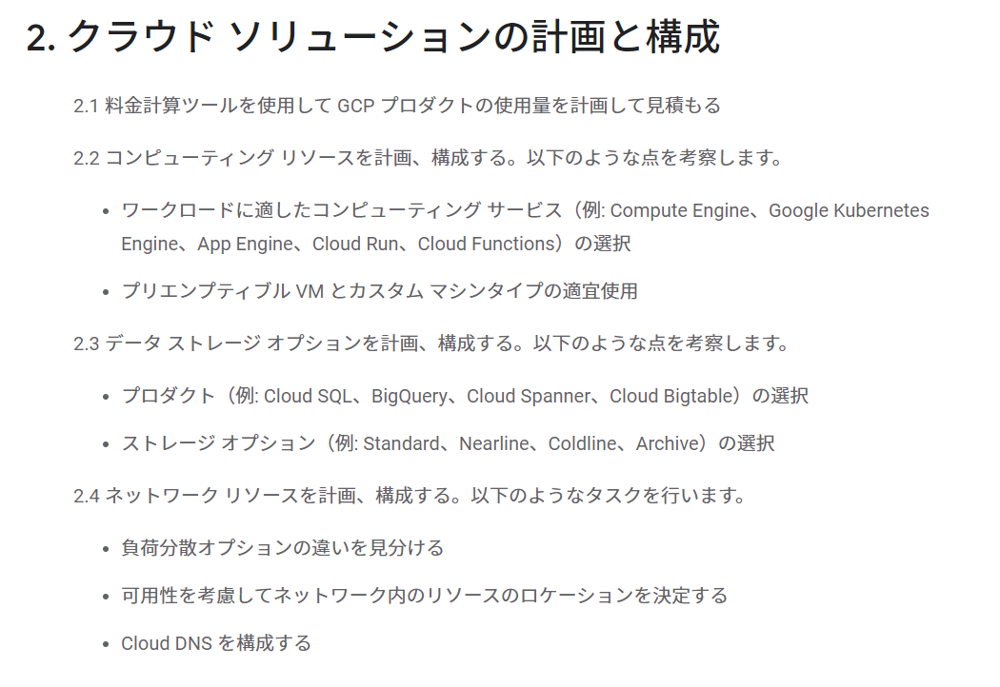
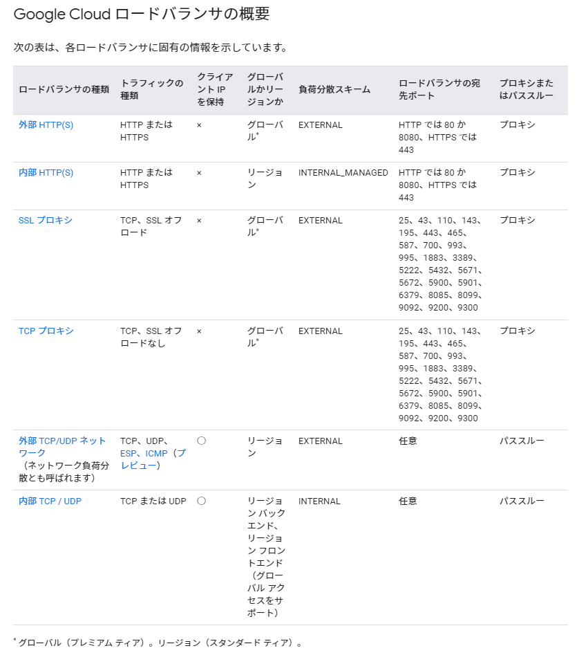

## はじめに

GCP Associate Cloud Engineerの受験に向けて試験ガイド記載のマニュアル確認と一部実機確認を行って、試験ガイドに沿った勉強を実施する。大項目レベルでは下記の5つが試験範囲となる。

1. クラウド ソリューション環境の設定
2. クラウド ソリューションの計画と構成
3. クラウド ソリューションのデプロイと実装
4. クラウド ソリューションの正常なオペレーションの確保
5. アクセスとセキュリティの構成

[認定試験ガイド](https://cloud.google.com/certification/guides/cloud-engineer?hl=ja)にはこの大項目が細分化されており、この一つ一つを掘り下げて下記のように具体的な出題項目が設定されているようだ。



今回は<u>クラウド ソリューションの計画と構成</u>に対して確認を行う。

## 2. クラウド ソリューションの計画と構成

### 2.1 料金計算ツールを使用して GCP プロダクトの使用量を計画して見積もる

- Google Cloud Pricing Calculatorを使用して見積もる

  > 参考：[Google Cloud Platform 料金計算ツール](https://cloud.google.com/products/calculator)

### 2.2 コンピューティング リソースを計画、構成する。以下のような点を考察します。

- #### ワークロードに適したコンピューティング サービス（例: Compute Engine、Google Kubernetes Engine、App Engine、Cloud Run、Cloud Functions）の選択

  - 多くのホスティングオプションがある。デプロイ形式からディスクの必要有無、スケーリングの速さ等のユースケースから最適なコンピューティングサービスを選択する必要あり。

  

  > 参考：[アプリケーションのホスティングのオプション  \| Hosting Options  \| Google Cloud](https://cloud.google.com/hosting-options?hl=ja)

- #### プリエンプティブル VM とカスタム マシンタイプの適宜使用

  - プリエンプティブル VM インスタンス

    > プリエンプティブル VM は、通常のインスタンスよりはるかに[低価格](https://cloud.google.com/compute/vm-instance-pricing?hl=ja)で作成、実行できるインスタンスです。ただし、他のタスクがリソースへのアクセスを必要とする場合、Compute Engine がこのインスタンスを停止（プリエンプト）する可能性があります。プリエンプティブル インスタンスは Compute Engine の余剰のキャパシティを利用する機能であり、使用できるかどうかは利用状況に応じて異なります。

    - AWSのスポットインスタンスのようなもの
      - [プリエンプティブル VM インスタンス  \| Compute Engine ドキュメント  \| Google Cloud](https://cloud.google.com/compute/docs/instances/preemptible?hl=ja#what_is_a_preemptible_instance)

  

  

  - カスタム マシンタイプ

    > 事前定義されたマシンタイプがニーズに合わない場合は、カスタムの仮想ハードウェア設定を使用して VM インスタンスを作成できます。具体的には、カスタム マシンタイプを効果的に利用して、vCPU の数とメモリ容量をカスタマイズした VM インスタンスを作成できます。

    - [カスタム VM インスタンスの作成  \| Compute Engine ドキュメント  \| Google Cloud](https://cloud.google.com/compute/docs/instances/creating-instance-with-custom-machine-type?hl=ja)
  
    

    
    
    - gcloudコマンドで作成する際には`--custome-cpu`や`--customer-memory`をオプションに使う
  
    ```
    gcloud compute instances create example-instance --custom-cpu=4 --custom-memory=5
    ```
    
    - 既存のインスタンスに対してもメモリを追加出来るようで便利な機能だと思った
    
      > 各マシンタイプには、マシンに応じてデフォルトで特定のメモリ量が設定されています。たとえば、カスタム N1 VM を作成する場合は、vCPU あたり最大 6.5 GB のメモリを設定できます。カスタム N2 VM の場合、この数値は vCPU あたり最大 8 GB のメモリに引き上げられます。

### 2.3 データ ストレージ オプションを計画、構成する。以下のような点を考察します。

- #### プロダクト（例: Cloud SQL、BigQuery、Cloud Spanner、Cloud Bigtable）の選択

  - トランザクションが必要なのか、水平スケーリングが必要なのか、SQLベースの分析クエリが必要なのか、大規模で低レイテンシのワークロードに対応したKey-Value型のデータストアが必要なのか、ワールドワイドなリージョンに跨るデータ格納が必要なのか、、みたいな要件に応じて適切なデータストアを検討する
    - [Google Cloud データベース](https://cloud.google.com/products/databases?hl=ja)

- #### ストレージ オプション（例: Standard、Nearline、Coldline、Archive）の選択

  | ストレージ クラス | API と gsutil の名前 | [最小保存期間](https://cloud.google.com/storage/pricing?hl=ja#archival-pricing) | 一般的な月間可用性                                           |
  | :---------------- | :------------------- | :----------------------------------------------------------- | :----------------------------------------------------------- |
  | Standard Storage  | `STANDARD`           | なし                                                         | マルチリージョンとデュアルリージョンでは 99.99% を超えるリージョンでは 99.99% |
  | Nearline Storage  | `NEARLINE`           | 30 日                                                        | マルチリージョンとデュアルリージョンでは 99.95%リージョンでは 99.9% |
  | Coldline Storage  | `COLDLINE`           | 90 日                                                        | マルチリージョンとデュアルリージョンでは 99.95%リージョンでは 99.9% |
  | Archive Storage   | `ARCHIVE`            | 365 日                                                       | マルチリージョンとデュアルリージョンでは 99.95%リージョンでは 99.9% |

  [ストレージ クラス  \| Cloud Storage  \| Google Cloud](https://cloud.google.com/storage/docs/storage-classes?hl=ja#available_storage_classes)

### 2.4 ネットワーク リソースを計画、構成する。以下のようなタスクを行います。

- #### 負荷分散オプションの違いを見分ける

> 参考：[ロードバランサの選択  \| 負荷分散  \| Google Cloud](https://cloud.google.com/load-balancing/docs/choosing-load-balancer?hl=ja#summary-of-google-cloud-load-balancers)




- #### 可用性を考慮してネットワーク内のリソースのロケーションを決定する

  - 下記のような要素に注意しつつ、ロケーションを選択する。複数リージョンにデプロイして負荷分散させることや、複数リージョンの分散フロントを実装するが、バックエンドは単一リージョンで構成するか等要件に応じて適切な選択を行う
    - リージョンに固有の制限
    - リージョンによるユーザー レイテンシ
    - アプリのレイテンシ要件
    - レイテンシをどの程度制御できるか
    - 低レイテンシとシンプルさのバランス

  > 参考：[Compute Engine のリージョン選択に関するベスト プラクティス  \| ソリューション  \| Google Cloud](https://cloud.google.com/solutions/best-practices-compute-engine-region-selection?hl=ja)

- #### Cloud DNS を構成する

  - Cloud DNS は、高パフォーマンスで復元力を備えたグローバル ドメイン ネーム システム（DNS）サービス
  - 用語がGCP用語でスッと入ってこないが、基本はRoute53と同じような特徴、機能を持っているようだ

> 参考：[Cloud DNS の概要  \| Google Cloud](https://cloud.google.com/dns/docs/overview)
>


