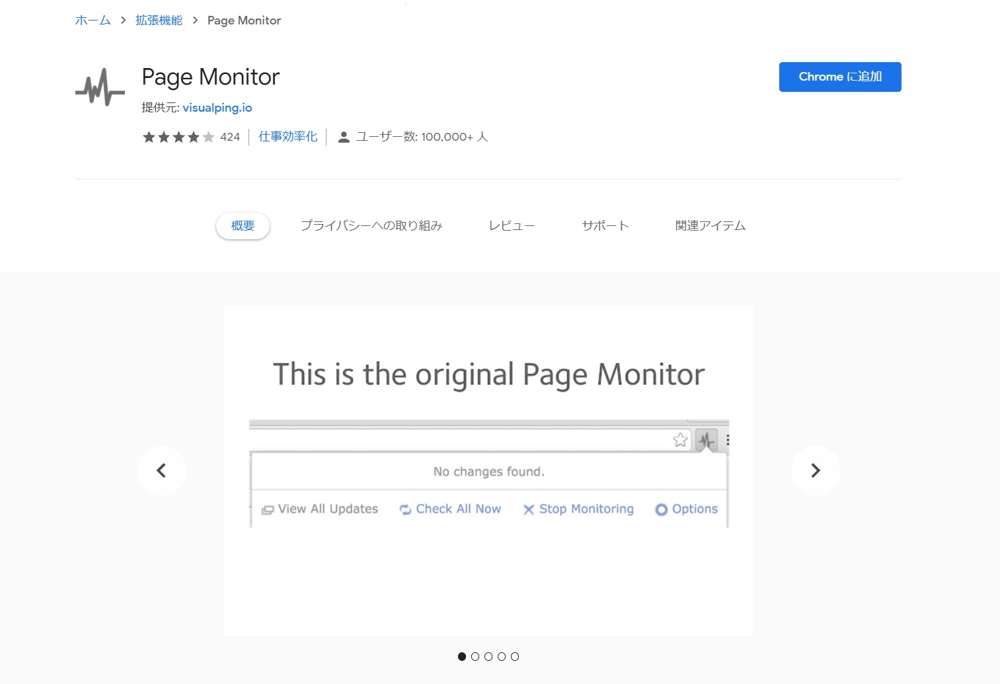

RSSがオワコンと言われて数年未だにRSSを使っています。RSSを配信していないサイトが多いのでどうしたものかと思っていたらサイト更新を検知して通知してくれるサービスがあることを知りました。この2つのサービスが良さそう。使ってみて感想を書きます。

[Distill web monitor](https://distill.io/)

[Page Monitor](https://chrome.google.com/webstore/detail/page-monitor/ogeebjpdeabhncjpfhgdibjajcajepgg?hl=ja)

