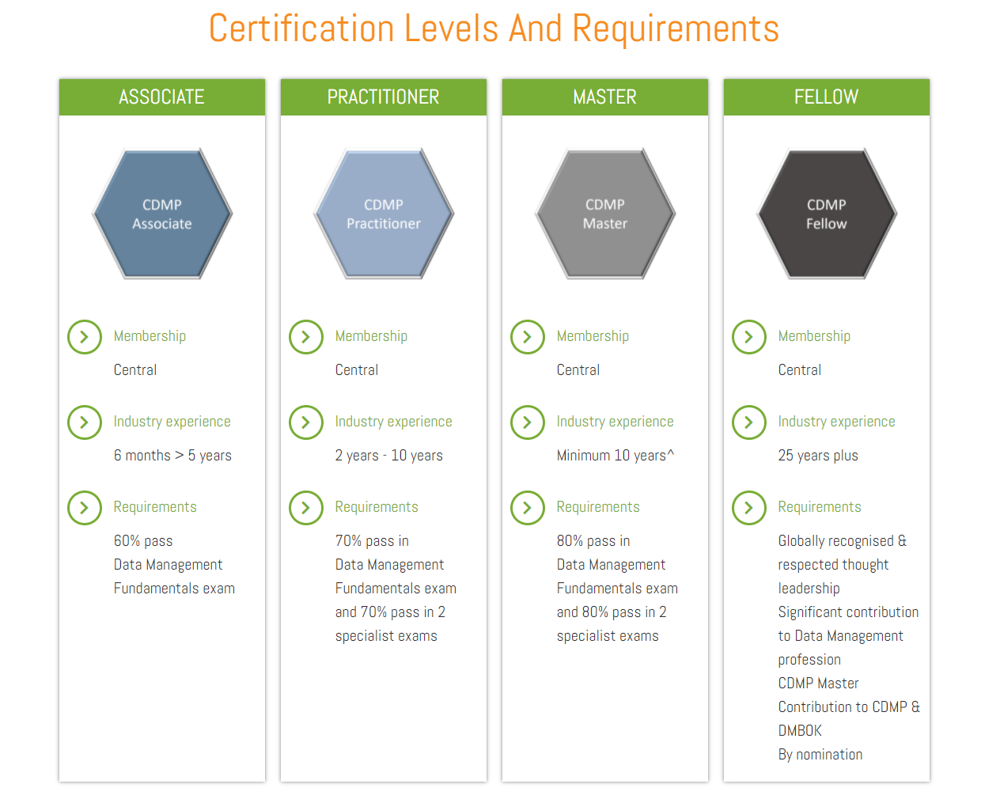

## モチベーション

データ基盤、データレイク、データ分析基盤等を作っていくにあたってインフラ周りだけではなく、実際にはデータをどのように収集して、管理して、品質を高めてビジネスに活かしていくかというデータマネージメントの観点も必要で、そこの知識を断片的な状況から一歩引き上げて網羅的に身に着けたいと考えた。データエンジニアリング的な要素は後述のDMBOKでいうとデータマネージメント領域の一領域なのでここだけの観点で構築しても実際には意味がない。

## CDMP&DMBOKの参考リンク

- [データマネジメントの知識体系"DMBOK"とは？どう役立つのか？](https://jp.drinet.co.jp/blog/about_dmbok)
- [CDMP Associate 認定を取得した話 \- Qiita](https://qiita.com/tac0x2a/items/e68701284178fa30f03e)
- [2週間で合格！CDMP合格体験記 \| Metafindコンサルティング](https://metafind.jp/2020/07/13/cdmp-experience-note/)
- [CDMPを取得した話｜へなちょこ｜note](https://note.com/henachocolate/n/n03feb71ed465#pAYQD)

## CDMPとは

CDMP（Certified Data Management Professionals）は、DAMA（Data Management Association）が認定しているデータマネジメントに関する国際資格のこと。DAMAはData Management Body of Knowledge（DMBOK）というデータマネジメントに関する知識体系をまとめており、PMBOKのデータマネージメントという思っていれば良い。

## CDMPに認定されるためには

複数のレベルがあり、Data Management Fundamentls ExamとSpecialist Examを受けることによってそれぞれのレベルに認定される。一番最初のstepとしてはData Management Fundamentls Examを60％以上の成績でpassすること。

https://cdmp.info/about/

## Data Management Fundamentls Examの問題傾向

下記の通りの配点なので、重要な分野を中心に勉強していくのが良さそう。

| No   | 分野                                             | 配点 |
| ---- | ------------------------------------------------ | ---- |
| 1    | データガバナンス                                 | 11%  |
| 2    | データのモデリングと設計                         | 11%  |
| 3    | データ品質                                       | 11%  |
| 4    | メタデータ管理                                   | 11%  |
| 5    | マスターおよび参照データ管理                     | 10%  |
| 6    | データウェアハウジングとビジネスインテリジェンス | 10%  |
| 7    | データアーキテクチャ                             | 6%   |
| 8    | ドキュメントとコンテンツの管理                   | 6%   |
| 9    | データ統合と相互運用性                           | 6%   |
| 10   | データセキュリティ                               | 6%   |
| 11   | データの保存と運用                               | 6%   |
| 12   | データ管理プロセス                               | 2%   |
| 13   | ビッグデータ                                     | 2%   |
| 14   | データ倫理                                       | 2%   |

## 勉強方針

業務中に必要に応じて参照しつつあったが、改めて下記3点を通読、及び視聴しようと思う。その後、模試を受ける。

データマネジメント知識体系ガイド 第二版 https://www.amazon.co.jp/dp/4296100491

データマネジメントが30分でわかる本  https://www.amazon.co.jp/dp/B085W4YSZJ

【初学者向け】データマネジメント入門！DX推進やAI 導入を支える重要な要素をDMBOKに沿ってみていこう！ | Udemy https://www.udemy.com/course/data-management/

