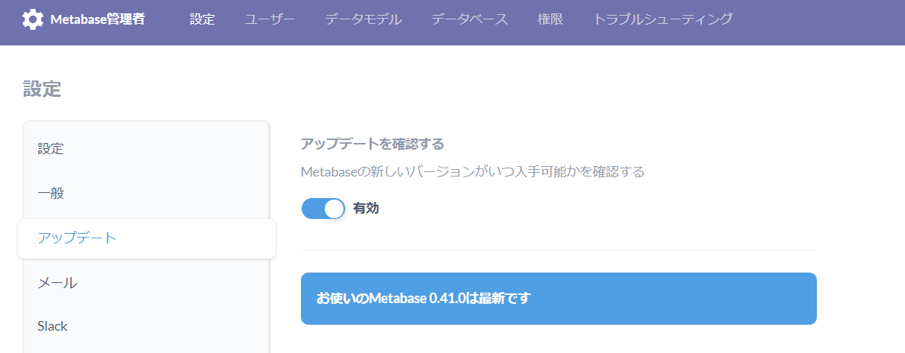

## アップデートの有無確認

公式ページや公式Twitterからも当然確認出来るが、管理者画面からも有無は分かる。アップデートボタンをクリックした場合、マニュアルに飛ばされるだけなので注意。


## アップデート方法

### metabaseのサービスを停止

```sh
sudo systemctl stop metabase.service
```

### wgetで最新のjarファイルを取得

最新のダウンロード先はこちら→ https://www.metabase.com/start/oss/jar

#### コマンド

```sh
cd /opt/metabase
mv -f metabase.jar metabase.jar.bk
wget https://downloads.metabase.com/v0.41.0/metabase.jar
ls -l
sudo systemctl status metabase.service
```

#### 実行ログ

```sh

[ec2-user@bastin metabase]$ pwd
/opt/metabase
[ec2-user@bastin metabase]$ sudo systemctl stop metabase.service
[ec2-user@bastin metabase]$ echo $?
0
[ec2-user@bastin metabase]$ cd /opt/metabase
[ec2-user@bastin metabase]$ mv -f metabase.jar metabase.jar.bk
[ec2-user@bastin metabase]$ wget https://downloads.metabase.com/v0.41.0/metabase.jar
--2021-10-15 20:32:50--  https://downloads.metabase.com/v0.41.0/metabase.jar
Resolving downloads.metabase.com (downloads.metabase.com)... 18.65.214.22, 18.65.214.55, 18.65.214.111, ...
Connecting to downloads.metabase.com (downloads.metabase.com)|18.65.214.22|:443... connected.
HTTP request sent, awaiting response... 200 OK
Length: 273601461 (261M) [application/java-archive]
Saving to: ‘metabase.jar’

100%[===============================================================================================================================================================================================================================================>] 273,601,461  105MB/s   in 2.5s   

2021-10-15 20:32:53 (105 MB/s) - ‘metabase.jar’ saved [273601461/273601461]

[ec2-user@bastin metabase]$ ls -l
total 532200
-rw-r--r-- 1 root     root        733184 Sep 14 20:03 metabase.db.mv.db
-rw-r--r-- 1 root     root        292207 Sep 14 20:03 metabase.db.trace.db
-rw-rw-r-- 1 ec2-user ec2-user 273601461 Oct  7 06:34 metabase.jar
-rwxr-xr-x 1 ec2-user ec2-user 270334859 Aug 26 04:42 metabase.jar.bk
drwxr-xr-x 2 root     root          4096 Sep  9 19:58 plugins
[ec2-user@bastin metabase]$ sudo systemctl status metabase.service
● metabase.service - Metabase.
   Loaded: loaded (/usr/lib/systemd/system/metabase.service; enabled; vendor preset: disabled)
   Active: active (running) since Fri 2021-10-15 20:34:36 JST; 1min 22s ago
  Process: 3315 ExecStop=/bin/kill -SIGTERM $MAINPID (code=exited, status=0/SUCCESS)
 Main PID: 3374 (java)
   CGroup: /system.slice/metabase.service
           └─3374 /usr/bin/java -jar /opt/metabase/metabase.jar

Oct 15 20:35:21 bastin metabase[3374]: 2021-10-15 20:35:21,224 INFO metabase.task :: タスク CheckForNewVersions を初期化しています 
Oct 15 20:35:21 bastin metabase[3374]: 2021-10-15 20:35:21,284 INFO metabase.task :: タスク SendAnonymousUsageStats を初期化しています 
Oct 15 20:35:21 bastin metabase[3374]: 2021-10-15 20:35:21,309 INFO metabase.task :: タスク SendAbandomentEmails を初期化しています 
Oct 15 20:35:21 bastin metabase[3374]: 2021-10-15 20:35:21,330 INFO metabase.task :: タスク SendPulses を初期化しています 
Oct 15 20:35:21 bastin metabase[3374]: 2021-10-15 20:35:21,354 INFO metabase.task :: タスク SendFollowUpEmails を初期化しています 
Oct 15 20:35:21 bastin metabase[3374]: 2021-10-15 20:35:21,370 INFO metabase.task :: タスク TaskHistoryCleanup を初期化しています 
Oct 15 20:35:21 bastin metabase[3374]: 2021-10-15 20:35:21,407 INFO driver.impl :: ドライバー:sqlの初期化中です...
Oct 15 20:35:21 bastin metabase[3374]: 2021-10-15 20:35:21,410 INFO driver.impl :: ドライバー:sql-jdbcの初期化中です...
Oct 15 20:35:21 bastin metabase[3374]: 2021-10-15 20:35:21,411 INFO driver.impl :: ドライバー:h2の初期化中です...
Oct 15 20:35:21 bastin metabase[3374]: 2021-10-15 20:35:21,439 INFO metabase.core :: Metabaseの初期化が完了しました
[ec2-user@bastin metabase]$ 

```

### アップデート後の確認




