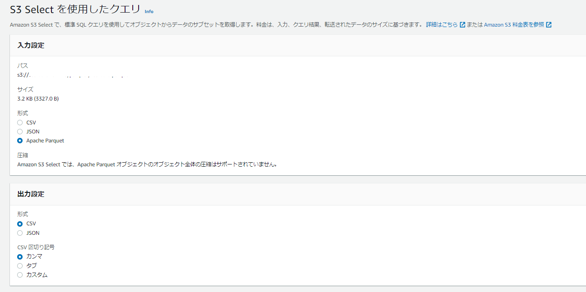

pandasでparquetを扱えることを知った

### テスト用CSVの作成

```
cat << EOF > testdata.csv
1,test1,ゎぶばあちあぬナクバ
2,test2,がマうひバぴじクハぺ
3,test3,スみでてゥあッあけげ
EOF
```

### pyarrowのインストール

```
pip install pyarrow
```

### csvからparquetへの変換

```
import pandas as pd
import pyarrow as pa
import pyarrow.parquet as pq

#csvからparquetへの変換
df = pd.read_csv('./testdata.csv')
table = pa.Table.from_pandas(df)
pq.write_table(table, './testdata.parquet')
```

### parquetの内容確認

```
#parquetの内容確認
load_df_pq = pd.read_parquet("./testdata.parquet")
print(load_df_pq.info())
print(load_df_pq)
```

AWSのs3 selectでもParquetを簡単に見れて便利



