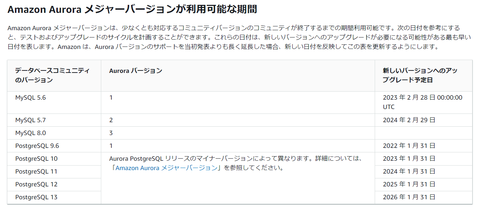
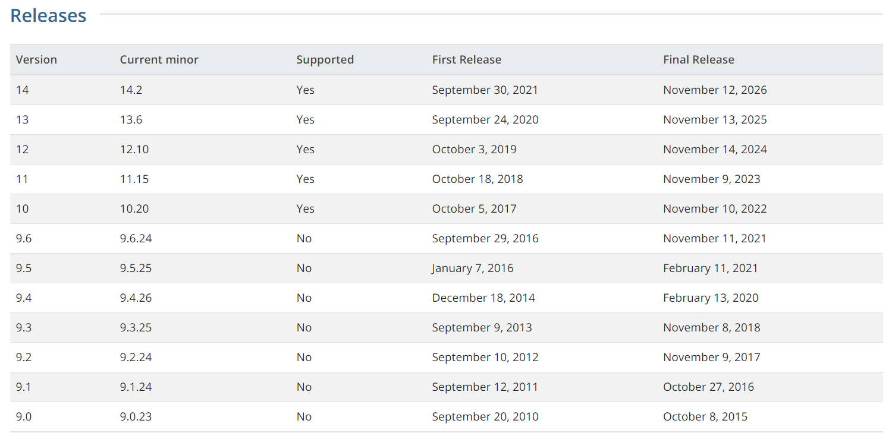
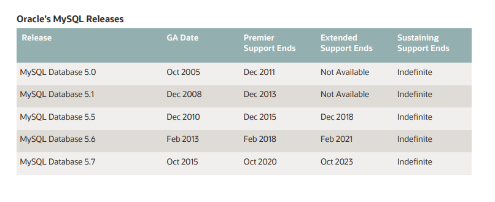

※2022/05/01時点。最新はリンク先へ

### Auroraマニュアル

> https://docs.aws.amazon.com/ja_jp/AmazonRDS/latest/AuroraUserGuide/Aurora.VersionPolicy.html?utm_source=pocket_mylist#Aurora.VersionPolicy.MajorVersionLifetime
>
> Amazon Aurora メジャーバージョンが利用可能な期間

マイナーバージョンの使用期間が最低12ヶ月となっているので特定メジャーバージョンが上記まで使えるというわけではなく、最新のメジャーバージョンの場合、上記の期間まで使えると認識していた方が良さそうである。

> https://docs.aws.amazon.com/ja_jp/AmazonRDS/latest/AuroraUserGuide/Aurora.VersionPolicy.html?utm_source=pocket_mylist#Aurora.VersionPolicy.MinorVersionLifetime
>
> 特定のメジャーバージョン用の各 Amazon Aurora マイナーバージョンは、少なくとも 12 か月間利用可能にしています。この期間が終了すると、Aurora は、後続のデフォルトのマイナーバージョンに関し、自動マイナーバージョンアップグレードを適用する可能性があります。

### 参考：PostgreSQL

> The PostgreSQL Global Development Group supports a major version for 5 years after its initial release. After its five year anniversary, a major version will have one last minor release containing any fixes and will be considered end-of-life (EOL) and no longer supported.
>
> 最初のリリースから5年間メジャーバージョンをサポートしています。5周年を迎えた後、メジャーバージョンには修正を含む最後のマイナーリリースが1つあり、保守終了（EOL）と見なされ、サポートされなくなります。

https://www.postgresql.org/support/versioning/

### 参考：MySQL

https://www.oracle.com/us/support/library/lifetime-support-technology-069183.pdf

