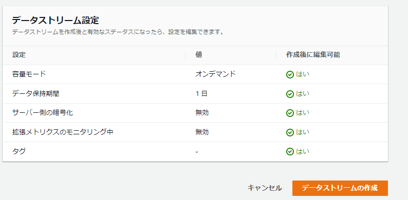
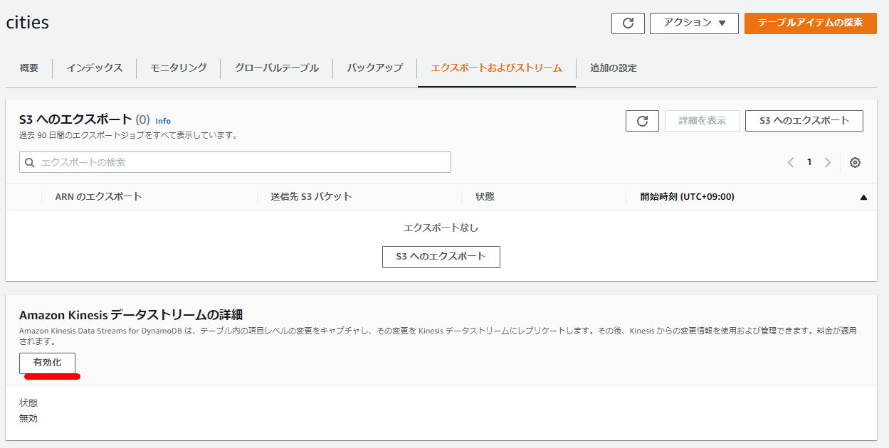
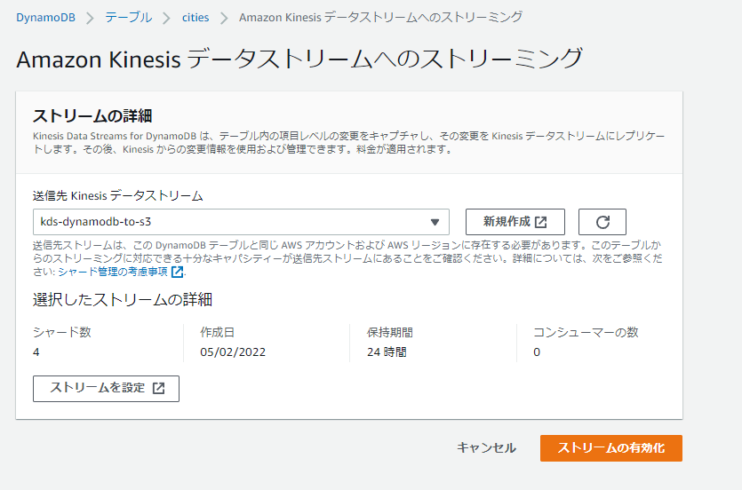
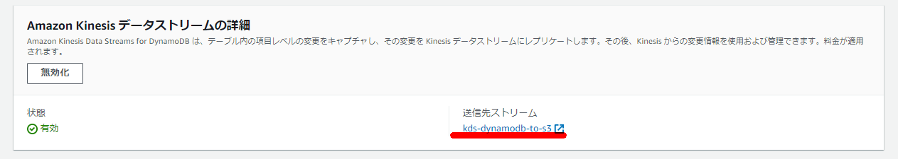
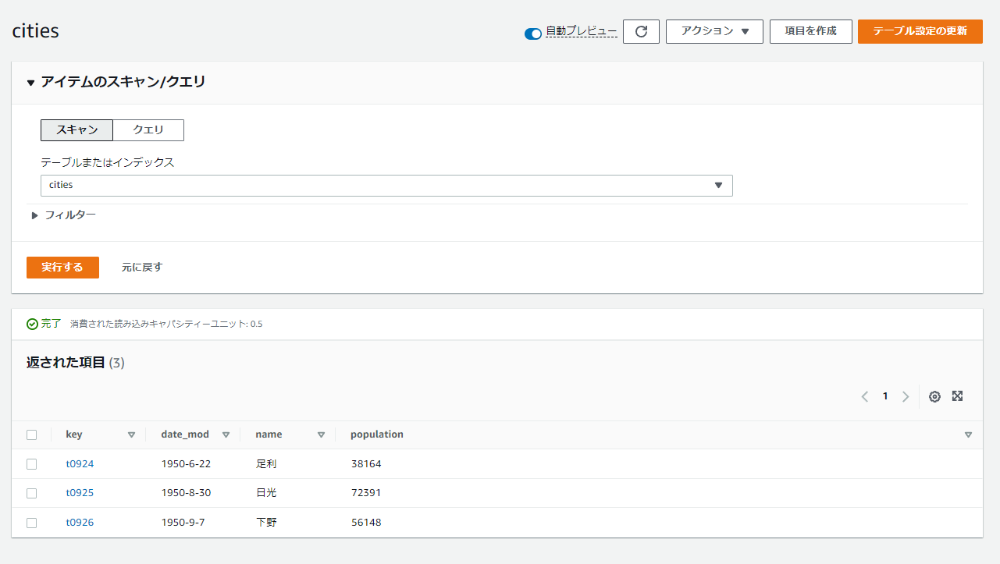
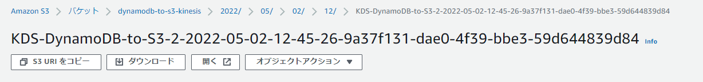

### Kinesis Data Streamsの作成





### Kinesis Data Firehoseの設定


### DynamoDB側の設定

```
aws dynamodb create-table --table-name 'cities' \
--attribute-definitions '[{"AttributeName":"key","AttributeType": "S"}]' \
--key-schema '[{"AttributeName":"key","KeyType": "HASH"}]' \
--provisioned-throughput '{"ReadCapacityUnits": 5,"WriteCapacityUnits": 5}'
```







### DynamoDB側でデータ生成

```
aws dynamodb put-item --table-name cities --item '{ "population": { "N": "38164" }, "date_mod": { "S": "1950-6-22" }, "key": { "S": "t0924" }, "name": { "S": "足利" } }'
aws dynamodb put-item --table-name cities --item '{ "population": { "N": "72391" }, "date_mod": { "S": "1950-8-30" }, "key": { "S": "t0925" }, "name": { "S": "日光" } }'
aws dynamodb put-item --table-name cities --item '{ "population": { "N": "56148" }, "date_mod": { "S": "1950-9-7" }, "key": { "S": "t0926" }, "name": { "S": "下野" } }'
```



### S3側の出力（※一部抜粋）



```json
{"awsRegion":"ap-northeast-1","eventID":"1e84f1ca-438d-4837-a6bd-aa4592be6f8a","eventName":"MODIFY","userIdentity":null,"recordFormat":"application/json","tableName":"cities","dynamodb":{"ApproximateCreationDateTime":1651495525900,"Keys":{"key":{"S":"t0926"}},"NewImage":{"population":{"N":"54148"},"key":{"S":"t0926"},"name":{"S":"下野"},"date_mod":{"S":"1950-9-7"}},"OldImage":{"population":{"N":"56148"},"key":{"S":"t0926"},"name":{"S":"下野"},"date_mod":{"S":"1950-9-7"}},"SizeBytes":104},"eventSource":"aws:dynamodb"}
```

