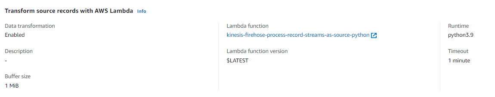

### はじめに

DynamoDBへの更新をS3に連携したい場合は下記の通りkinesis firehoseを経由させることで簡単にできるようになった。（従来はDynamoDB-Lamdba-Kinesisとすることが必要だった。）

> DynamoDBからkinesis firehose経由でS3に出力 | my opinion is my own 👋 https://zatoima.github.io/aws-dynamodb-to-s3-by-kinesis/

が、不要なレコードも一緒に出力されるので必要なものだけを抽出したい場合は、Kinesis firehoseの変換機能を使用する必要がある。Node.jsのスクリプトは公式からの提供されているが、Pythonはあまり見つけられなかった。

```json
{"awsRegion":"ap-northeast-1","eventID":"1e84f1ca-438d-4837-a6bd-aa4592be6f8a","eventName":"MODIFY","userIdentity":null,"recordFormat":"application/json","tableName":"cities","dynamodb":{"ApproximateCreationDateTime":1651495525900,"Keys":{"key":{"S":"t0926"}},"NewImage":{"population":{"N":"54148"},"key":{"S":"t0926"},"name":{"S":"下野"},"date_mod":{"S":"1950-9-7"}},"OldImage":{"population":{"N":"56148"},"key":{"S":"t0926"},"name":{"S":"下野"},"date_mod":{"S":"1950-9-7"}},"SizeBytes":104},"eventSource":"aws:dynamodb"}
```

### 必要な設定

Firehose側でS3に保存時に変換したい場合は、`Transform source records with AWS Lambda`を`enable`に設定してLambda Functionを設定する



### DynamoDB側のテーブル構造

idとdatetimeだけが用意されているテーブル


下記スクリプトで適当にデータを挿入する。

```sh
for i in {0..10000}
do
  NOW=`date --iso-8601=seconds`
  aws dynamodb put-item --table-name dynamotest --item "{ \"datetime\": { \"S\": \"${NOW}\" }, \"id\": { \"S\": \"${i}\" } }"
  echo $i
  sleep $(($RANDOM % 5))
done
```

### LambdaのPythonスクリプト

Kinesis Firehose側の決まりごとに沿う必要があることに注意。

> Amazon Kinesis Data Firehose のデータ変換 - Amazon Kinesis Data Firehose https://docs.aws.amazon.com/ja_jp/firehose/latest/dev/data-transformation.html

> DynamoDB StreamsとKinesis Data Firehoseを使ったサーバーレスリアルタイムETL - Qiita https://qiita.com/kzk-maeda/items/6dd02b9b567a6dd063fd
>
> - Kinesis Data Firehoseから連携されたPayload Sizeが6MBを超えるときは、PayloadをFirehoseに戻す必要がある
>   - さらに、その戻すRecord数が500を超える場合は分割する必要がある
> - Transform処理が完了したデータをFirehoseに戻す際、所定フォーマットにしたがった形式で、Dataの実態はbase64でencordする必要がある

下記のスクリプトはペイロード制限やRecord数は考慮していないので注意。更新量が多いDynamoDBに関しては要注意かもしれない。

```python
import json
import base64

def lambda_handler(event, context):

    results = []
    records = event["records"]
    for record in records:
        record_id = record.get('recordId')
        data = json.loads(base64.b64decode(record.get('data')))
        #print("Raw Data : " + str(data))
        
        id = data['dynamodb']['Keys']['id']['S']
        datetime = data['dynamodb']['Keys']['datetime']['S']

        #print("New Data : " + str(id) + str(datetime))
        return_data = ','.join([id,datetime])  + '\n'
        #print("return_data : "  +  str(return_data))
     
        data = base64.b64encode(return_data.encode())

        results.append({
            "result":"Ok",
            "recordId":record_id,
            "data":data
        })
        
    return {
        "records":results
    }
```

なお、DynamoDB側から流れてくるJSONデータは下記なので、こちらのJSONデータをパースして必要なものだけを抽出する。今回はカラム（`id`と`datetime`）に対する挿入操作をCSVで出力するようにした。

※サンプルなので、実際のカラムではないです

```json
{
  "Records": [
    {
      "eventID": "c4ca4238a0b923820dcc509a6f75849b",
      "eventName": "INSERT",
      "eventVersion": "1.1",
      "eventSource": "aws:dynamodb",
      "awsRegion": "us-east-1",
      "dynamodb": {
        "Keys": {
          "Id": {
            "N": "101"
          }
        },
        "NewImage": {
          "Message": {
            "S": "New item!"
          },
          "Id": {
            "N": "101"
          }
        },
        "ApproximateCreationDateTime": 1428537600,
        "SequenceNumber": "4421584500000000017450439091",
        "SizeBytes": 26,
        "StreamViewType": "NEW_AND_OLD_IMAGES"
      },
      "eventSourceARN": "arn:aws:dynamodb:us-east-1:123456789012:table/ExampleTableWithStream/stream/2015-06-27T00:48:05.899"
    },
    {
      "eventID": "c81e728d9d4c2f636f067f89cc14862c",
      "eventName": "MODIFY",
      "eventVersion": "1.1",
      "eventSource": "aws:dynamodb",
      "awsRegion": "us-east-1",
      "dynamodb": {
        "Keys": {
          "Id": {
            "N": "101"
          }
        },
        "NewImage": {
          "Message": {
            "S": "This item has changed"
          },
          "Id": {
            "N": "101"
          }
        },
        "OldImage": {
          "Message": {
            "S": "New item!"
          },
          "Id": {
            "N": "101"
          }
        },
        "ApproximateCreationDateTime": 1428537600,
        "SequenceNumber": "4421584500000000017450439092",
        "SizeBytes": 59,
        "StreamViewType": "NEW_AND_OLD_IMAGES"
      },
      "eventSourceARN": "arn:aws:dynamodb:us-east-1:123456789012:table/ExampleTableWithStream/stream/2015-06-27T00:48:05.899"
    },
    {
      "eventID": "eccbc87e4b5ce2fe28308fd9f2a7baf3",
      "eventName": "REMOVE",
      "eventVersion": "1.1",
      "eventSource": "aws:dynamodb",
      "awsRegion": "us-east-1",
      "dynamodb": {
        "Keys": {
          "Id": {
            "N": "101"
          }
        },
        "OldImage": {
          "Message": {
            "S": "This item has changed"
          },
          "Id": {
            "N": "101"
          }
        },
        "ApproximateCreationDateTime": 1428537600,
        "SequenceNumber": "4421584500000000017450439093",
        "SizeBytes": 38,
        "StreamViewType": "NEW_AND_OLD_IMAGES"
      },
      "eventSourceARN": "arn:aws:dynamodb:us-east-1:123456789012:table/ExampleTableWithStream/stream/2015-06-27T00:48:05.899"
    }
  ]
}
```

### 後日追記①：

Node.jsであれば下記を参考

```javascript
'use strict';
console.log('Loading function');

/* Stock Ticker format parser */
const parser = /^\{\"TICKER_SYMBOL\"\:\"[A-Z]+\"\,\"SECTOR\"\:"[A-Z]+\"\,\"CHANGE\"\:[-.0-9]+\,\"PRICE\"\:[-.0-9]+\}/;

exports.handler = (event, context, callback) => {
    let success = 0; // Number of valid entries found
    let failure = 0; // Number of invalid entries found
    let dropped = 0; // Number of dropped entries 

    /* Process the list of records and transform them */
    const output = event.records.map((record) => {

        const entry = (new Buffer(record.data, 'base64')).toString('utf8');
        let match = parser.exec(entry);
        if (match) {
            let parsed_match = JSON.parse(match); 
            var milliseconds = new Date().getTime();
            /* Add timestamp and convert to CSV */
            const result = `${milliseconds},${parsed_match.TICKER_SYMBOL},${parsed_match.SECTOR},${parsed_match.CHANGE},${parsed_match.PRICE}`+"\n";
            const payload = (new Buffer(result, 'utf8')).toString('base64');
            if (parsed_match.SECTOR != 'RETAIL') {
                /* Dropped event, notify and leave the record intact */
                dropped++;
                return {
                    recordId: record.recordId,
                    result: 'Dropped',
                    data: record.data,
                };
            }
            else {
                /* Transformed event */
                success++;  
                return {
                    recordId: record.recordId,
                    result: 'Ok',
                    data: payload,
                };
            }
        }
        else {
            /* Failed event, notify the error and leave the record intact */
            console.log("Failed event : "+ record.data);
            failure++;
            return {
                recordId: record.recordId,
                result: 'ProcessingFailed',
                data: record.data,
            };
        }
        /* This transformation is the "identity" transformation, the data is left intact 
        return {
            recordId: record.recordId,
            result: 'Ok',
            data: record.data,
        } */
    });
    console.log(`Processing completed.  Successful records ${output.length}.`);
    callback(null, { records: output });
};
```

後日追記②：

下記を全面的に採用させていただき、そのままではエラーで動作しなかったため、一部修正して動作するようにした。

> DynamoDB StreamsとKinesis Data Firehoseを使ったサーバーレスリアルタイムETL - Qiita https://qiita.com/kzk-maeda/items/6dd02b9b567a6dd063fd

```python
import json
import boto3
import base64
from datetime import datetime

PAYLOAD_MAX_SIZE = 6000000
MAX_RECORD_COUNT = 500

def transform(data):
    """
    データ変換関数
    """
    data['NewColumn'] = 'New Value'
    # Change Schema
    id = data['dynamodb']['Keys']['id']['S']
    datetime = data['dynamodb']['Keys']['datetime']['S']
    print("New Data : " + str(id) + str(datetime))

    return_data = ','.join([id,datetime])
    print("return_data : "  +  str(return_data))

    return return_data


def proceed_records(records):
    """
    transform each data and yield each record
    """
    for record in records:
        record_id = record.get('recordId')
        data = json.loads(base64.b64decode(record.get('data')))
        print("Raw Data : " + str(data))
        try:
            transformed_data = transform(data)
            result = 'Ok'
        except Exception as e:
            print(e)
            transformed_data = data
            result = 'ProcessingFailed'
        print("New Data : " + str(transformed_data))

        proceeded_data = json.dumps(transformed_data) + '\n'
        proceeded_data = str(transformed_data) + '\n'

        return_record = {
            "recordId": record_id,
            "result": result,
            "data": base64.b64encode(proceeded_data.encode('utf-8'))
        }

        yield return_record


def put_records_to_firehose(streamName, records, client):
    print('Trying to return record to firehose')
    print(f'Item count: {len(records)}')
    print(f'Record: {str(records)}')
    try:
        response = client.put_record_batch(DeliveryStreamName=streamName, Records=records)
    except Exception as e:
        # failedRecords = records
        errMsg = str(e)
        print(errMsg)


def lambda_handler(event, context):
    invocation_id = event.get('invocationId')
    event_records = event.get('records')
    # Transform Data
    records = list(proceed_records(event_records))

    # Check Data
    projected_size = 0 # Responseサイズが6MBを超えない様制御
    data_by_record_id = {rec['recordId']: _create_reingestion_record(rec) for rec in event['records']}
    total_records_to_be_reingested = 0
    records_to_reingest = []
    put_record_batches = []
    for idx, rec in enumerate(records):
        if rec['result'] != 'Ok':
            continue
        projected_size += len(rec['data']) + len(rec['recordId'])
        if projected_size > PAYLOAD_MAX_SIZE:
            """
            Lambda 同期呼び出しモードには、リクエストとレスポンスの両方について、
            ペイロードサイズに 6 MB の制限があります。
            https://docs.aws.amazon.com/ja_jp/firehose/latest/dev/data-transformation.html
            """
            print(f"Payload size has been exceeded over {PAYLOAD_MAX_SIZE/1000/1000}MB")
            total_records_to_be_reingested += 1
            records_to_reingest.append(
                _get_reingestion_record(data_by_record_id[rec['recordId']])
            )
            records[idx]['result'] = 'Dropped'
            del(records[idx]['data'])

        if len(records_to_reingest) == MAX_RECORD_COUNT:
            """
            Each PutRecordBatch request supports up to 500 records.
            https://docs.aws.amazon.com/firehose/latest/APIReference/API_PutRecordBatch.html
            """
            print(f'Records count has been exceeded over {MAX_RECORD_COUNT}')
            put_record_batches.append(records_to_reingest)
            records_to_reingest = []

    if len(records_to_reingest) > 0:
        # add the last batch
        put_record_batches.append(records_to_reingest)

    # iterate and call putRecordBatch for each group
    records_reingested_already = 0
    stream_arn = event['deliveryStreamArn']
    region = stream_arn.split(':')[3]
    stream_name = stream_arn.split('/')[1]
    if len(put_record_batches) > 0:
        client = boto3.client('firehose', region_name=region)
        for record_batch in put_record_batches:
            put_records_to_firehose(stream_name, record_batch, client)
            records_reingested_already += len(record_batch)
            print(f'Reingested {records_reingested_already}/{total_records_to_be_reingested} records out of {len(event["records"])}')
    else:
        print('No records to be reingested')


    # Return records to Firehose
    return_records = {
        'records': records
    }
    print(str(return_records))
    return return_records


# Transform method for temporary data
def _create_reingestion_record(original_record):
    return {'data': base64.b64decode(original_record['data'])}

def _get_reingestion_record(re_ingestion_record):
    return {'Data': re_ingestion_record['data']}
```

### 参考

> - Amazon Kinesis Firehose Data Transformation with AWS Lambda | AWS Compute Blog https://aws.amazon.com/jp/blogs/compute/amazon-kinesis-firehose-data-transformation-with-aws-lambda/
> - DynamoDB StreamsとKinesis Data Firehoseを使ったサーバーレスリアルタイムETL - Qiita https://qiita.com/kzk-maeda/items/6dd02b9b567a6dd063fd
> - Amazon DynamoDB ストリームを使用して、順序付けされたデータをアプリケーション間でレプリケーションする方法 | Amazon Web Services ブログ https://aws.amazon.com/jp/blogs/news/how-to-perform-ordered-data-replication-between-applications-by-using-amazon-dynamodb-streams/
