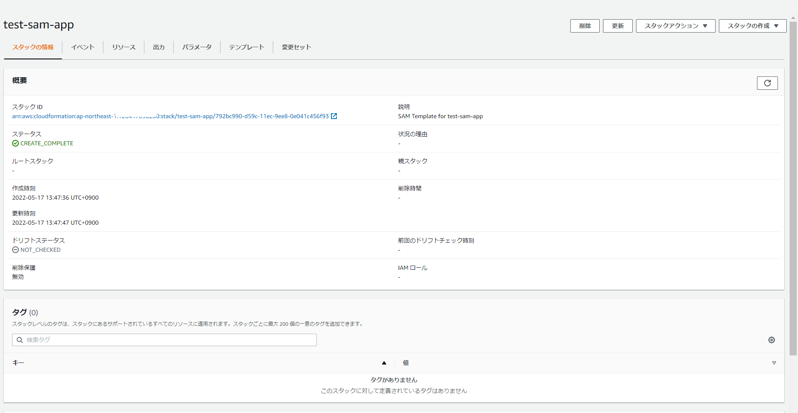

### SAM CLIのインストール

##### コマンド

```sh
wget https://github.com/aws/aws-sam-cli/releases/latest/download/aws-sam-cli-linux-x86_64.zip
unzip aws-sam-cli-linux-x86_64.zip -d sam-installation
sudo ./sam-installation/install
sam --version
```

### 事前準備

Python3.8系がインストールされていないとエラーになったのでインストール

> [ec2-user@bastin test-sam]$ sam build
> Building codeuri: /home/ec2-user/test-sam/function runtime: python3.8 metadata: {} architecture: x86_64 functions: ['Function']
>
> Build Failed
> Error: PythonPipBuilder:Validation - Binary validation failed for python, searched for python in following locations  : ['/usr/bin/python'] which did not satisfy constraints for runtime: python3.8. Do you have python for runtime: python3.8 on your PATH?

```sh
sudo amazon-linux-extras install python3.8
```

### ディレクトリ/デプロイ用のファイル準備

```sh
[ec2-user@bastin test-sam]$ tree
.
├── function
│   ├── function.py
│   └── requirements.txt
├── samconfig.toml
└── template.yaml

1 directory, 4 files
[ec2-user@bastin test-sam]$ cat function/function.py 
import json
import requests

def lambda_handler(event, context):

    print(requests.get('https://google.com'))
    return {
        'statusCode': 200,
        'body': json.dumps('Hello from Lambda!')
    }

[ec2-user@bastin test-sam]$ 
[ec2-user@bastin test-sam]$ cat function/requirements.txt 
requests
[ec2-user@bastin test-sam]$ 
[ec2-user@bastin test-sam]$ cat samconfig.toml 
version = 0.1
[default]
[default.deploy]
[default.deploy.parameters]
stack_name = "test-sam-app"
s3_bucket = "zatoima"
s3_prefix = "test-sam-app"
region = "ap-northeast-1"
capabilities = "CAPABILITY_IAM"

[ec2-user@bastin test-sam]$ 
[ec2-user@bastin test-sam]$ cat template.yaml 
AWSTemplateFormatVersion: '2010-09-09'
Transform: AWS::Serverless-2016-10-31
Description: SAM Template for test-sam-app
Globals:
  Function:
    Timeout: 3

Resources:
  Function:
    Type: AWS::Serverless::Function
    Properties:
      FunctionName: test-sam-app
      CodeUri: function/
      Handler: function.lambda_handler
      Runtime: python3.8

Outputs:
  Function:
    Description: "test-sam-app Lambda Function ARN"
    Value: !GetAtt Function.Arn
  FunctionIamRole:
    Description: "Implicit IAM Role created for test-sam-app function"
    Value: !GetAtt FunctionRole.Arn


```

ビルド、デプロイ

```sh
[ec2-user@bastin test-sam]$ sam build
Building codeuri: /home/ec2-user/test-sam/function runtime: python3.8 metadata: {} architecture: x86_64 functions: ['Function']
Running PythonPipBuilder:ResolveDependencies
Running PythonPipBuilder:CopySource

Build Succeeded

Built Artifacts  : .aws-sam/build
Built Template   : .aws-sam/build/template.yaml

Commands you can use next
=========================
[*] Validate SAM template: sam validate
[*] Invoke Function: sam local invoke
[*] Test Function in the Cloud: sam sync --stack-name {stack-name} --watch
[*] Deploy: sam deploy --guided
        
[ec2-user@bastin test-sam]$ 
[ec2-user@bastin test-sam]$ 
[ec2-user@bastin test-sam]$ sam deploy
Uploading to test-sam-app/70531b5489f5a99ab4c62e4acc57d0ef  452386 / 452386  (100.00%)

	Deploying with following values
	===============================
	Stack name                   : test-sam-app
	Region                       : ap-northeast-1
	Confirm changeset            : False
	Disable rollback             : False
	Deployment s3 bucket         : zatoima
	Capabilities                 : ["CAPABILITY_IAM"]
	Parameter overrides          : {}
	Signing Profiles             : {}

Initiating deployment
=====================
Uploading to test-sam-app/ba13ca287976cbfe7f0c7cda0b66556e.template  725 / 725  (100.00%)

Waiting for changeset to be created..

～省略～

Successfully created/updated stack - test-sam-app in ap-northeast-1
```

CloudFormation



Lambda


