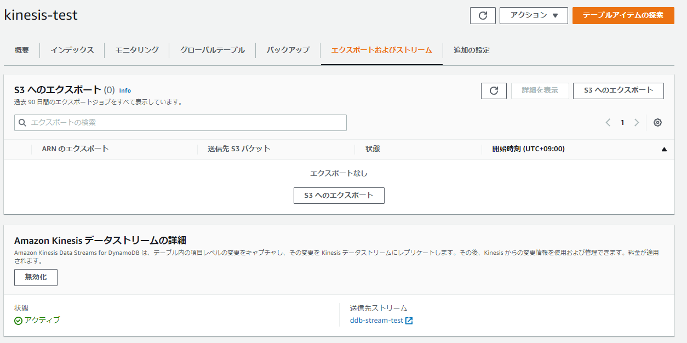

### テーブル定義

------

```sh
aws dynamodb create-table \
    --table-name dynamotest \
    --attribute-definitions \
      AttributeName=id,AttributeType=S \
      AttributeName=datetime,AttributeType=S \
    --key-schema AttributeName=id,KeyType=HASH AttributeName=datetime,KeyType=RANGE \
    --billing-mode PAY_PER_REQUEST
```

### DynamoDBのKinesis Data Streamsの設定

------



### テーブル新規挿入&更新

------

2件INSERT、2件UPDATE（このとき全て同じキーをアップデートする）

```sh
aws dynamodb put-item --table-name kinesis-test --item "{ \"datetime\": { \"S\": \"aaaaaaaaaaa\" }, \"id\": { \"S\": \"aaaaaaaaaaa\" } }"
aws dynamodb put-item --table-name kinesis-test --item "{ \"datetime\": { \"S\": \"bbbbbbbbbbb\" }, \"id\": { \"S\": \"bbbbbbbbbbb\" } }"
aws dynamodb update-item  --table-name kinesis-test --key "{ \"datetime\": { \"S\": \"aaaaaaaaaaa\" }, \"id\": { \"S\": \"aaaaaaaaaaa\" } }" --attribute-updates '{"ccc": {"Value": {"S":"sample text"}}}'
aws dynamodb update-item  --table-name kinesis-test --key "{ \"datetime\": { \"S\": \"aaaaaaaaaaa\" }, \"id\": { \"S\": \"aaaaaaaaaaa\" } }" --attribute-updates '{"ccc": {"Value": {"S":"gogogogo"}}}'
aws dynamodb scan --table-name kinesis-test 

```

### 結果

------

base64 デコードするとデータの中身も見れる。

> https://www.base64decode.org/

オンデマンドのKinesis Data Streamsにデータを流していて、シャード0とシャード1にはデータ無し、シャード2には1件、シャード3には3件入っている。DynamoDB側のキーが同じアップデートに対しては同じシャードに入ってくる。

```sh
[ec2-user@bastin ~]$ SHARD_ITERATOR=$(aws kinesis get-shard-iterator --shard-id shardId-000000000002 --shard-iterator-type TRIM_HORIZON --stream-name ddb-stream-test --query 'ShardIterator')
[ec2-user@bastin ~]$ aws kinesis get-records --shard-iterator $SHARD_ITERATOR
{
    "Records": [
        {
            "SequenceNumber": "49630754920274845572843534141988045219888124757907865634",
            "ApproximateArrivalTimestamp": "2022-06-24T14:23:08.513000+09:00",
            "Data": "eyJhd3NSZWdpb24iOiJhcC1ub3J0aGVhc3QtMSIsImV2ZW50SUQiOiJlYjFiOWM2Ni03MTY5LTQzNjQtYjY0Mi1hYzU2ZjAxY2JhZjAiLCJldmVudE5hbWUiOiJJTlNFUlQiLCJ1c2VySWRlbnRpdHkiOm51bGwsInJlY29yZEZvcm1hdCI6ImFwcGxpY2F0aW9uL2pzb24iLCJ0YWJsZU5hbWUiOiJraW5lc2lzLXRlc3QiLCJkeW5hbW9kYiI6eyJBcHByb3hpbWF0ZUNyZWF0aW9uRGF0ZVRpbWUiOjE2NTYwNDgxODc5MjIsIktleXMiOnsiaWQiOnsiUyI6ImJiYmJiYmJiYmJiIn0sImRhdGV0aW1lIjp7IlMiOiJiYmJiYmJiYmJiYiJ9fSwiTmV3SW1hZ2UiOnsiaWQiOnsiUyI6ImJiYmJiYmJiYmJiIn0sImRhdGV0aW1lIjp7IlMiOiJiYmJiYmJiYmJiYiJ9fSwiU2l6ZUJ5dGVzIjo2NH0sImV2ZW50U291cmNlIjoiYXdzOmR5bmFtb2RiIn0=",
            "PartitionKey": "49DE9F3D57177739BC4A3A6E32350613"
        }
    ],
    "NextShardIterator": "AAAAAAAAAAFAzXEe3Y9ICjI+/VTUw038RKRC5PNLwKueAvRHUdllhOoWHRyUnc4ReetrVMFOdWcng4Qe2czh/zhnWallAJmQC+yqO7kEY8ZgGFw8lfBAgrnbp4dMnZtuoEAgC66TxKmQhFieDQB5pprN5fhfMq1Ep0BVsqsr1SgXpv4aH1U5fsbKHpuGbiUOleZyDyigqofl0k2tFFERdwwNcXX5YEM81iK9JrAEoiQp4Fl5b7Y7pA==",
    "MillisBehindLatest": 0
}
[ec2-user@bastin ~]$ 
[ec2-user@bastin ~]$ SHARD_ITERATOR=$(aws kinesis get-shard-iterator --shard-id shardId-000000000003 --shard-iterator-type TRIM_HORIZON --stream-name ddb-stream-test --query 'ShardIterator')

[ec2-user@bastin ~]$ aws kinesis get-records --shard-iterator $SHARD_ITERATOR
{
    "Records": [
        {
            "SequenceNumber": "49630754920297146318042064765128372012341141379089432626",
            "ApproximateArrivalTimestamp": "2022-06-24T14:18:58.894000+09:00",
            "Data": "eyJhd3NSZWdpb24iOiJhcC1ub3J0aGVhc3QtMSIsImV2ZW50SUQiOiJjMWViYmM3NS00Mjk3LTQwNzQtYWJlMC0yZmQ2OTMwNjk3YzUiLCJldmVudE5hbWUiOiJJTlNFUlQiLCJ1c2VySWRlbnRpdHkiOm51bGwsInJlY29yZEZvcm1hdCI6ImFwcGxpY2F0aW9uL2pzb24iLCJ0YWJsZU5hbWUiOiJraW5lc2lzLXRlc3QiLCJkeW5hbW9kYiI6eyJBcHByb3hpbWF0ZUNyZWF0aW9uRGF0ZVRpbWUiOjE2NTYwNDc5Mzg3MzksIktleXMiOnsiaWQiOnsiUyI6ImFhYWFhYWFhYWFhIn0sImRhdGV0aW1lIjp7IlMiOiJhYWFhYWFhYWFhYSJ9fSwiTmV3SW1hZ2UiOnsiaWQiOnsiUyI6ImFhYWFhYWFhYWFhIn0sImRhdGV0aW1lIjp7IlMiOiJhYWFhYWFhYWFhYSJ9fSwiU2l6ZUJ5dGVzIjo2NH0sImV2ZW50U291cmNlIjoiYXdzOmR5bmFtb2RiIn0=",
            "PartitionKey": "D1174FF2F6189C4B8B91C573346158AD"
        },
        {
            "SequenceNumber": "49630754920297146318042064765135625567258871347896385586",
            "ApproximateArrivalTimestamp": "2022-06-24T14:29:13.673000+09:00",
            "Data": "eyJhd3NSZWdpb24iOiJhcC1ub3J0aGVhc3QtMSIsImV2ZW50SUQiOiJmMWRjZmYxZS1hNzg0LTQzMWItYmI2MS00Mjc0YmU5NjM1YWQiLCJldmVudE5hbWUiOiJNT0RJRlkiLCJ1c2VySWRlbnRpdHkiOm51bGwsInJlY29yZEZvcm1hdCI6ImFwcGxpY2F0aW9uL2pzb24iLCJ0YWJsZU5hbWUiOiJraW5lc2lzLXRlc3QiLCJkeW5hbW9kYiI6eyJBcHByb3hpbWF0ZUNyZWF0aW9uRGF0ZVRpbWUiOjE2NTYwNDg1NTM1NTcsIktleXMiOnsiaWQiOnsiUyI6ImFhYWFhYWFhYWFhIn0sImRhdGV0aW1lIjp7IlMiOiJhYWFhYWFhYWFhYSJ9fSwiTmV3SW1hZ2UiOnsiaWQiOnsiUyI6ImFhYWFhYWFhYWFhIn0sImRhdGV0aW1lIjp7IlMiOiJhYWFhYWFhYWFhYSJ9LCJjY2MiOnsiUyI6InNhbXBsZSB0ZXh0In19LCJPbGRJbWFnZSI6eyJpZCI6eyJTIjoiYWFhYWFhYWFhYWEifSwiZGF0ZXRpbWUiOnsiUyI6ImFhYWFhYWFhYWFhIn19LCJTaXplQnl0ZXMiOjExMH0sImV2ZW50U291cmNlIjoiYXdzOmR5bmFtb2RiIn0=",
            "PartitionKey": "D1174FF2F6189C4B8B91C573346158AD"
        },
        {
            "SequenceNumber": "49630754920297146318042064765136834493078514152056553522",
            "ApproximateArrivalTimestamp": "2022-06-24T14:36:03.966000+09:00",
            "Data": "eyJhd3NSZWdpb24iOiJhcC1ub3J0aGVhc3QtMSIsImV2ZW50SUQiOiI0NmQ2Mjc3Ni03ZjU1LTQwNGEtODc2Ni1iNDlhYWI4Y2QxZmMiLCJldmVudE5hbWUiOiJNT0RJRlkiLCJ1c2VySWRlbnRpdHkiOm51bGwsInJlY29yZEZvcm1hdCI6ImFwcGxpY2F0aW9uL2pzb24iLCJ0YWJsZU5hbWUiOiJraW5lc2lzLXRlc3QiLCJkeW5hbW9kYiI6eyJBcHByb3hpbWF0ZUNyZWF0aW9uRGF0ZVRpbWUiOjE2NTYwNDg5NjM1NjYsIktleXMiOnsiaWQiOnsiUyI6ImFhYWFhYWFhYWFhIn0sImRhdGV0aW1lIjp7IlMiOiJhYWFhYWFhYWFhYSJ9fSwiTmV3SW1hZ2UiOnsiaWQiOnsiUyI6ImFhYWFhYWFhYWFhIn0sImRhdGV0aW1lIjp7IlMiOiJhYWFhYWFhYWFhYSJ9LCJjY2MiOnsiUyI6ImdvZ29nb2dvIn19LCJPbGRJbWFnZSI6eyJpZCI6eyJTIjoiYWFhYWFhYWFhYWEifSwiZGF0ZXRpbWUiOnsiUyI6ImFhYWFhYWFhYWFhIn0sImNjYyI6eyJTIjoic2FtcGxlIHRleHQifX0sIlNpemVCeXRlcyI6MTIxfSwiZXZlbnRTb3VyY2UiOiJhd3M6ZHluYW1vZGIifQ==",
            "PartitionKey": "D1174FF2F6189C4B8B91C573346158AD"
        }
    ],
    "NextShardIterator": "AAAAAAAAAAEbQXenaHcCeosgGJwhLcOtqHDk/l5RQk/qOmihRWM/yJirzXs3pArN6Y8sm+gF97rqlDWAvjNvy+MpuUmm+U+29j4qtyUB117A86ImSQYNIA6bT5fkUyUUIr/nutrVFx+3+PwHZeDEx1aACuJL9znIV37rWwrfocGs8zeDbRBStom5Dk84VBYrAubwM9KPZyCRSJvIuZgJHnerHb9PQKC40+O3TcyoMZZ4EoHpt4mhww==",
    "MillisBehindLatest": 0
}
```

