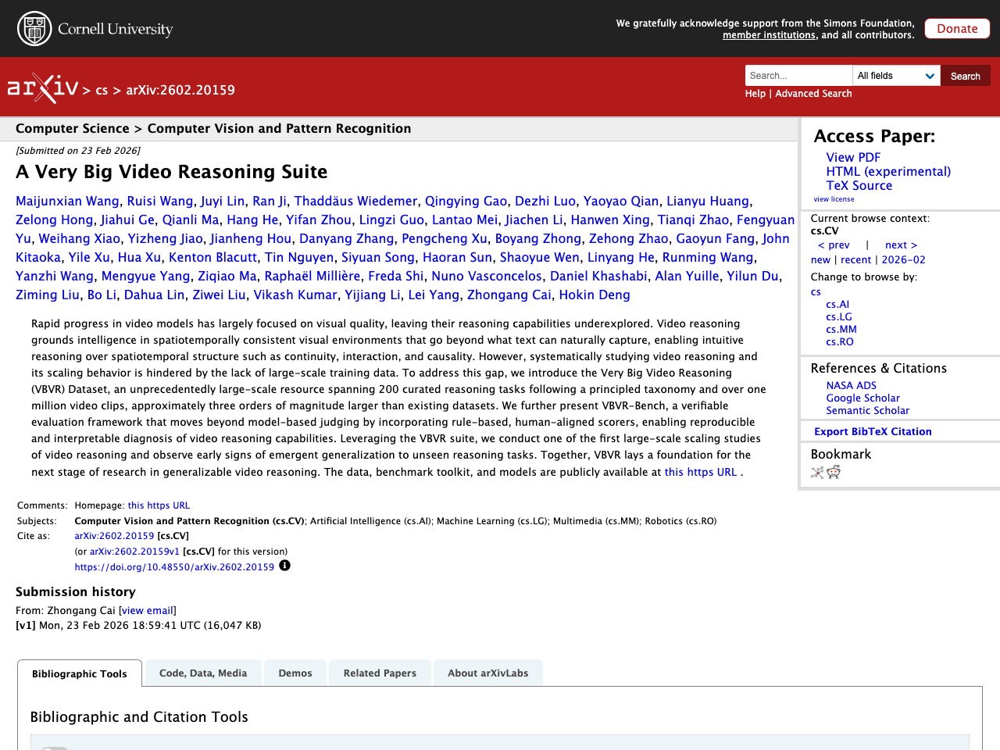
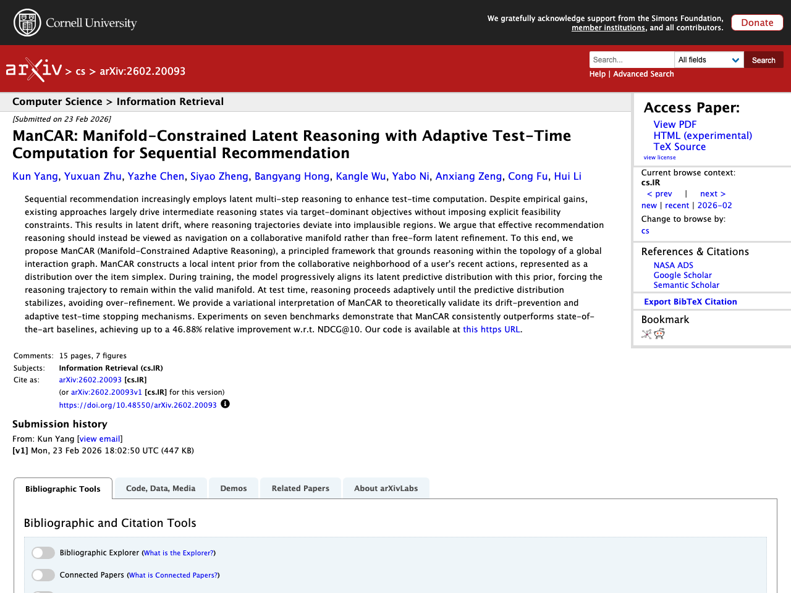
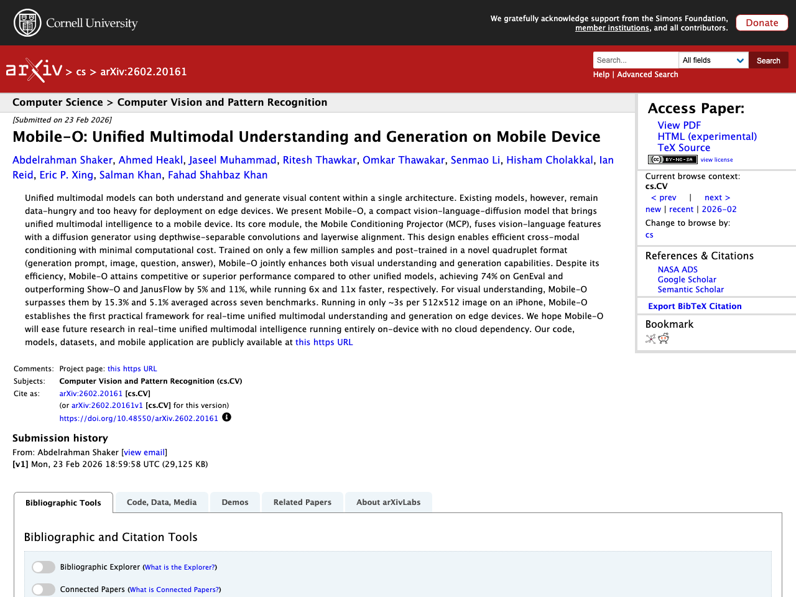

## はじめに

本記事は2026-02-25時点でのLLM関連の注目論文をまとめたものです。arXiv、Semantic Scholar、Hugging Face Daily Papersから自動収集し、Claude APIで日本語要約を生成しています。

## 1. A Very Big Video Reasoning Suite

- **著者**: Maijunxian Wang, Ruisi Wang, Juyi Lin, Ran Ji, Thaddäus Wiedemer ほか
- **公開日**: 2026-02-23
- **ソース**: [huggingface](https://arxiv.org/abs/2602.20159)
- **arXiv ID**: 2602.20159

### 要約

動画モデルの急速な進歩は主に視覚的品質に焦点が当てられており、推論能力の研究は十分に進んでいない。本研究では、動画推論の大規模学習データの不足を解決するため、体系的な分類法に基づく200の推論タスクと100万以上の動画クリップを含む超大規模データセット「VBVR Dataset」を構築した。さらに、モデルベースの評価を超え、ルールベースかつ人間の判断と整合したスコアラーを組み込んだ検証可能な評価フレームワーク「VBVR-Bench」を提案している。このVBVRスイートを活用して動画推論の大規模スケーリング研究を実施した結果、未知の推論タスクへの創発的な汎化の初期兆候が観察された。データセット、ベンチマークツールキット、モデルはすべて公開されている。


Rapid progress in video models has largely focused on visual quality, leaving their reasoning capabilities underexplored. Video reasoning grounds intelligence in spatiotemporally consistent visual environments that go beyond what text can naturally capture, enabling intuitive reasoning over spatiotemporal structure such as continuity, interaction, and causality. However, systematically studying video reasoning and its scaling behavior is hindered by the lack of large-scale training data. To address this gap, we introduce the Very Big Video Reasoning (VBVR) Dataset, an unprecedentedly large-scale resource spanning 200 curated reasoning tasks following a principled taxonomy and over one million video clips, approximately three orders of magnitude larger than existing datasets. We further present VBVR-Bench, a verifiable evaluation framework that moves beyond model-based judging by incorporating rule-based, human-aligned scorers, enabling reproducible and interpretable diagnosis of video reasoning capabilities. Leveraging the VBVR suite, we conduct one of the first large-scale scaling studies of video reasoning and observe early signs of emergent generalization to unseen reasoning tasks. Together, VBVR lays a foundation for the next stage of research in generalizable video reasoning. The data, benchmark toolkit, and models are publicly available at https://video-reason.com/ .


## 2. VLANeXt: Recipes for Building Strong VLA Models

- **著者**: Xiao-Ming Wu, Bin Fan, Kang Liao, Jian-Jian Jiang, Runze Yang ほか
- **公開日**: 2026-02-20
- **ソース**: [huggingface](https://arxiv.org/abs/2602.18532)
- **arXiv ID**: 2602.18532

### 要約

大規模基盤モデルの台頭に伴い、視覚・言語理解を活用した汎用的な方策学習のためのVision-Language-Action（VLA）モデルが登場したが、現状では学習プロトコルや評価設定の不統一により、どの設計選択が重要かの判断が困難である。本研究では、統一的なフレームワークと評価環境のもとでVLAの設計空間を再検討し、RT-2やOpenVLAに類似したシンプルなベースラインから出発して、基盤コンポーネント・知覚の要素・行動モデリングの3つの観点から設計選択を体系的に分析した。この分析から、強力なVLAモデル構築のための実践的なレシピとなる12の重要な知見を抽出した。その成果であるVLANeXtは、LIBEROおよびLIBERO-plusベンチマークで従来の最先端手法を上回る性能を達成し、実世界実験でも高い汎化能力を示した。


Following the rise of large foundation models, Vision-Language-Action models (VLAs) emerged, leveraging strong visual and language understanding for general-purpose policy learning. Yet, the current VLA landscape remains fragmented and exploratory. Although many groups have proposed their own VLA models, inconsistencies in training protocols and evaluation settings make it difficult to identify which design choices truly matter. To bring structure to this evolving space, we reexamine the VLA design space under a unified framework and evaluation setup. Starting from a simple VLA baseline similar to RT-2 and OpenVLA, we systematically dissect design choices along three dimensions: foundational components, perception essentials, and action modelling perspectives. From this study, we distill 12 key findings that together form a practical recipe for building strong VLA models. The outcome of this exploration is a simple yet effective model, VLANeXt. VLANeXt outperforms prior state-of-the-art methods on the LIBERO and LIBERO-plus benchmarks and demonstrates strong generalization in real-world experiments. We will release a unified, easy-to-use codebase that serves as a common platform for the community to reproduce our findings, explore the design space, and build new VLA variants on top of a shared foundation.


## 3. TOPReward: Token Probabilities as Hidden Zero-Shot Rewards for Robotics

- **著者**: Shirui Chen, Cole Harrison, Ying-Chun Lee, Angela Jin Yang, Zhongzheng Ren ほか
- **公開日**: 2026-02-22
- **ソース**: [huggingface](https://arxiv.org/abs/2602.19313)
- **arXiv ID**: 2602.19313

### 要約

視覚言語行動（VLA）モデルの強化学習における低いサンプル効率とスパース報酬の課題に対処するため、事前学習済みビデオ視覚言語モデル（VLM）の潜在的な世界知識を活用してロボットタスクの進捗を推定する新しい時間的価値関数「TOPReward」を提案している。従来のVLMに進捗値を直接出力させる手法が数値の誤表現を起こしやすいのに対し、TOPRewardはVLM内部のトークンロジットからタスク進捗を確率的に抽出する点が特徴である。130以上の実世界タスクと複数のロボットプラットフォーム（Franka、YAM、SO-100/101など）でのゼロショット評価において、Qwen3-VL上で平均Value-Order Correlation（VOC）0.947を達成し、同一モデルでほぼゼロの相関しか得られない最先端手法GVLを大幅に上回った。さらに、TOPRewardが成功検出や報酬整合型行動クローニングなどの下流応用にも有効であることを実証している。


While Vision-Language-Action (VLA) models have seen rapid progress in pretraining, their advancement in Reinforcement Learning (RL) remains hampered by low sample efficiency and sparse rewards in real-world settings. Developing generalizable process reward models is essential for providing the fine-grained feedback necessary to bridge this gap, yet existing temporal value functions often fail to generalize beyond their training domains. We introduce TOPReward, a novel, probabilistically grounded temporal value function that leverages the latent world knowledge of pretrained video Vision-Language Models (VLMs) to estimate robotic task progress. Unlike prior methods that prompt VLMs to directly output progress values, which are prone to numerical misrepresentation, TOPReward extracts task progress directly from the VLM's internal token logits. In zero-shot evaluations across 130+ distinct real-world tasks and multiple robot platforms (e.g., Franka, YAM, SO-100/101), TOPReward achieves 0.947 mean Value-Order Correlation (VOC) on Qwen3-VL, dramatically outperforming the state-of-the-art GVL baseline which achieves near-zero correlation on the same open-source model. We further demonstrate that TOPReward serves as a versatile tool for downstream applications, including success detection and reward-aligned behavior cloning.


## 4. ManCAR: Manifold-Constrained Latent Reasoning with Adaptive Test-Time Computation for Sequential Recommendation

- **著者**: Kun Yang, Yuxuan Zhu, Yazhe Chen, Siyao Zheng, Bangyang Hong ほか
- **公開日**: 2026-02-23
- **ソース**: [huggingface](https://arxiv.org/abs/2602.20093)
- **arXiv ID**: 2602.20093

### 要約

逐次推薦において、潜在空間での多段階推論はテスト時計算の強化に有効だが、既存手法は中間推論状態に対する明示的な実現可能性制約を欠くため、推論軌道が非現実的な領域へ逸脱する「潜在ドリフト」問題が生じる。本研究では、推薦推論を自由な潜在空間の精緻化ではなく協調フィルタリング多様体上のナビゲーションと捉え、ManCAR（Manifold-Constrained Adaptive Reasoning）を提案する。ManCARはグローバルなインタラクショングラフのトポロジーに基づき、ユーザーの直近行動の協調近傍からアイテムシンプレックス上の分布として局所的な意図事前分布を構築し、訓練時に潜在予測分布をこの事前分布に段階的に整合させることで推論軌道を有効な多様体内に制約する。テスト時には予測分布が安定するまで適応的に推論を進め、過剰な精緻化を回避する。7つのベンチマークでの実験により、ManCARはNDCG@10で最大46.88%の相対改善を達成し、最先端手法を一貫して上回ることが示された。


Sequential recommendation increasingly employs latent multi-step reasoning to enhance test-time computation. Despite empirical gains, existing approaches largely drive intermediate reasoning states via target-dominant objectives without imposing explicit feasibility constraints. This results in latent drift, where reasoning trajectories deviate into implausible regions. We argue that effective recommendation reasoning should instead be viewed as navigation on a collaborative manifold rather than free-form latent refinement. To this end, we propose ManCAR (Manifold-Constrained Adaptive Reasoning), a principled framework that grounds reasoning within the topology of a global interaction graph. ManCAR constructs a local intent prior from the collaborative neighborhood of a user's recent actions, represented as a distribution over the item simplex. During training, the model progressively aligns its latent predictive distribution with this prior, forcing the reasoning trajectory to remain within the valid manifold. At test time, reasoning proceeds adaptively until the predictive distribution stabilizes, avoiding over-refinement. We provide a variational interpretation of ManCAR to theoretically validate its drift-prevention and adaptive test-time stopping mechanisms. Experiments on seven benchmarks demonstrate that ManCAR consistently outperforms state-of-the-art baselines, achieving up to a 46.88% relative improvement w.r.t. NDCG@10. Our code is available at https://github.com/FuCongResearchSquad/ManCAR.


## 5. Mobile-O: Unified Multimodal Understanding and Generation on Mobile Device

- **著者**: Abdelrahman Shaker, Ahmed Heakl, Jaseel Muhammad, Ritesh Thawkar, Omkar Thawakar ほか
- **公開日**: 2026-02-23
- **ソース**: [huggingface](https://arxiv.org/abs/2602.20161)
- **arXiv ID**: 2602.20161

### 要約

統合マルチモーダルモデルは単一アーキテクチャで視覚コンテンツの理解と生成の両方を行えるが、既存モデルはデータ量が多く必要でエッジデバイスへの展開には重すぎる。本論文では、統合マルチモーダル知能をモバイルデバイス上で実現するコンパクトなビジョン・言語・拡散モデル「Mobile-O」を提案する。中核モジュールであるMobile Conditioning Projector（MCP）は、深さ方向分離可能な畳み込みと層ごとのアライメントを用いて、ビジョン・言語特徴量と拡散生成器を最小限の計算コストで効率的に融合する。数百万サンプルのみで学習し、新しい4つ組形式（生成プロンプト、画像、質問、回答）で後段学習を行うことで、視覚理解と生成能力を同時に向上させる。Mobile-OはGenEvalで74%を達成しShow-OやJanusFlowをそれぞれ5%・11%上回りつつ6倍・11倍高速に動作し、視覚理解でも7つのベンチマーク平均で15.3%・5.1%上回る性能を示し、iPhone上で512×512画像を約3秒で処理可能な、エッジデバイス上でのリアルタイム統合マルチモーダル理解・生成の初の実用的フレームワークを確立した。


Unified multimodal models can both understand and generate visual content within a single architecture. Existing models, however, remain data-hungry and too heavy for deployment on edge devices. We present Mobile-O, a compact vision-language-diffusion model that brings unified multimodal intelligence to a mobile device. Its core module, the Mobile Conditioning Projector (MCP), fuses vision-language features with a diffusion generator using depthwise-separable convolutions and layerwise alignment. This design enables efficient cross-modal conditioning with minimal computational cost. Trained on only a few million samples and post-trained in a novel quadruplet format (generation prompt, image, question, answer), Mobile-O jointly enhances both visual understanding and generation capabilities. Despite its efficiency, Mobile-O attains competitive or superior performance compared to other unified models, achieving 74% on GenEval and outperforming Show-O and JanusFlow by 5% and 11%, while running 6x and 11x faster, respectively. For visual understanding, Mobile-O surpasses them by 15.3% and 5.1% averaged across seven benchmarks. Running in only ~3s per 512x512 image on an iPhone, Mobile-O establishes the first practical framework for real-time unified multimodal understanding and generation on edge devices. We hope Mobile-O will ease future research in real-time unified multimodal intelligence running entirely on-device with no cloud dependency. Our code, models, datasets, and mobile application are publicly available at https://amshaker.github.io/Mobile-O/


---

*この記事は自動生成されています。論文の詳細は各ソースURLをご参照ください。*