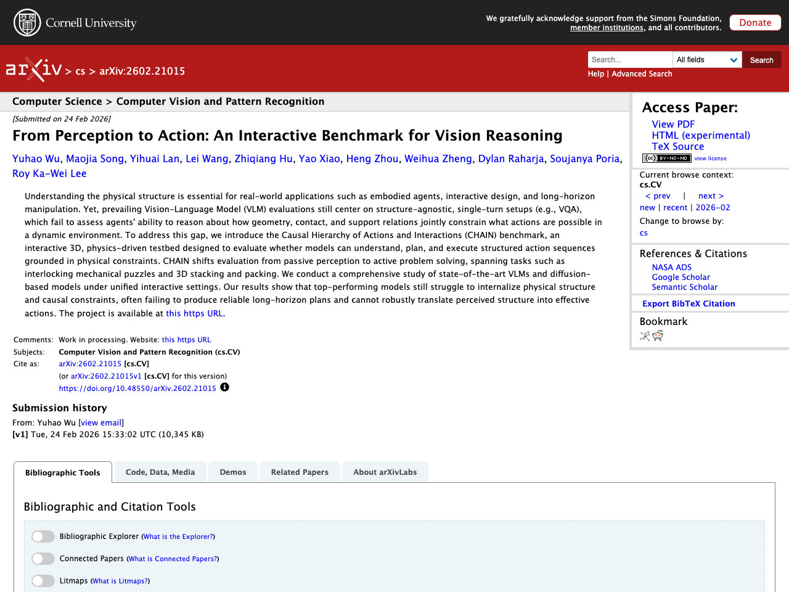

## はじめに

本記事は2026-02-26時点でのLLM関連の注目論文をまとめたものです。arXiv、Semantic Scholar、Hugging Face Daily Papersから自動収集し、Claude APIで日本語要約を生成しています。

## 1. Query-focused and Memory-aware Reranker for Long Context Processing

- **著者**: Yuqing Li, Jiangnan Li, Mo Yu, Guoxuan Ding, Zheng Lin ほか
- **公開日**: 2026-02-12
- **ソース**: [huggingface](https://arxiv.org/abs/2602.12192)
- **arXiv ID**: 2602.12192

### 要約

大規模言語モデルにおける検索ヘッド（retrieval heads）の分析に基づき、選択されたヘッドのアテンションスコアを用いてパッセージとクエリの関連性を推定するリランキングフレームワークを提案している。この手法はリストワイズ方式により候補リスト全体の情報を活用し、連続的な関連性スコアを自然に生成するため、Likertスケールの教師データを必要とせず任意の検索データセットで学習可能である。4Bパラメータ程度の小規模モデルでも高い性能を発揮する軽量なフレームワークであり、Wikipediaや長文ナラティブデータセットを含む複数ドメインで既存のポイントワイズ・リストワイズリランカーを上回る性能を達成した。さらに対話理解と記憶活用能力を評価するLoCoMoベンチマークで新たな最高性能を記録し、候補パッセージへの文脈情報の付加や中間層のアテンションヘッドの活用といった柔軟な拡張にも対応することを示した。


Built upon the existing analysis of retrieval heads in large language models, we propose an alternative reranking framework that trains models to estimate passage-query relevance using the attention scores of selected heads. This approach provides a listwise solution that leverages holistic information within the entire candidate shortlist during ranking. At the same time, it naturally produces continuous relevance scores, enabling training on arbitrary retrieval datasets without requiring Likert-scale supervision. Our framework is lightweight and effective, requiring only small-scale models (e.g., 4B parameters) to achieve strong performance. Extensive experiments demonstrate that our method outperforms existing state-of-the-art pointwise and listwise rerankers across multiple domains, including Wikipedia and long narrative datasets. It further establishes a new state-of-the-art on the LoCoMo benchmark that assesses the capabilities of dialogue understanding and memory usage. We further demonstrate that our framework supports flexible extensions. For example, augmenting candidate passages with contextual information further improves ranking accuracy, while training attention heads from middle layers enhances efficiency without sacrificing performance.


## 2. PyVision-RL: Forging Open Agentic Vision Models via RL

- **著者**: Shitian Zhao, Shaoheng Lin, Ming Li, Haoquan Zhang, Wenshuo Peng ほか
- **公開日**: 2026-02-24
- **ソース**: [huggingface](https://arxiv.org/abs/2602.20739)
- **arXiv ID**: 2602.20739

### 要約

強化学習によるエージェント型マルチモーダルモデルでは、モデルがツール使用やマルチターン推論を減らす「インタラクション崩壊」が課題となっている。本研究では、オープンウェイトのマルチモーダルモデル向け強化学習フレームワーク「PyVision-RL」を提案し、オーバーサンプリング・フィルタリング・ランキングによるロールアウト戦略と累積ツール報酬を組み合わせることで、崩壊を防ぎマルチターンのツール使用を促進する。統一的な学習パイプラインにより、画像理解用のPyVision-Imageと動画理解用のPyVision-Videoを開発した。特にPyVision-Videoでは、推論中にタスクに関連するフレームを選択的にサンプリングするオンデマンドコンテキスト構築により、視覚トークンの使用量を大幅に削減する。実験の結果、高い性能と効率の向上が確認され、持続的なインタラクションとオンデマンドの視覚処理がスケーラブルなマルチモーダルエージェントに不可欠であることが示された。


Reinforcement learning for agentic multimodal models often suffers from interaction collapse, where models learn to reduce tool usage and multi-turn reasoning, limiting the benefits of agentic behavior. We introduce PyVision-RL, a reinforcement learning framework for open-weight multimodal models that stabilizes training and sustains interaction. Our approach combines an oversampling-filtering-ranking rollout strategy with an accumulative tool reward to prevent collapse and encourage multi-turn tool use. Using a unified training pipeline, we develop PyVision-Image and PyVision-Video for image and video understanding. For video reasoning, PyVision-Video employs on-demand context construction, selectively sampling task-relevant frames during reasoning to significantly reduce visual token usage. Experiments show strong performance and improved efficiency, demonstrating that sustained interaction and on-demand visual processing are critical for scalable multimodal agents.


## 3. From Perception to Action: An Interactive Benchmark for Vision Reasoning

- **著者**: Yuhao Wu, Maojia Song, Yihuai Lan, Lei Wang, Zhiqiang Hu ほか
- **公開日**: 2026-02-24
- **ソース**: [huggingface](https://arxiv.org/abs/2602.21015)
- **arXiv ID**: 2602.21015

### 要約

現実世界の応用（embodiedエージェント、インタラクティブデザイン、長期的操作など）には物理的構造の理解が不可欠であるが、既存のVision-Language Model（VLM）評価は構造を考慮しない単一ターンの設定（VQAなど）に偏っており、動的環境における幾何学・接触・支持関係に基づく行動推論能力を適切に評価できていない。この課題に対し、著者らはCHAIN（Causal Hierarchy of Actions and Interactions）ベンチマークを提案した。これは物理シミュレーション駆動のインタラクティブな3Dテスト環境であり、モデルが物理的制約に基づいて構造化された行動系列を理解・計画・実行できるかを評価する。CHAINは受動的な知覚から能動的な問題解決へと評価を転換し、連動する機械パズルや3D積み上げ・パッキングなどのタスクを含む。最先端のVLMおよび拡散ベースモデルを統一的なインタラクティブ設定で評価した結果、トップモデルでさえ物理構造や因果的制約の内在化に苦戦し、信頼性のある長期計画の生成や、知覚した構造を効果的な行動に変換することが困難であることが明らかになった。


Understanding the physical structure is essential for real-world applications such as embodied agents, interactive design, and long-horizon manipulation. Yet, prevailing Vision-Language Model (VLM) evaluations still center on structure-agnostic, single-turn setups (e.g., VQA), which fail to assess agents' ability to reason about how geometry, contact, and support relations jointly constrain what actions are possible in a dynamic environment. To address this gap, we introduce the Causal Hierarchy of Actions and Interactions (CHAIN) benchmark, an interactive 3D, physics-driven testbed designed to evaluate whether models can understand, plan, and execute structured action sequences grounded in physical constraints. CHAIN shifts evaluation from passive perception to active problem solving, spanning tasks such as interlocking mechanical puzzles and 3D stacking and packing. We conduct a comprehensive study of state-of-the-art VLMs and diffusion-based models under unified interactive settings. Our results show that top-performing models still struggle to internalize physical structure and causal constraints, often failing to produce reliable long-horizon plans and cannot robustly translate perceived structure into effective actions. The project is available at https://social-ai-studio.github.io/CHAIN/.


## 4. Multi-Vector Index Compression in Any Modality

- **著者**: Hanxiang Qin, Alexander Martin, Rohan Jha, Chunsheng Zuo, Reno Kriz ほか
- **公開日**: 2026-02-24
- **ソース**: [huggingface](https://arxiv.org/abs/2602.21202)
- **arXiv ID**: 2602.21202

### 要約

本研究は、テキスト・画像・動画など任意のモダリティにおける遅延インタラクション型検索のための、効率的なマルチベクトルインデックス圧縮手法を提案している。遅延インタラクションは情報検索の主要なパラダイムとなっているが、計算コストとストレージコストが文書長に比例して増大するという課題がある。この問題に対し、クエリ非依存のマルチベクトル文書表現圧縮手法として、シーケンスリサイズ、メモリトークン、階層的プーリング、および新手法であるアテンション誘導クラスタリング（AGC）の4つのアプローチを提案している。AGCはアテンション機構を用いて文書中の意味的に重要な領域をクラスタ重心として特定し、トークン集約の重み付けを行う手法である。テキスト（BEIR）、視覚文書（ViDoRe）、動画（MSR-VTT、MultiVENT 2.0）の検索タスクで評価した結果、AGCは他のパラメトリック圧縮手法を一貫して上回り、非圧縮インデックスと同等以上の性能を達成した。


We study efficient multi-vector retrieval for late interaction in any modality. Late interaction has emerged as a dominant paradigm for information retrieval in text, images, visual documents, and videos, but its computation and storage costs grow linearly with document length, making it costly for image-, video-, and audio-rich corpora. To address this limitation, we explore query-agnostic methods for compressing multi-vector document representations under a constant vector budget. We introduce four approaches for index compression: sequence resizing, memory tokens, hierarchical pooling, and a novel attention-guided clustering (AGC). AGC uses an attention-guided mechanism to identify the most semantically salient regions of a document as cluster centroids and to weight token aggregation. Evaluating these methods on retrieval tasks spanning text (BEIR), visual-document (ViDoRe), and video (MSR-VTT, MultiVENT 2.0), we show that attention-guided clustering consistently outperforms other parameterized compression methods (sequence resizing and memory tokens), provides greater flexibility in index size than non-parametric hierarchical clustering, and achieves competitive or improved performance compared to a full, uncompressed index. The source code is available at: github.com/hanxiangqin/omni-col-press.


## 5. Learning Cross-View Object Correspondence via Cycle-Consistent Mask Prediction

- **著者**: Shannan Yan, Leqi Zheng, Keyu Lv, Jingchen Ni, Hongyang Wei ほか
- **公開日**: 2026-02-22
- **ソース**: [huggingface](https://arxiv.org/abs/2602.18996)
- **arXiv ID**: 2602.18996

### 要約

本研究では、動画中の異なる視点間（特に一人称視点と三人称視点の相互変換）におけるオブジェクトレベルの視覚的対応付けタスクに取り組んでいる。提案手法は条件付き二値セグメンテーションに基づくシンプルかつ効果的なフレームワークであり、クエリとなるオブジェクトマスクを潜在表現にエンコードし、ターゲット動画中の対応オブジェクトの位置特定を行う。視点に不変な頑健な表現を学習するため、サイクル整合性に基づく学習目的関数を導入し、ターゲット視点で予測されたマスクをソース視点に逆投影して元のクエリマスクを再構成する双方向制約を課している。この制約は正解アノテーションを必要としない強力な自己教師信号として機能し、推論時のテスト時学習（TTT）も可能にする。Ego-Exo4DおよびHANDAL-Xベンチマークでの実験により、提案手法の最適化目的関数とTTT戦略の有効性が示され、最先端の性能を達成した。


We study the task of establishing object-level visual correspondence across different viewpoints in videos, focusing on the challenging egocentric-to-exocentric and exocentric-to-egocentric scenarios. We propose a simple yet effective framework based on conditional binary segmentation, where an object query mask is encoded into a latent representation to guide the localization of the corresponding object in a target video. To encourage robust, view-invariant representations, we introduce a cycle-consistency training objective: the predicted mask in the target view is projected back to the source view to reconstruct the original query mask. This bidirectional constraint provides a strong self-supervisory signal without requiring ground-truth annotations and enables test-time training (TTT) at inference. Experiments on the Ego-Exo4D and HANDAL-X benchmarks demonstrate the effectiveness of our optimization objective and TTT strategy, achieving state-of-the-art performance. The code is available at https://github.com/shannany0606/CCMP.


---

*この記事は自動生成されています。論文の詳細は各ソースURLをご参照ください。*