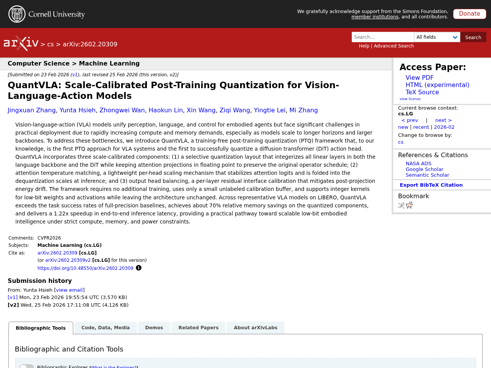
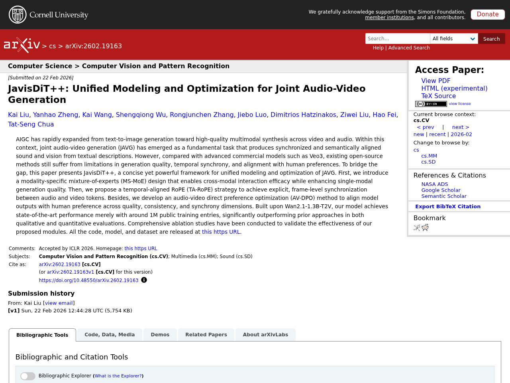

## はじめに

本記事は2026-02-27時点でのLLM関連の注目論文をまとめたものです。arXiv、Semantic Scholar、Hugging Face Daily Papersから自動収集し、Claude APIで日本語要約を生成しています。

## 1. GUI-Libra: Training Native GUI Agents to Reason and Act with Action-aware Supervision and Partially Verifiable RL

- **著者**: Rui Yang, Qianhui Wu, Zhaoyang Wang, Hanyang Chen, Ke Yang ほか
- **公開日**: 2026-02-25
- **ソース**: [huggingface](https://arxiv.org/abs/2602.22190)
- **arXiv ID**: 2602.22190

### 要約

オープンソースのネイティブGUIエージェントは、長期的なナビゲーションタスクにおいてクローズドソースシステムに依然として遅れを取っている。本研究では、その原因として高品質なアクション整合型推論データの不足と、GUIエージェント固有の課題を無視した汎用的な後段学習パイプラインの直接適用という2つの限界を特定した。提案手法GUI-Libraでは、81Kの精選されたGUI推論データセットの構築、推論とグラウンディングを両立させるアクション認識型SFT（推論→アクションと直接アクションのデータ混合およびトークン重み付け）、そして部分的検証可能性の下でRLを安定化させるためのKL正則化と成功適応型スケーリングを導入した。Web・モバイルの多様なベンチマークにおいて、ステップ単位の精度とエンドツーエンドのタスク完了率の両方で一貫した改善を達成し、コストのかかるオンラインデータ収集なしに大幅な性能向上が可能であることを示した。


Open-source native GUI agents still lag behind closed-source systems on long-horizon navigation tasks. This gap stems from two limitations: a shortage of high-quality, action-aligned reasoning data, and the direct adoption of generic post-training pipelines that overlook the unique challenges of GUI agents. We identify two fundamental issues in these pipelines: (i) standard SFT with CoT reasoning often hurts grounding, and (ii) step-wise RLVR-tyle training faces partial verifiability, where multiple actions can be correct but only a single demonstrated action is used for verification. This makes offline step-wise metrics weak predictors of online task success. In this work, we present GUI-Libra, a tailored training recipe that addresses these challenges. First, to mitigate the scarcity of action-aligned reasoning data, we introduce a data construction and filtering pipeline and release a curated 81K GUI reasoning dataset. Second, to reconcile reasoning with grounding, we propose action-aware SFT that mixes reasoning-then-action and direct-action data and reweights tokens to emphasize action and grounding. Third, to stabilize RL under partial verifiability, we identify the overlooked importance of KL regularization in RLVR and show that a KL trust region is critical for improving offline-to-online predictability; we further introduce success-adaptive scaling to downweight unreliable negative gradients. Across diverse web and mobile benchmarks, GUI-Libra consistently improves both step-wise accuracy and end-to-end task completion. Our results suggest that carefully designed post-training and data curation can unlock significantly stronger task-solving capabilities without costly online data collection. We release our dataset, code, and models to facilitate further research on data-efficient post-training for reasoning-capable GUI agents.


## 2. QuantVLA: Scale-Calibrated Post-Training Quantization for Vision-Language-Action Models

- **著者**: Jingxuan Zhang, Yunta Hsieh, Zhongwei Wang, Haokun Lin, Xin Wang ほか
- **公開日**: 2026-02-23
- **ソース**: [huggingface](https://arxiv.org/abs/2602.20309)
- **arXiv ID**: 2602.20309

### 要約

QuantVLAは、視覚・言語・行動（VLA）モデルに対する初の学習不要なポストトレーニング量子化（PTQ）フレームワークであり、拡散トランスフォーマー（DiT）アクションヘッドの量子化にも初めて成功した手法である。本フレームワークは、選択的量子化レイアウト、注意温度マッチング、出力ヘッドバランシングという3つのスケール校正コンポーネントを組み込んでおり、追加学習なしに少量のラベルなしキャリブレーションデータのみで適用可能である。LIBEROベンチマーク上の代表的なVLAモデルにおいて、QuantVLAはフル精度ベースラインのタスク成功率を上回りつつ、量子化コンポーネントで約70%のメモリ削減と1.22倍のエンドツーエンド推論高速化を達成し、計算・メモリ・電力制約下でのスケーラブルな低ビット身体知能への実用的な道筋を示した。


Vision-language-action (VLA) models unify perception, language, and control for embodied agents but face significant challenges in practical deployment due to rapidly increasing compute and memory demands, especially as models scale to longer horizons and larger backbones. To address these bottlenecks, we introduce QuantVLA, a training-free post-training quantization (PTQ) framework that, to our knowledge, is the first PTQ approach for VLA systems and the first to successfully quantize a diffusion transformer (DiT) action head. QuantVLA incorporates three scale-calibrated components: (1) a selective quantization layout that integerizes all linear layers in both the language backbone and the DiT while keeping attention projections in floating point to preserve the original operator schedule; (2) attention temperature matching, a lightweight per-head scaling mechanism that stabilizes attention logits and is folded into the dequantization scales at inference; and (3) output head balancing, a per-layer residual interface calibration that mitigates post-projection energy drift. The framework requires no additional training, uses only a small unlabeled calibration buffer, and supports integer kernels for low-bit weights and activations while leaving the architecture unchanged. Across representative VLA models on LIBERO, QuantVLA exceeds the task success rates of full-precision baselines, achieves about 70% relative memory savings on the quantized components, and delivers a 1.22x speedup in end-to-end inference latency, providing a practical pathway toward scalable low-bit embodied intelligence under strict compute, memory, and power constraints.


## 3. VecGlypher: Unified Vector Glyph Generation with Language Models

- **著者**: Xiaoke Huang, Bhavul Gauri, Kam Woh Ng, Tony Ng, Mengmeng Xu ほか
- **公開日**: 2026-02-25
- **ソース**: [huggingface](https://arxiv.org/abs/2602.21461)
- **arXiv ID**: 2602.21461

### 要約

ベクターグリフ（デジタルタイポグラフィの基本単位）の生成において、従来の学習ベース手法は手作業で用意した見本シートやラスター・ベクター変換の後処理に依存しており、アクセシビリティや編集性に制約があった。本論文では、テキスト記述や画像見本から高品質なベクターグリフをSVGパストークンとして直接自己回帰的に生成するマルチモーダル言語モデル「VecGlypher」を提案する。学習には、39Kのノイズを含むEnvatoフォントによる大規模継続学習でSVG構文と長距離の幾何構造を習得した後、2.5Kの専門家アノテーション付きGoogle Fontsで言語・画像と幾何情報の整合を図る2段階レシピを採用している。クロスファミリーの分布外評価において、テキストのみの生成では汎用LLMや専門ベースラインを大幅に上回り、画像参照生成ではDeepVecFont-v2やDualVectorを超える最先端性能を達成した。本手法により、ユーザーは言葉や見本画像だけでフォントを設計でき、将来のマルチモーダルデザインツールへのスケーラブルな基盤を提供する。


Vector glyphs are the atomic units of digital typography, yet most learning-based pipelines still depend on carefully curated exemplar sheets and raster-to-vector postprocessing, which limits accessibility and editability. We introduce VecGlypher, a single multimodal language model that generates high-fidelity vector glyphs directly from text descriptions or image exemplars. Given a style prompt, optional reference glyph images, and a target character, VecGlypher autoregressively emits SVG path tokens, avoiding raster intermediates and producing editable, watertight outlines in one pass. A typography-aware data and training recipe makes this possible: (i) a large-scale continuation stage on 39K noisy Envato fonts to master SVG syntax and long-horizon geometry, followed by (ii) post-training on 2.5K expert-annotated Google Fonts with descriptive tags and exemplars to align language and imagery with geometry; preprocessing normalizes coordinate frames, canonicalizes paths, de-duplicates families, and quantizes coordinates for stable long-sequence decoding. On cross-family OOD evaluation, VecGlypher substantially outperforms both general-purpose LLMs and specialized vector-font baselines for text-only generation, while image-referenced generation reaches a state-of-the-art performance, with marked gains over DeepVecFont-v2 and DualVector. Ablations show that model scale and the two-stage recipe are critical and that absolute-coordinate serialization yields the best geometry. VecGlypher lowers the barrier to font creation by letting users design with words or exemplars, and provides a scalable foundation for future multimodal design tools.


## 4. JavisDiT++: Unified Modeling and Optimization for Joint Audio-Video Generation

- **著者**: Kai Liu, Yanhao Zheng, Kai Wang, Shengqiong Wu, Rongjunchen Zhang ほか
- **公開日**: 2026-02-22
- **ソース**: [huggingface](https://arxiv.org/abs/2602.19163)
- **arXiv ID**: 2602.19163

### 要約

AIGCがテキストから画像生成を超えて動画・音声のマルチモーダル合成へと拡大する中、テキスト記述から同期・意味整合された音声と映像を同時生成する「共同音声動画生成（JAVG）」が重要な課題となっている。本論文では、JavisDiT++というJAVGの統一的なモデリングと最適化フレームワークを提案し、モダリティ固有のMixture-of-Experts（MS-MoE）設計によりクロスモーダルな相互作用を促進しつつ単一モダリティの生成品質を向上させている。さらに、音声・動画トークン間のフレームレベルでの明示的な時間同期を実現するTemporal-Aligned RoPE（TA-RoPE）戦略と、品質・一貫性・同期性の各次元で人間の選好にモデル出力を整合させるAudio-Video Direct Preference Optimization（AV-DPO）手法を導入している。Wan2.1-1.3B-T2Vをベースとし、約100万件の公開データのみで学習した本モデルは、定性的・定量的評価の両面で既存手法を大幅に上回り、最先端の性能を達成した。


AIGC has rapidly expanded from text-to-image generation toward high-quality multimodal synthesis across video and audio. Within this context, joint audio-video generation (JAVG) has emerged as a fundamental task that produces synchronized and semantically aligned sound and vision from textual descriptions. However, compared with advanced commercial models such as Veo3, existing open-source methods still suffer from limitations in generation quality, temporal synchrony, and alignment with human preferences. To bridge the gap, this paper presents JavisDiT++, a concise yet powerful framework for unified modeling and optimization of JAVG. First, we introduce a modality-specific mixture-of-experts (MS-MoE) design that enables cross-modal interaction efficacy while enhancing single-modal generation quality. Then, we propose a temporal-aligned RoPE (TA-RoPE) strategy to achieve explicit, frame-level synchronization between audio and video tokens. Besides, we develop an audio-video direct preference optimization (AV-DPO) method to align model outputs with human preference across quality, consistency, and synchrony dimensions. Built upon Wan2.1-1.3B-T2V, our model achieves state-of-the-art performance merely with around 1M public training entries, significantly outperforming prior approaches in both qualitative and quantitative evaluations. Comprehensive ablation studies have been conducted to validate the effectiveness of our proposed modules. All the code, model, and dataset are released at https://JavisVerse.github.io/JavisDiT2-page.


## 5. DualPath: Breaking the Storage Bandwidth Bottleneck in Agentic LLM Inference

- **著者**: Yongtong Wu, Shaoyuan Chen, Yinmin Zhong, Rilin Huang, Yixuan Tan ほか
- **公開日**: 2026-02-25
- **ソース**: [huggingface](https://arxiv.org/abs/2602.21548)
- **arXiv ID**: 2602.21548

### 要約

マルチターンのエージェント型LLM推論では、KVキャッシュのストレージI/Oが性能のボトルネックとなっており、分離型アーキテクチャにおいてプリフィルエンジンのストレージNICが帯域飽和する一方、デコードエンジン側は遊休状態になるという非対称性が生じている。本論文では、この問題を解決するDualPathを提案し、従来のストレージからプリフィルへの経路に加え、ストレージからデコードエンジンを経由しRDMAでプリフィルエンジンへ転送する新たな経路を導入する。この二重経路方式はネットワーク輻輳やレイテンシに敏感なモデル実行通信への干渉を回避でき、さらにグローバルスケジューラによりプリフィル・デコードエンジン間の負荷を動的に分散する。本番のエージェント型ワークロードを用いた3モデルでの評価では、オフライン推論スループットが最大1.87倍、オンラインサービングスループットがSLOを維持しつつ平均1.96倍に向上した。


The performance of multi-turn, agentic LLM inference is increasingly dominated by KV-Cache storage I/O rather than computation. In prevalent disaggregated architectures, loading the massive KV-Cache from external storage creates a fundamental imbalance: storage NICs on prefill engines become bandwidth-saturated, while those on decoding engines remain idle. This asymmetry severely constrains overall system throughput.
  We present DualPath, an inference system that breaks this bottleneck by introducing dual-path KV-Cache loading. Beyond the traditional storage-to-prefill path, DualPath enables a novel storage-to-decode path, in which the KV-Cache is loaded into decoding engines and then efficiently transferred to prefill engines via RDMA over the compute network. DualPath combines this optimized data path -- which inherently avoids network congestion and avoids interference with latency-critical model execution communications -- with a global scheduler that dynamically balances load across prefill and decode engines.
  Our evaluation on three models with production agentic workloads demonstrates that DualPath improves offline inference throughput by up to 1.87times on our in-house inference system. It can also improve online serving throughput by an average factor of 1.96times without violating SLO.


---

*この記事は自動生成されています。論文の詳細は各ソースURLをご参照ください。*