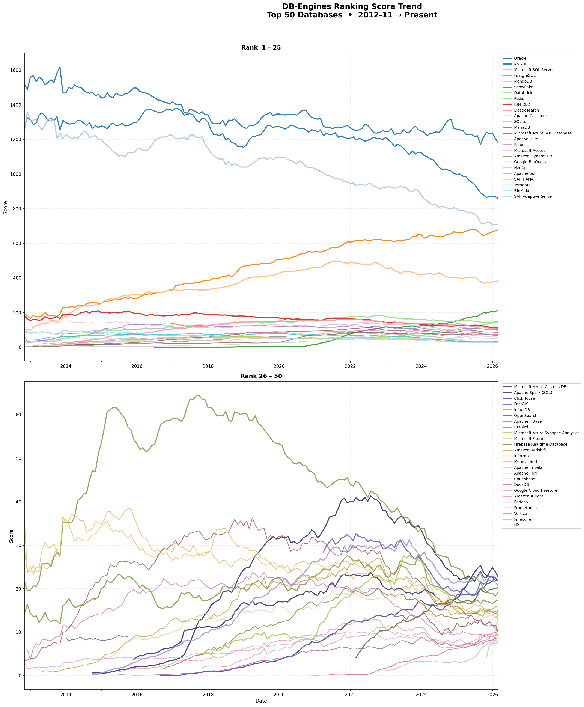
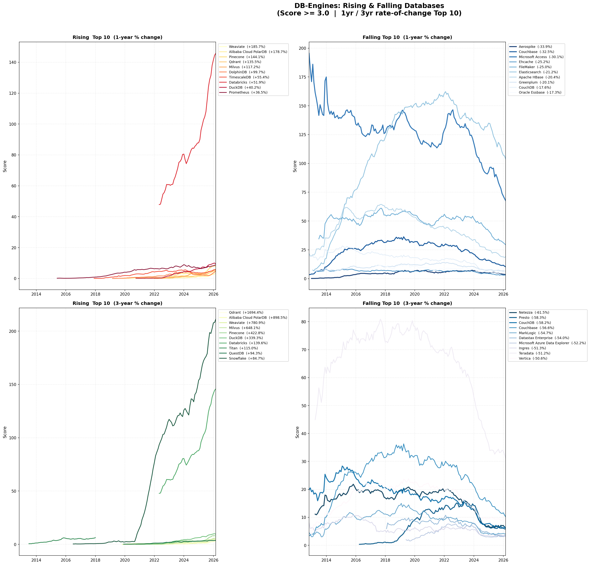

## はじめに

[DB-Engines](https://db-engines.com/en/ranking) はデータベース管理システムの人気を毎月計測・公開しているサービスで、2012年11月から継続的にスコアを追跡している。スコアはGoogle・Bingなどの検索エンジンヒット数、Google Trends、Stack Overflowの言及数、LinkedInのプロフィール件数、Indeed・Simply Hiredの求人数、Twitterの言及数を標準化・集計して算出される。実際のインストール数や利用数を直接測定するものではなく、「どれだけ話題にされているか」を反映した指標となっている。

本記事では2026年3月時点のデータを使い、上位50件の長期推移と急上昇・急下降しているデータベースを整理する。

## 調査方法

DB-Enginesのトレンドページ（`/en/ranking_trend`）に埋め込まれているJavaScriptデータをPythonでスクレイピングし、matplotlibで可視化した。データは2012年11月から2026年3月まで月次で記録されており、487件のDBシステムが収録されている。

分析対象の絞り込みは以下の条件で行った。

| 条件 | 内容 |
|------|------|
| 上位50件の推移 | 2026年3月時点のスコアで上位50件を抽出 |
| モメンタム分析 | スコア3.0以上かつ直近1年・3年の変化率を算出 |
| 対象除外 | スコア3.0未満のマイナーDBはノイズが大きいため除外 |

スクリプトは以下で公開している。

- `dbengines_top50_trend.py` — 上位50件の推移グラフを生成
- `dbengines_momentum.py` — 急上昇・急下降分析グラフを生成

## 上位50件のスコア推移

2026年3月時点のTop 50は以下の通り。

| 順位 | DB名 | スコア |
|------|------|--------|
| 1 | Oracle | 1182.46 |
| 2 | MySQL | 858.34 |
| 3 | Microsoft SQL Server | 711.47 |
| 4 | PostgreSQL | 680.08 |
| 5 | MongoDB | 383.58 |
| 6 | Snowflake | 211.24 |
| 7 | Databricks | 145.81 |
| 8 | Redis | 145.19 |
| 9 | IBM Db2 | 111.38 |
| 10 | Elasticsearch | 103.58 |
| 11 | Apache Cassandra | 101.88 |
| 12 | SQLite | 95.97 |
| 13 | MariaDB | 87.00 |
| 14 | Microsoft Azure SQL Database | 73.92 |
| 15 | Apache Hive | 72.95 |
| 16 | Splunk | 72.21 |
| 17 | Microsoft Access | 67.56 |
| 18 | Amazon DynamoDB | 65.42 |
| 19 | Google BigQuery | 55.82 |
| 20 | Neo4j | 47.32 |
| 21 | Apache Solr | 32.79 |
| 22 | SAP HANA | 32.09 |
| 23 | Teradata | 31.08 |
| 24 | FileMaker | 29.31 |
| 25 | SAP Adaptive Server | 25.53 |
| 26 | Microsoft Azure Cosmos DB | 22.75 |
| 27 | Apache Spark (SQL) | 22.07 |
| 28 | ClickHouse | 22.01 |
| 29 | PostGIS | 21.88 |
| 30 | InfluxDB | 20.73 |
| 31 | OpenSearch | 20.27 |
| 32 | Apache HBase | 19.18 |
| 33 | Firebird | 17.44 |
| 34 | Microsoft Azure Synapse Analytics | 15.98 |
| 35 | Microsoft Fabric | 15.12 |
| 36 | Firebase Realtime Database | 15.11 |
| 37 | Amazon Redshift | 14.25 |
| 38 | Informix | 13.78 |
| 39 | Memcached | 13.68 |
| 40 | Apache Impala | 12.67 |
| 41 | Apache Flink | 10.25 |
| 42 | Couchbase | 10.15 |
| 43 | DuckDB | 9.41 |
| 44 | Google Cloud Firestore | 9.29 |
| 45 | Amazon Aurora | 9.16 |
| 46 | Endeca | 9.08 |
| 47 | Prometheus | 8.71 |
| 48 | Vertica | 8.39 |
| 49 | Pinecone | 7.74 |
| 50 | H2 | 7.56 |

下図はRank 1–25（上段）とRank 26–50（下段）の長期スコア推移。

*DB-Engines — 上位50件のスコア推移（2012年11月〜2026年3月）*

長期トレンドから読み取れる主な変化を整理する。

| DB | 傾向 | 備考 |
|----|------|------|
| Oracle | 漸減 | 2013年頃をピークに長期低下。依然1位 |
| MySQL | 漸減 | 2位を維持するが絶対値は縮小傾向 |
| PostgreSQL | 緩やかに上昇 | MySQL との差を着実に縮めている |
| Snowflake | 急成長 | 2016年からDB-Enginesに登場。2020年IPO前後に急上昇し6位まで到達 |
| Databricks | 急成長 | 2020年以降に急伸。7位 |
| MongoDB | 安定 | NoSQL勢の中で唯一Top 5を維持 |

## 急上昇データベース

スコア3.0以上を対象に、直近1年・3年の変化率を算出した。

*DB-Engines — 急上昇・急下降ランキング（スコア3.0以上、1年・3年変化率 Top 10）*

### 直近1年（2025年3月→2026年3月）

| 順位 | DB名 | カテゴリ | 最新スコア | 1年前 | 変化率 |
|------|------|---------|-----------|-------|--------|
| 1 | Weaviate | ベクトルDB | 4.52 | 1.58 | +186% |
| 2 | Alibaba Cloud PolarDB | クラウドRDB | 3.31 | 1.19 | +179% |
| 3 | Pinecone | ベクトルDB | 7.74 | 3.17 | +144% |
| 4 | Qdrant | ベクトルDB | 4.79 | 2.03 | +136% |
| 5 | Milvus | ベクトルDB | 6.02 | 2.77 | +117% |
| 6 | DolphinDB | 時系列DB | 4.58 | 2.29 | +100% |
| 7 | TimescaleDB | 時系列DB | 5.42 | 3.48 | +55% |
| 8 | Databricks | クラウドDWH | 145.81 | 96.01 | +52% |
| 9 | DuckDB | 組み込み分析DB | 9.41 | 6.71 | +40% |
| 10 | Prometheus | 時系列DB | 8.71 | 6.38 | +37% |

1年変化率の上位はベクトルDB（Weaviate・Pinecone・Qdrant・Milvus）が独占している。いずれもRAG（Retrieval-Augmented Generation）やセマンティック検索の基盤として採用が増えており、生成AIブームの需要を直接吸収している形となる。

DuckDBは+40%と安定した伸びを継続。インプロセス分析エンジンとして、Snowflakeコストの削減やローカル分析基盤として採用が広がっている。

### 直近3年（2023年3月→2026年3月）

| 順位 | DB名 | カテゴリ | 最新スコア | 3年前 | 変化率 |
| --- | --- | --- | --- | --- | --- |
| 1 | Qdrant | ベクトルDB | 4.79 | 0.27 | +1694% |
| 2 | Weaviate | ベクトルDB | 4.52 | 0.51 | +781% |
| 3 | Milvus | ベクトルDB | 6.02 | 0.81 | +648% |
| 4 | Pinecone | ベクトルDB | 7.74 | 1.48 | +423% |
| 5 | DuckDB | 組み込み分析DB | 9.41 | 2.14 | +339% |
| 6 | Databricks | クラウドDWH | 145.81 | 60.86 | +140% |
| 7 | QuestDB | 時系列DB | 3.66 | 1.89 | +94% |
| 8 | Snowflake | クラウドDWH | 211.24 | 114.40 | +85% |

3年スパンで見るとベクトルDB4強の台頭がより鮮明になる。Qdrantは3年前のスコアが0.27から4.79へ、約17倍。DuckDBも3年で4.4倍に成長しており、2023年以前とは明らかに異なるカーブを描いている。

## 急下降データベース

### 直近1年（2025年3月→2026年3月）

| 順位 | DB名 | カテゴリ | 最新スコア | 1年前 | 変化率 |
| --- | --- | --- | --- | --- | --- |
| 1 | Aerospike | NoSQL (Key-Value) | 3.45 | 5.22 | -34% |
| 2 | Couchbase | NoSQL (Document) | 10.15 | 15.05 | -33% |
| 3 | Microsoft Access | デスクトップRDB | 67.56 | 96.72 | -30% |
| 4 | FileMaker | デスクトップRDB | 29.31 | 39.06 | -25% |
| 5 | Ehcache | インメモリキャッシュ | 3.16 | 4.22 | -25% |
| 6 | Elasticsearch | 検索エンジン | 103.58 | 131.38 | -21% |
| 7 | Apache HBase | NoSQL (Wide Column) | 19.18 | 24.08 | -20% |
| 8 | Greenplum | MPP分析DB | 6.26 | 7.83 | -20% |
| 9 | CouchDB | NoSQL (Document) | 6.05 | 7.34 | -17% |
| 10 | Oracle Essbase | OLAP/多次元DB | 4.54 | 5.49 | -17% |

Elasticsearchは-21%と大きく落としている。フルテキスト検索用途がOpenSearch（Elasticsearchのフォーク）や各クラウドマネージドサービスへ分散している影響が考えられる。Microsoft Access（-30%）・FileMaker（-25%）といったレガシーデスクトップDBの退場も続いている。

### 直近3年（2023年3月→2026年3月）

| 順位 | DB名 | カテゴリ | 最新スコア | 3年前 | 変化率 |
| --- | --- | --- | --- | --- | --- |
| 1 | Netezza | オンプレDWH | 6.28 | 16.31 | -62% |
| 2 | Presto | 分散クエリエンジン | 5.79 | 13.89 | -58% |
| 3 | CouchDB | NoSQL (Document) | 6.05 | 14.46 | -58% |
| 4 | Couchbase | NoSQL (Document) | 10.15 | 23.36 | -57% |
| 5 | MarkLogic | NoSQL (Document/XML) | 4.02 | 8.87 | -55% |
| 6 | DataStax Enterprise | NoSQL (Wide Column) | 3.37 | 7.33 | -54% |
| 7 | Teradata | オンプレDWH | 31.08 | 63.74 | -51% |
| 8 | Vertica | オンプレ分析DB | 8.39 | 16.98 | -51% |

3年スパンでは、Hadoopエコシステムと密接に関連していたオンプレDWHや分散クエリエンジンの下落が目立つ。いずれもオンプレミス前提のアーキテクチャで競争力を失い、クラウドネイティブな設計への置き換えが進んでいる構図が見える。

## 考察

今回のデータから浮かび上がるトレンドを3点整理する。

**1. 生成AIがベクトルDB需要を直接牽引している**

Qdrant・Weaviate・Milvus・Pineconeの4つはいずれも2023年前後からスコアが急上昇しており、ChatGPT登場後のRAGアーキテクチャ採用拡大と時期が一致する。これらはRDBMSや汎用NoSQLの代替ではなく、LLMアプリケーションのインフラとして独自の需要を創出している。

**2. DuckDBはクラウドDWH代替の文脈で注目を集めている**

DuckDBの3年変化率+339%は、分析用途においてクラウドDWHのコスト削減代替として採用が広がっていることを反映している。インプロセスで動作するためインフラが不要で、小〜中規模の分析ワークロードであれば十分な性能を発揮できる。

**3. レガシーDWH・Hadoopエコシステムの退場が加速している**

オンプレDWHや分散クエリエンジンはいずれも3年で-50%超の下落。オンプレミス前提のアーキテクチャやHadoopエコシステムと密接に関連していた処理系はクラウドネイティブな設計に対して競争力を失い、エンジニアの関心が急速に薄れていることがDB-Enginesのスコアにも反映されている。

## まとめ

- **上位50件の長期推移**: Oracle・MySQL・SQL Serverが漸減、PostgreSQLが緩やかに上昇、Snowflake・Databricksが急成長
- **急上昇（1年）**: ベクトルDB4強（Weaviate・Pinecone・Qdrant・Milvus）が+100〜+186%。AIブームの直撃
- **急上昇（3年）**: Qdrant +1694%、DuckDB +339%。構造的な変化として定着しつつある
- **急下降**: レガシーDWH（Teradata・Netezza）が3年で-50%超。NoSQL第一世代（Couchbase・CouchDB）も退潮

## 参考資料






