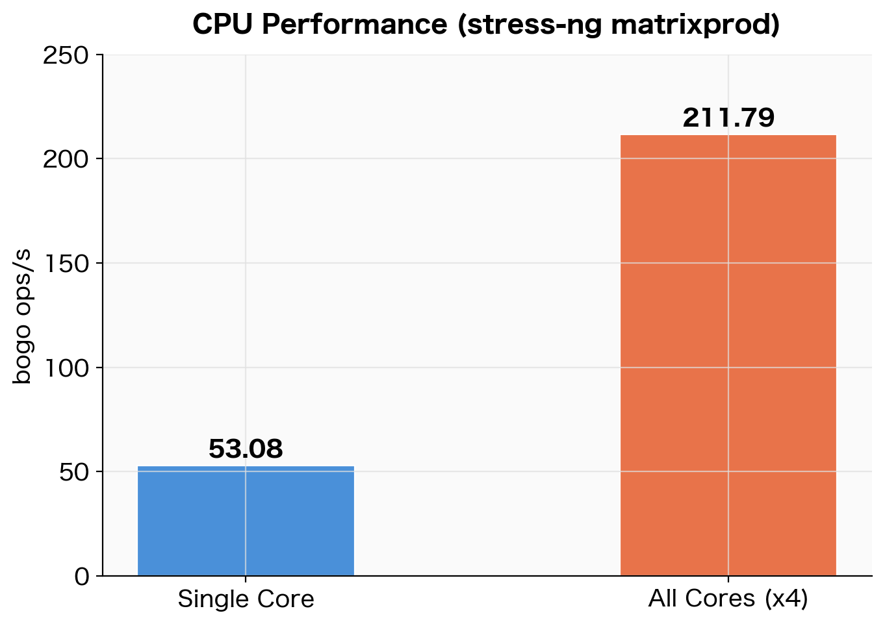
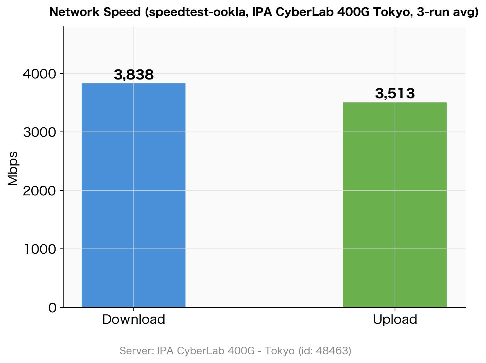

## はじめに

[Oracle Cloud Always Free](https://www.oracle.com/jp/cloud/free/) では、ARM64アーキテクチャの [Ampere A1 Compute](https://www.oracle.com/jp/cloud/compute/arm/) インスタンスを無料で利用できる。CPUコアとメモリを一定量まで永続無料で使えるため、個人用途やCI/CDの実行基盤として活用している人も多い。

本記事では、このARM64インスタンスのCPU・暗号処理・メモリ・ディスクI/O・ネットワーク速度を、`stress-ng`・`fio`・`openssl speed`・`speedtest` を使って3回計測し、その平均値をまとめる。

## 計測環境とツール

OS は Oracle Linux 9.6、カーネルは aarch64 (ARM64)。

```bash
$ uname -a
Linux oci-free 6.12.0-1.23.3.2.el9uek.aarch64 #1 SMP ... aarch64 GNU/Linux

$ lscpu | grep -E 'Model name|CPU\(s\)'
CPU(s):   4
Model name: Neoverse-N1
```

使用ツールと役割は以下のとおり。

| ツール | 用途 | インストール |
| --- | --- | --- |
| stress-ng | CPU・メモリ負荷テスト | `dnf install stress-ng` |
| fio | ディスクI/O計測 | `dnf install fio` |
| openssl speed | 暗号処理スループット | 標準インストール済み |
| speedtest | ネットワーク速度計測 | Ookla 公式バイナリ |

`stress-ng` と `fio` は EPEL リポジトリ経由で入手できる。

```bash
sudo dnf install -y epel-release
sudo dnf install -y stress-ng fio
```

各項目を3回計測し、平均値を使用している。

## CPU性能

`stress-ng` の `matrixprod`（行列積）ストレッサーで30秒間負荷をかけ、bogo ops/s を計測した。

```bash
# シングルコア
stress-ng --cpu 1 --cpu-method matrixprod --metrics-brief --timeout 30s

# 全コア (4)
stress-ng --cpu 4 --cpu-method matrixprod --metrics-brief --timeout 30s
```

```text
stress-ng: metrc: cpu  1609  30.09  30.06  0.00  53.48  53.53
stress-ng: metrc: cpu  6401  30.07  119.64  0.04  212.90  53.49
```

| 計測種別 | bogo ops/s（3回平均） |
| --- | --- |
| シングルコア | 53.08 |
| 全コア (4) | 211.79 |
| スケーリング比 | 3.99倍 |


*stress-ng matrixprod による CPU ベンチマーク結果（3回平均）*

シングルコアからフルコアへのスケーリング効率はほぼ4倍で、コア間の干渉がほとんど発生していない。Neoverse-N1 はシングルスレッド性能を犠牲にせずにコア数を増やす設計のため、この結果は理にかなっている。

なお bogo ops/s は stress-ng 固有の擬似指標であり、異なるストレッサー間での比較はできない。ここでは同一ストレッサー（matrixprod）での相対的なスケーリング効率の確認を目的としている。

## 暗号処理性能

`openssl speed` で AES-256-CBC と SHA-256 のスループットを計測した。Neoverse-N1 はハードウェアAES命令（ARMv8 Cryptography Extensions）を搭載しており、ソフトウェア実装と比較して大幅に高速化される。

```bash
openssl speed aes-256-cbc sha256
```

```text
sha256           72255.22k   261173.17k   740627.88k  1369694.87k  1817938.60k  1869770.57k
aes-256-cbc     834545.80k  1378167.23k  1615928.85k  1677753.69k  1700137.64k  1702980.27k
```

出力の各列はブロックサイズ（16B / 64B / 256B / 1KB / 8KB / 16KB）に対応している。

| アルゴリズム | 16KBブロック（3回平均） |
| --- | --- |
| AES-256-CBC | 1,705,589 KB/s（≒ 1.71 GB/s） |
| SHA-256 | 1,870,470 KB/s（≒ 1.87 GB/s） |

16KBブロックでの AES-256-CBC が約 **1.71 GB/s** というのは、HTTPS や VPN などの暗号化処理をほぼノーコストで行えるスループット水準となる。

## メモリ性能

`stress-ng` の `--vm` ストレッサーで4GBのワーキングセットに対して読み書きを繰り返し、スループットを計測した。

```bash
stress-ng --vm 1 --vm-bytes 4G --metrics-brief --timeout 30s
```

```text
stress-ng: metrc: vm  1324315  30.23  26.54  3.65  43810.44  43868.81
```

| 計測 | bogo ops/s（3回平均） |
| --- | --- |
| メモリ読み書き（4GBワーキングセット） | 42,896 |

3回計測のうち1回で他プロセスとの競合が発生したと思われる低い値が出たが（38,748 bogo ops/s）、残り2回は44,000〜46,000台で安定していた。

## ディスクI/O性能

`fio` で `/home` ボリューム（100GB）のシーケンシャルおよびランダムI/Oを計測した。

```bash
# シーケンシャル書き込み
fio --name=seq_write --directory=/home/opc/fio_test \
    --rw=write --bs=1M --size=2G --numjobs=1 \
    --time_based --runtime=30 --iodepth=16 --ioengine=libaio --direct=1 --group_reporting

# シーケンシャル読み込み
fio --name=seq_read --directory=/home/opc/fio_test \
    --rw=read --bs=1M --size=2G --numjobs=1 \
    --time_based --runtime=30 --iodepth=16 --ioengine=libaio --direct=1 --group_reporting

# ランダム4K 読み書き
fio --name=rand_rw --directory=/home/opc/fio_test \
    --rw=randrw --bs=4k --size=1G --numjobs=4 \
    --time_based --runtime=30 --iodepth=32 --ioengine=libaio --direct=1 --group_reporting
```

```text
# シーケンシャル書き込み
WRITE: bw=51.0MiB/s (53.5MB/s), io=2049MiB, run=40179msec

# シーケンシャル読み込み
READ: bw=46.9MiB/s (49.2MB/s), io=1411MiB, run=30059msec

# ランダム 4K
read: IOPS=4071, BW=15.9MiB/s
write: IOPS=4094, BW=16.0MiB/s
```

| 計測種別 | 結果（3回平均） |
| --- | --- |
| シーケンシャル書き込み | 49.7 MiB/s |
| シーケンシャル読み込み | 46.9 MiB/s |
| ランダム4K Read IOPS | 3,977 |
| ランダム4K Write IOPS | 3,999 |


*fio によるディスク I/O ベンチマーク結果（3回平均）*

シーケンシャルは約50 MiB/s、ランダム4KのIOPSは約4,000という結果となった。

### なぜこの数字になるのか

OCI Block Volume の「Balanced」ティア（デフォルト）の性能はボリュームサイズに比例する。

| 指標 | Balanced ティアの計算式 | 100GBでの上限 |
| --- | --- | --- |
| スループット | 480 KB/s × GB | **47.0 MiB/s** |
| IOPS | 60 IOPS × GB | **6,000 IOPS** |

今回の実測値と上限を比較すると次のとおり。

| 計測結果 | OCI 上限 | 比率 |
| --- | --- | --- |
| Seq Read: 46.9 MiB/s | 47.0 MiB/s | 99.8%（上限に到達） |
| Seq Write: 49.7 MiB/s | 47.0 MiB/s | ほぼ上限（書き込みバッファ効果） |
| 4K Read IOPS: 3,977 | 6,000 IOPS | 66% |

「遅い環境」ではなく「Balanced ストレージの性能限界まで出し切っている」状態となる。参考として他クラウドのブロックストレージと比較すると以下のとおり。

| サービス | シーケンシャル | IOPS |
| --- | --- | --- |
| OCI Always Free (Balanced, 100GB) | ~47 MiB/s | ~6,000 |
| AWS gp3 EBS（デフォルト） | 125 MiB/s | 3,000 |
| AWS gp2 EBS（100GB） | 128 MiB/s | 300（burst 3,000） |

AWS gp3 と比べると約1/3 のスループットになるが、用途によっては問題にならない。

| 用途 | 判定 |
| --- | --- |
| ログ集約、定期バッチ | 問題なし |
| 軽量Webサーバ・APIサーバ | 問題なし |
| 大量データの ETL（GB 単位） | ボトルネックになりうる |
| DB のランダム I/O ヘビー処理 | 厳しい |

## ネットワーク速度

Ookla 公式の `speedtest` CLI を使い、東京の固定サーバ（IPA CyberLab 400G, id: 48463）に接続して計測した。接続先を固定することで、サーバ選択による結果のばらつきを排除している。

```bash
speedtest --server-id=48463 --accept-license --accept-gdpr
```

```text
Server: IPA CyberLab 400G - Tokyo (id: 48463)
   ISP: Oracle Cloud
Idle Latency:  1.76 ms
    Download:  3829.18 Mbps
      Upload:  3977.41 Mbps
 Packet Loss:  0.0%
```

| 計測 | 結果（3回平均） |
| --- | --- |
| Idle Latency | 1.88 ms |
| Download | 3,838 Mbps |
| Upload | 3,513 Mbps |


*speedtest（IPA CyberLab 400G Tokyo）によるネットワーク速度計測結果（3回平均）*

Download は3回とも 3,790〜3,860 Mbps で安定しており、OCI のネットワーク帯域が約 **3.8 Gbps** 出ていることがわかる。Upload は計測ごとにやや変動があるが、平均 3.5 Gbps 超を記録した。

## 結果サマリー

| 指標 | 計測値（3回平均） |
| --- | --- |
| CPU シングルコア | 53.08 bogo ops/s |
| CPU 全コア (4) | 211.79 bogo ops/s（スケーリング効率 3.99倍） |
| AES-256-CBC 16KB | 1,705,589 KB/s（≒ 1.71 GB/s） |
| SHA-256 16KB | 1,870,470 KB/s（≒ 1.87 GB/s） |
| メモリ（4GB WS） | 42,896 bogo ops/s |
| Disk Seq Write | 49.7 MiB/s |
| Disk Seq Read | 46.9 MiB/s |
| Disk 4K Read IOPS | 3,977 |
| Disk 4K Write IOPS | 3,999 |
| ネットワーク DL | 3,838 Mbps |
| ネットワーク UL | 3,513 Mbps |

## まとめ

OCI Always Free ARM64インスタンスのベンチマーク結果をまとめると以下のとおり。

- **CPU**: コアあたりのスループットは控えめだが、4コアのスケーリング効率がほぼ100%で、並列処理に向いている
- **暗号処理**: ハードウェアAES命令によりAES-256-CBCが1.71 GB/s出るため、TLS終端や暗号化ストレージの用途に適している
- **ディスク**: シーケンシャル約50 MiB/s・ランダム4K約4,000 IOPSはBalancedティアの上限値で、クラウドブロックストレージとして標準的な水準
- **ネットワーク**: 固定サーバ計測で Download **3.8 Gbps** を記録。無料枠とは思えない帯域で、大容量データの転送や高トラフィックなWebサービスにも十分対応できる

完全無料で使える環境としては十分な性能を持っており、軽量Webサーバ・定期バッチ処理・データ分析基盤など多様な用途に活用できる。

## 参考資料






