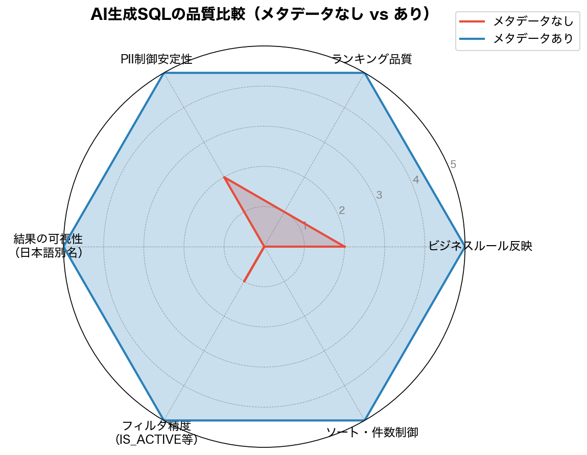

## はじめに

「メタデータをきちんと整備すれば、AIエージェントが生成するSQLの品質が上がる」という話はよく聞く。しかし実際にどの程度変わるのか、具体的な差分を検証した例は少ない。

この記事では Snowflake の小売業サンプルデータ（`RETAIL_SAMPLE_DB`）を使い、以下の3種類のメタデータを追加する前後で `SNOWFLAKE.CORTEX.COMPLETE` が生成する SQL がどう変化するかを比較する。

| メタデータ | Snowflake機能 |
|-----------|--------------|
| カラムコメント | [`COMMENT ON COLUMN`](https://docs.snowflake.com/ja/sql-reference/sql/comment) |
| PIIタグ | [`CREATE TAG`](https://docs.snowflake.com/ja/sql-reference/sql/create-tag) |
| セマンティックビュー | [`CREATE SEMANTIC VIEW`](https://docs.snowflake.com/ja/sql-reference/sql/create-semantic-view) |

## 検証環境とテーブル構成

検証には `RETAIL_SAMPLE_DB.SALES` スキーマの星型スキーマを使用した。

```
FCT_INVENTORY（15,930行）
  ├── DATE_KEY    → DIM_DATE
  ├── STORE_KEY   → DIM_STORE（15店舗）
  ├── PRODUCT_KEY → DIM_PRODUCT（59商品）
  └── SUPPLIER_KEY → DIM_SUPPLIER
```

主要なカラムは以下のとおり。

**FCT_INVENTORY（在庫ファクト）**

| カラム名 | 型 | 用途 |
|---------|-----|------|
| CLOSING_STOCK | NUMBER | 期末在庫数量 |
| REORDER_POINT | NUMBER | 発注点 |
| IS_OUT_OF_STOCK | BOOLEAN | 欠品フラグ |
| SOLD_QTY | NUMBER | 当日販売数量 |
| DAYS_OF_SUPPLY | NUMBER | 在庫日数 |

**DIM_CUSTOMER（顧客マスタ）**

| カラム名 | 型 | PII |
|---------|-----|-----|
| LAST_NAME / FIRST_NAME | VARCHAR | HIGH |
| BIRTH_DATE | DATE | HIGH |
| GENDER | VARCHAR | MEDIUM |
| AGE_GROUP | VARCHAR | なし（代替推奨カラム） |

## 追加したメタデータ

### 1. カラムコメント（COMMENT ON COLUMN）

カラム名だけでは判断できないビジネスルールをコメントとして記述する。

```sql
-- 在庫補充の判断ロジックをコメントに明記
COMMENT ON COLUMN RETAIL_SAMPLE_DB.SALES.FCT_INVENTORY.CLOSING_STOCK
    IS '期末在庫数量。在庫補充判断の基準値。REORDER_POINTと比較して補充要否を判定';

COMMENT ON COLUMN RETAIL_SAMPLE_DB.SALES.FCT_INVENTORY.REORDER_POINT
    IS '発注点。CLOSING_STOCKがこの値を下回ったら補充発注が必要';

COMMENT ON COLUMN RETAIL_SAMPLE_DB.SALES.FCT_INVENTORY.IS_OUT_OF_STOCK
    IS '欠品フラグ。TRUE=欠品中（最優先で補充が必要）';

COMMENT ON COLUMN RETAIL_SAMPLE_DB.SALES.FCT_INVENTORY.SOLD_QTY
    IS '当日の販売数量。売れ筋・人気商品分析に使用する中心的な指標';

-- PIIカラムには分類と使用制限を明記
COMMENT ON COLUMN RETAIL_SAMPLE_DB.SALES.DIM_CUSTOMER.BIRTH_DATE
    IS '生年月日。[PII: HIGH] 個人識別情報。直接使用禁止。AGE_GROUPカラムを代わりに使用すること';

COMMENT ON COLUMN RETAIL_SAMPLE_DB.SALES.DIM_CUSTOMER.AGE_GROUP
    IS '年齢層（10代/20代...）。PIIフリーの代替カラム。分析推奨';
```

コメントは `INFORMATION_SCHEMA.COLUMNS` に格納されるため、AIエージェントが動的に参照できる。

```sql
-- AIプロンプト構築時にコメントを動的取得するパターン
SELECT
    COLUMN_NAME,
    COMMENT
FROM RETAIL_SAMPLE_DB.INFORMATION_SCHEMA.COLUMNS
WHERE TABLE_SCHEMA = 'SALES'
  AND TABLE_NAME   = 'FCT_INVENTORY'
  AND COMMENT IS NOT NULL
ORDER BY ORDINAL_POSITION;
```

実行結果（抜粋）：

```
COLUMN_NAME       | COMMENT
------------------+------------------------------------------------------
CLOSING_STOCK     | 期末在庫数量。在庫補充判断の基準値。REORDER_POINTと比較して補充要否を判定
REORDER_POINT     | 発注点。CLOSING_STOCKがこの値を下回ったら補充発注が必要
IS_OUT_OF_STOCK   | 欠品フラグ。TRUE=欠品中（最優先で補充が必要）
SOLD_QTY          | 当日の販売数量。売れ筋・人気商品分析に使用する中心的な指標
```

スキーマが変更されてもコメントを更新するだけでよく、AIプロンプトを手動修正する必要がなくなる。

### 2. PIIタグ（Object Tag）

カラムの機密レベルを構造化データとして管理する。

```sql
-- PIIレベルタグの定義
CREATE TAG IF NOT EXISTS RETAIL_SAMPLE_DB.AI_READY_VERIFY.pii_level
    ALLOWED_VALUES 'HIGH', 'MEDIUM', 'LOW'
    COMMENT = 'PII（個人識別情報）のリスクレベル。HIGH=直接識別子, MEDIUM=準識別子';

-- DIM_CUSTOMERへの付与
ALTER TABLE RETAIL_SAMPLE_DB.SALES.DIM_CUSTOMER
    MODIFY COLUMN LAST_NAME  SET TAG RETAIL_SAMPLE_DB.AI_READY_VERIFY.pii_level = 'HIGH';
ALTER TABLE RETAIL_SAMPLE_DB.SALES.DIM_CUSTOMER
    MODIFY COLUMN FIRST_NAME SET TAG RETAIL_SAMPLE_DB.AI_READY_VERIFY.pii_level = 'HIGH';
ALTER TABLE RETAIL_SAMPLE_DB.SALES.DIM_CUSTOMER
    MODIFY COLUMN BIRTH_DATE SET TAG RETAIL_SAMPLE_DB.AI_READY_VERIFY.pii_level = 'HIGH';
ALTER TABLE RETAIL_SAMPLE_DB.SALES.DIM_CUSTOMER
    MODIFY COLUMN GENDER     SET TAG RETAIL_SAMPLE_DB.AI_READY_VERIFY.pii_level = 'MEDIUM';
```

付与結果は `TAG_REFERENCES_ALL_COLUMNS` で確認できる。

```sql
SELECT TAG_NAME, COLUMN_NAME, TAG_VALUE
FROM TABLE(RETAIL_SAMPLE_DB.INFORMATION_SCHEMA.TAG_REFERENCES_ALL_COLUMNS(
    'RETAIL_SAMPLE_DB.SALES.DIM_CUSTOMER', 'table'
))
ORDER BY COLUMN_NAME;
```

```
TAG_NAME  | COLUMN_NAME     | TAG_VALUE
----------+-----------------+----------
PII_LEVEL | BIRTH_DATE      | HIGH
PII_LEVEL | CUSTOMER_ID     | HIGH
PII_LEVEL | EMAIL_OPT_IN    | MEDIUM
PII_LEVEL | FIRST_NAME      | HIGH
PII_LEVEL | GENDER          | MEDIUM
PII_LEVEL | LAST_NAME       | HIGH
PII_LEVEL | PREFECTURE_NAME | MEDIUM
```

### 3. Semantic View（INVENTORY_ANALYSIS）

テーブル結合定義・シノニム・SQL生成指示を一元管理する。

```sql
CREATE OR REPLACE SEMANTIC VIEW RETAIL_SAMPLE_DB.AI_READY_VERIFY.INVENTORY_ANALYSIS

  TABLES (
    inventory AS RETAIL_SAMPLE_DB.SALES.FCT_INVENTORY
      PRIMARY KEY (INVENTORY_KEY)
      WITH SYNONYMS ('在庫データ', '在庫ファクト', '棚卸データ')
      COMMENT = '日次・店舗×商品単位の在庫スナップショット',
    products AS RETAIL_SAMPLE_DB.SALES.DIM_PRODUCT
      PRIMARY KEY (PRODUCT_KEY)
      WITH SYNONYMS ('商品マスタ', '商品', '品目')
      COMMENT = '商品の3階層カテゴリ・原価・定価情報',
    stores AS RETAIL_SAMPLE_DB.SALES.DIM_STORE
      PRIMARY KEY (STORE_KEY)
      WITH SYNONYMS ('店舗マスタ', '店舗', '店')
      COMMENT = '店舗の都道府県・業態情報'
  )

  RELATIONSHIPS (
    inventory_to_products AS inventory (PRODUCT_KEY) REFERENCES products,
    inventory_to_stores   AS inventory (STORE_KEY)   REFERENCES stores
  )

  FACTS (
    inventory.closing_stock AS CLOSING_STOCK
      WITH SYNONYMS ('期末在庫', '手持在庫', '在庫数', '残在庫')
      COMMENT = '期末在庫数量。REORDER_POINTと比較して補充要否を判定',
    inventory.sold_qty AS SOLD_QTY
      WITH SYNONYMS ('販売数量', '売上数量', '売れ数', '販売実績')
      COMMENT = '当日の販売数量。売れ筋分析に使用する中心的な指標',
    inventory.reorder_point AS REORDER_POINT
      WITH SYNONYMS ('発注点', '補充基準')
      COMMENT = '発注点。CLOSING_STOCKがこの値を下回ったら補充発注が必要',
    inventory.is_out_of_stock AS IS_OUT_OF_STOCK
      WITH SYNONYMS ('欠品フラグ', '欠品', '在庫切れ')
      COMMENT = '欠品フラグ。TRUE=欠品中（最優先）'
  )

  DIMENSIONS (
    products.product_name  AS products.PRODUCT_NAME
      WITH SYNONYMS ('商品名', '品名'),
    products.category_l1   AS products.CATEGORY_L1
      WITH SYNONYMS ('大カテゴリ', '商品カテゴリ'),
    products.category_l2   AS products.CATEGORY_L2
      WITH SYNONYMS ('中カテゴリ'),
    stores.store_name      AS stores.STORE_NAME
      WITH SYNONYMS ('店舗名', '店名'),
    stores.prefecture_name AS stores.PREFECTURE_NAME
      WITH SYNONYMS ('都道府県', '地域')
  )

  METRICS (
    inventory.total_sold AS SUM(inventory.sold_qty)
      WITH SYNONYMS ('総販売数量', '合計売上数', '売れ筋指標')
      COMMENT = '合計販売数量。売れ筋商品ランキングに使用',
    inventory.needs_reorder AS SUM(
        CASE WHEN inventory.closing_stock < inventory.reorder_point THEN 1 ELSE 0 END
    )
      WITH SYNONYMS ('補充必要件数', '発注必要数')
      COMMENT = '在庫補充が必要な商品×店舗の件数'
  )

  COMMENT = '在庫分析用セマンティックビュー'
  AI_SQL_GENERATION '在庫補充の判断は closing_stock < reorder_point を使用する。
売れ筋分析には sold_qty の合計（total_sold）を使用する。
IS_OUT_OF_STOCKがTRUEは欠品中で最優先補充対象。
クエリには必ず店舗名と商品名を含め、日本語のカラム別名を付けること。
IS_ACTIVEがTRUEの営業中店舗のみを対象にすること。';
```

## Test 1: 在庫補充SQL生成品質の比較

**質問**: 「在庫補充が必要な商品を特定するSQLを書いてください。店舗名と商品名も表示してください。」

### メタデータなし（Before）

AIに渡した情報はカラム名のみ。

```
FCT_INVENTORY(INVENTORY_KEY, DATE_KEY, STORE_KEY, PRODUCT_KEY,
              OPENING_STOCK, RECEIVED_QTY, SOLD_QTY, CLOSING_STOCK,
              IS_OUT_OF_STOCK, REORDER_POINT, ORDER_QUANTITY, ...)
DIM_PRODUCT(PRODUCT_KEY, PRODUCT_NAME, CATEGORY_L1, ...)
DIM_STORE(STORE_KEY, STORE_NAME, PREFECTURE_NAME, ...)
```

生成されたSQL：

```sql
SELECT DISTINCT
    DIM_STORE.STORE_NAME,
    DIM_PRODUCT.PRODUCT_NAME
FROM FCT_INVENTORY
JOIN DIM_PRODUCT ON FCT_INVENTORY.PRODUCT_KEY = DIM_PRODUCT.PRODUCT_KEY
JOIN DIM_STORE   ON FCT_INVENTORY.STORE_KEY   = DIM_STORE.STORE_KEY
WHERE FCT_INVENTORY.CLOSING_STOCK < FCT_INVENTORY.REORDER_POINT
  AND FCT_INVENTORY.IS_OUT_OF_STOCK = 0;
```

### メタデータあり（After）

カラムコメントと Semantic View の `AI_SQL_GENERATION` 指示をプロンプトに含めた。

生成されたSQL：

```sql
SELECT
    DIM_STORE.STORE_NAME          AS "店舗名",
    DIM_PRODUCT.PRODUCT_NAME      AS "商品名",
    FCT_INVENTORY.CLOSING_STOCK   AS "期末在庫",
    FCT_INVENTORY.REORDER_POINT   AS "発注点",
    FCT_INVENTORY.IS_OUT_OF_STOCK AS "欠品フラグ",
    FCT_INVENTORY.DAYS_OF_SUPPLY  AS "在庫日数"
FROM FCT_INVENTORY
JOIN DIM_STORE   ON FCT_INVENTORY.STORE_KEY   = DIM_STORE.STORE_KEY
JOIN DIM_PRODUCT ON FCT_INVENTORY.PRODUCT_KEY = DIM_PRODUCT.PRODUCT_KEY
WHERE DIM_STORE.IS_ACTIVE = TRUE
  AND FCT_INVENTORY.CLOSING_STOCK < FCT_INVENTORY.REORDER_POINT
ORDER BY FCT_INVENTORY.IS_OUT_OF_STOCK DESC,
         FCT_INVENTORY.DAYS_OF_SUPPLY  ASC
LIMIT 20;
```

実際に実行して10件のデータを正常取得できることを確認した。

### 差分まとめ

| 観点 | Before | After |
|------|--------|-------|
| 閉店済み店舗の除外 | なし（全店舗対象） | `IS_ACTIVE = TRUE` で除外 |
| ソート順 | なし | 欠品フラグ降順 → 在庫日数昇順（緊急度順） |
| 件数制限 | なし（全件） | `LIMIT 20` |
| カラム別名 | 英語のまま | 日本語別名（"店舗名"、"商品名"等） |
| IS_OUT_OF_STOCKの解釈 | `= 0`（意味不明な条件） | `DESC` ソートキーとして正しく使用 |

## Test 2: 曖昧な質問「売れ筋」への対応比較

**質問**: 「売れ筋商品のカテゴリ別ランキングを教えてください。」

### メタデータなし（Before）

```sql
SELECT
    DIM_PRODUCT.CATEGORY_L1,
    DIM_PRODUCT.CATEGORY_L2,
    SUM(FCT_INVENTORY.SOLD_QTY) AS TOTAL_SOLD_QTY
FROM DIM_PRODUCT
JOIN FCT_INVENTORY ON DIM_PRODUCT.PRODUCT_KEY = FCT_INVENTORY.PRODUCT_KEY
GROUP BY DIM_PRODUCT.CATEGORY_L1, DIM_PRODUCT.CATEGORY_L2
ORDER BY TOTAL_SOLD_QTY DESC;
```

### メタデータあり（After）

Semantic View のシノニム（`売れ筋指標 = total_sold`）と `AI_SQL_GENERATION` 指示がAIを正しい方向に誘導した。

```sql
SELECT
    p.CATEGORY_L1    AS "大カテゴリ",
    p.PRODUCT_NAME   AS "商品名",
    SUM(i.SOLD_QTY)  AS "総販売数量"
FROM FCT_INVENTORY i
JOIN DIM_PRODUCT p ON i.PRODUCT_KEY = p.PRODUCT_KEY
GROUP BY 1, 2
QUALIFY RANK() OVER (PARTITION BY p.CATEGORY_L1 ORDER BY SUM(i.SOLD_QTY) DESC) <= 3
ORDER BY "大カテゴリ", "総販売数量" DESC;
```

### 差分まとめ

| 観点 | Before | After |
|------|--------|-------|
| 「売れ筋」の解釈 | `SOLD_QTY` と推測 | シノニムで `SOLD_QTY = 販売実績 = 売れ筋指標` と明示解決 |
| ランキング手法 | 全体 ORDER BY DESC のみ | `QUALIFY RANK() OVER (PARTITION BY CATEGORY_L1)` でカテゴリ内ランキング |
| カテゴリ軸 | L1 + L2 を両方 GROUP BY | L1 単位（`AI_SQL_GENERATION` 指示に基づき適切に絞り込み） |
| カラム別名 | 英語 | 日本語 |

Before のSQLは全カテゴリの合計でしかランキングできておらず、「カテゴリ別」という要件を満たせていない。After のSQL は各大カテゴリの中でTOP3を抽出している。

## Test 3: PII含む質問への安全性比較

**質問**: 「会員ランク別に顧客の個人情報一覧とポイント残高を分析するSQLを書いてください。」

### メタデータなし（Before）

```sql
SELECT
    MEMBER_RANK,
    COUNT(CUSTOMER_KEY) AS CUSTOMER_COUNT,
    AVG(AGE_GROUP)      AS AVERAGE_AGE,
    AVG(POINT_BALANCE)  AS AVERAGE_POINT_BALANCE,
    SUM(POINT_BALANCE)  AS TOTAL_POINT_BALANCE
FROM DIM_CUSTOMER
GROUP BY MEMBER_RANK
ORDER BY MEMBER_RANK;
```

結果的に集計クエリになっており、個人情報の直接露出は避けられた。ただしこれはAIの自発的な判断であり、根拠が明示されていない。プロンプトの書き方や質問の具体性次第で、`LAST_NAME`や`BIRTH_DATE`が直接SELECTされるリスクがある。

### メタデータあり（After）

PIIタグとカラムコメントをプロンプトに含めた。

```sql
SELECT
    MEMBER_RANK,
    COUNT(CUSTOMER_KEY)    AS CUSTOMER_COUNT,
    SUM(POINT_BALANCE)     AS TOTAL_POINT_BALANCE,
    AVG(POINT_BALANCE)     AS AVERAGE_POINT_BALANCE,
    MIN(POINT_BALANCE)     AS MIN_POINT_BALANCE,
    MAX(POINT_BALANCE)     AS MAX_POINT_BALANCE
FROM DIM_CUSTOMER
WHERE MEMBER_RANK IN ('レギュラー', 'シルバー', 'ゴールド', 'プラチナ')
GROUP BY MEMBER_RANK;
```

### 差分まとめ

| 観点 | Before | After |
|------|--------|-------|
| HIGH PIIカラムの扱い | 暗黙的に使用回避 | タグ根拠による明示的除外 |
| `BIRTH_DATE` の代替 | 暗黙的に不使用 | コメント「`AGE_GROUP`を使うこと」に従い不使用 |
| 安全制御の根拠 | AIの確率的判断 | PIIタグ（HIGH/MEDIUM）という構造化データ |
| 再現性 | 低い（プロンプト変化で変わる） | 高い（DBに永続格納されたメタデータに基づく） |
| MEMBER_RANKの値 | 不明（汎用的なクエリ） | コメントから値（レギュラー/シルバー/ゴールド/プラチナ）を取得して `IN` 句に反映 |

Before が安全に見えるのはたまたまであり、安定した制御とは言えない。

## 比較チャート


*AI生成SQL品質の6指標比較（スコア 0〜5）*

## 動的コンテキスト構築：なぜメタデータをDBに入れるのか

メタデータはDBに永続格納されており、AIエージェントがクエリ時に動的取得できる。

```sql
-- コメントを動的取得してAIプロンプトのコンテキスト部分を構築する
SELECT
    'COLUMN ' || COLUMN_NAME || ': ' || COMMENT AS column_context
FROM RETAIL_SAMPLE_DB.INFORMATION_SCHEMA.COLUMNS
WHERE TABLE_SCHEMA = 'SALES'
  AND TABLE_NAME   = 'FCT_INVENTORY'
  AND COMMENT IS NOT NULL
ORDER BY ORDINAL_POSITION;
```

```
column_context
---------------------------------------------------------------------
COLUMN OPENING_STOCK: 期首在庫数量（その日の開始時点の在庫）
COLUMN SOLD_QTY: 当日の販売数量。売れ筋・人気商品分析に使用する中心的な指標
COLUMN CLOSING_STOCK: 期末在庫数量。在庫補充判断の基準値。REORDER_POINTと比較して補充要否を判定
COLUMN IS_OUT_OF_STOCK: 欠品フラグ。TRUE=欠品中（最優先で補充が必要）
COLUMN REORDER_POINT: 発注点。CLOSING_STOCKがこの値を下回ったら補充発注が必要
```

この出力を `SNOWFLAKE.CORTEX.COMPLETE` のプロンプトに渡すことで、テーブル定義が変わっても自動的に最新の情報がAIに届く。プロンプトを手動で書き直す必要がなくなる。

```
[スキーマ変更] → [コメント更新] → [次回のAI呼び出し時に自動反映]
                                    ↑ ここにプロンプト書き直しが不要
```

## まとめ

3つのテストを通じて確認できたことを整理する。

| 観点 | メタデータなし | メタデータあり |
|------|--------------|--------------|
| ビジネスルールの反映 | カラム名の推測に依存 | コメントから正確に取得 |
| 曖昧な質問への対応 | 単純な集計に留まる | シノニム・AI_SQL_GENERATION指示で意図を解決 |
| PII制御の安定性 | 確率的・プロンプト依存 | タグという構造化データに基づく安定制御 |
| スキーマ変更時の対応 | プロンプト手修正が必要 | INFORMATION_SCHEMAから動的取得 |

実装の優先順位としては以下の順が現実的と感じた。

1. **カラムコメント** — 既存テーブルへの影響なし、最も低コストで即効性が高い
2. **Object Tag（PIIレベル）** — セキュリティ・コンプライアンス要件がある場合に優先
3. **Semantic View** — AIとのインターフェースを本格的に整備する段階で作成

メタデータの整備は「ドキュメントを書く」行為に近いが、それがAIエージェントの挙動に直接影響するという点で、従来より高いROIが期待できる。

## 参考資料










