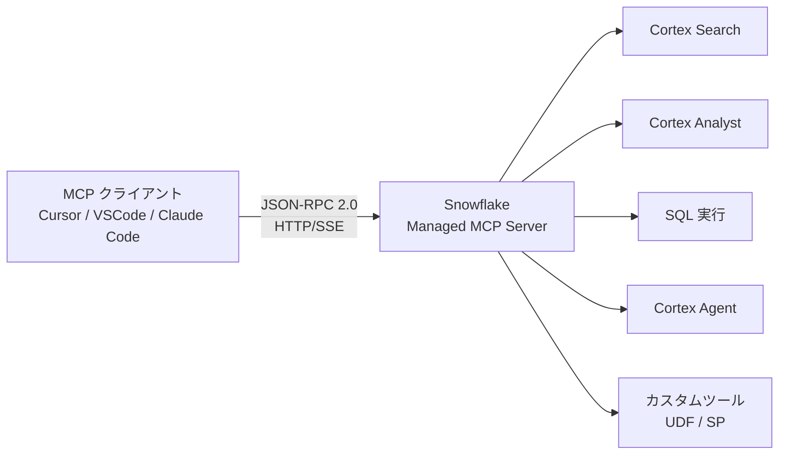
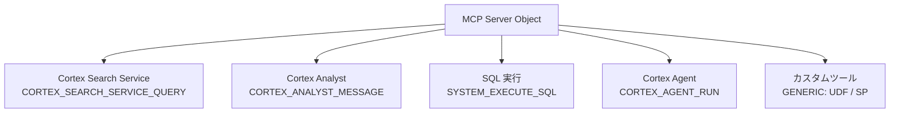
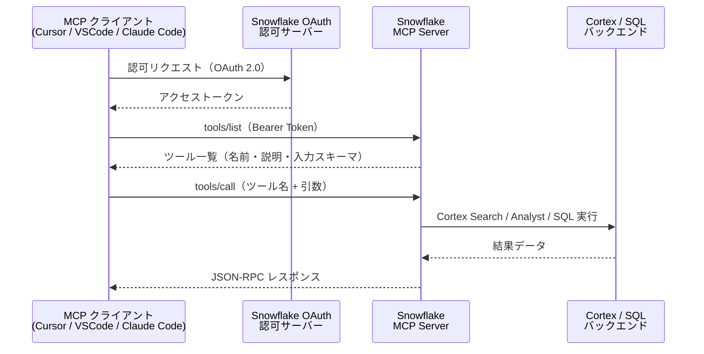
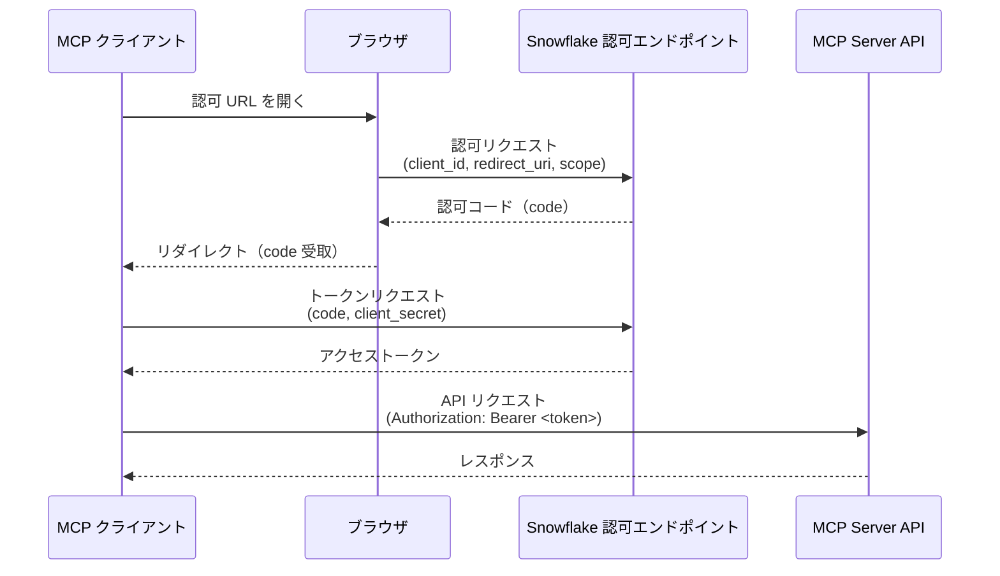

## はじめに

[Snowflake Managed MCP Server](https://docs.snowflake.com/en/user-guide/snowflake-cortex/cortex-agents-mcp) は、Snowflake がホストする MCP（Model Context Protocol）サーバーで、AI エージェントが別のインフラを用意せずに Snowflake アカウントのデータへ安全にアクセスできる。

2025年10月にプレビュー提供が始まり、同年11月に GA となった。Cursor、VSCode、Claude Code といった AI 開発ツールから Snowflake に直接接続できるようになり、データアクセスのパターンが変わりつつある。

Snowflake Managed MCP Server の仕組みと、各クライアントツールとの通信フロー・設定方法をまとめる。

---

## MCP の基礎

Model Context Protocol（MCP）は、AI エージェントと外部データソースを標準化された方法で接続するオープンプロトコルだ。

構成は3層に分かれる。

| 層 | 役割 |
| --- | --- |
| MCP クライアント | Cursor, VSCode, Claude Code などの AI ツール |
| MCP サーバー | ツールを公開し、クライアントからの呼び出しを処理する |
| バックエンド | Snowflake データ、Cortex サービス等の実体 |

通信プロトコルは **JSON-RPC 2.0 over HTTP/SSE（または Streamable HTTP）** を使用する。クライアントはまず `tools/list` でツール一覧を取得し、`tools/call` で呼び出す2ステップで動作する。



---

## Snowflake Managed MCP の全体アーキテクチャ

Managed と名付けられているのは、サーバーのインフラを Snowflake 側が管理するためだ。従来は MCP サーバーを自前でデプロイする必要があったが、Managed MCP では SQL コマンド一つでサーバーオブジェクトを作成できる。

Snowflake が現在サポートするツール種別は5種類ある。

| ツール種別 | 定数 | 用途 |
| --- | --- | --- |
| Cortex Search | `CORTEX_SEARCH_SERVICE_QUERY` | 非構造化データへのセマンティック検索 |
| Cortex Analyst | `CORTEX_ANALYST_MESSAGE` | セマンティックビューを使ったテキスト→SQL変換 |
| SQL 実行 | `SYSTEM_EXECUTE_SQL` | 任意の SQL クエリ実行 |
| Cortex Agent | `CORTEX_AGENT_RUN` | Cortex Agent への処理委譲 |
| カスタムツール | `GENERIC` | UDF・ストアドプロシージャ |



### MCP サーバーオブジェクトの作成

`CREATE MCP SERVER` DDL でサーバーを定義する。ツール定義は YAML 形式の SPECIFICATION で記述する。

```sql
CREATE MCP SERVER my_mcp_server
  FROM SPECIFICATION $$
    tools:
      - name: "product-search"
        type: "CORTEX_SEARCH_SERVICE_QUERY"
        identifier: "mydb.myschema.product_search_service"
        description: "商品に関するセマンティック検索"
        title: "Product Search"

      - name: "revenue-analyst"
        type: "CORTEX_ANALYST_MESSAGE"
        identifier: "mydb.myschema.revenue_semantic_view"
        description: "売上データの自然言語クエリ"
        title: "Revenue Analyst"

      - title: "SQL Execution Tool"
        name: "sql_exec"
        type: "SYSTEM_EXECUTE_SQL"
        description: "Snowflake に対して SQL クエリを実行する"
  $$;
```

作成後は `SHOW MCP SERVERS IN ACCOUNT` で一覧確認できる。

```sql
SHOW MCP SERVERS IN ACCOUNT;

-- 出力例
-- | created_on                             | name           | database_name | schema_name | owner        | comment |
-- |----------------------------------------|----------------|---------------|-------------|--------------|---------|
-- | 2025-11-05 10:00:00.000 +0000          | MY_MCP_SERVER  | MYDB          | MYSCHEMA    | ACCOUNTADMIN | [NULL]  |
```

---

## 通信フローの詳細

### エンドポイント URL

クライアントが接続するエンドポイントの形式は次のとおり。

```text
https://<account_URL>/api/v2/databases/{database}/schemas/{schema}/mcp-servers/{name}
```


ホスト名にアンダースコア（`_`）を含めると接続エラーが発生する。ハイフン（`-`）を使うこと。


### tools/list（ツール探索）

最初にサーバーが提供するツール一覧を取得する。

```json
POST /api/v2/databases/mydb/schemas/myschema/mcp-servers/my_mcp_server

{
  "jsonrpc": "2.0",
  "id": 1,
  "method": "tools/list",
  "params": {}
}
```

レスポンスにはツールの名前・説明・入力スキーマが含まれる。

### tools/call（ツール呼び出し）

Cortex Analyst ツールの呼び出し例を示す。

```json
POST /api/v2/databases/mydb/schemas/myschema/mcp-servers/my_mcp_server

{
  "jsonrpc": "2.0",
  "id": 2,
  "method": "tools/call",
  "params": {
    "name": "revenue-analyst",
    "arguments": {
      "message": "先月の売上上位10商品を教えて"
    }
  }
}
```

レスポンス例を示す。

```json
{
  "jsonrpc": "2.0",
  "id": 2,
  "result": {
    "content": [
      {
        "type": "text",
        "text": "SELECT product_name, SUM(revenue) AS total_revenue FROM sales WHERE month = '2025-10' GROUP BY product_name ORDER BY total_revenue DESC LIMIT 10"
      }
    ]
  }
}
```

### 通信シーケンス



---

## 認証フロー（OAuth 2.0）

Snowflake Managed MCP Server の認証は OAuth 2.0 を推奨する。PAT でも接続できるが、本番環境では OAuth を使うべきだ。

### Security Integration の作成

```sql
CREATE SECURITY INTEGRATION mcp_oauth_integration
  TYPE = OAUTH
  OAUTH_CLIENT = CUSTOM
  ENABLED = TRUE
  OAUTH_CLIENT_TYPE = 'CONFIDENTIAL'
  OAUTH_REDIRECT_URI = 'http://localhost:8080/callback';
```

作成後、クライアント ID とシークレットを取得する。統合名は大文字で指定する。

```sql
SELECT SYSTEM$SHOW_OAUTH_CLIENT_SECRETS('MCP_OAUTH_INTEGRATION');

-- 出力例（JSON）
-- {
--   "OAUTH_CLIENT_ID": "abcdefg1234567",
--   "OAUTH_CLIENT_SECRET": "xxxxxxxxxxxxxxxxxxxxxxxx",
--   "OAUTH_CLIENT_SECRET_2": null
-- }
```

### OAuth フロー



### PAT（Programmatic Access Token）を使う場合

開発・検証目的であれば PAT を直接 Bearer トークンとして使える。最小権限のロールを設定した上で利用し、本番環境ではトークン漏洩リスクを踏まえて OAuth に切り替える。

---

## クライアント別セットアップ

### Cursor

Cursor のグローバル MCP 設定は `~/.cursor/mcp.json` に記述する。Cursor 1.0 以降は Streamable HTTP と OAuth のネイティブサポートが追加された。

```json
{
  "mcpServers": {
    "snowflake": {
      "url": "https://<account_URL>/api/v2/databases/mydb/schemas/myschema/mcp-servers/my_mcp_server",
      "headers": {
        "Authorization": "Bearer <PAT_or_access_token>"
      }
    }
  }
}
```

Cursor の Settings → Tools & MCP → "Add Custom MCP" からも設定できる。

### VSCode（GitHub Copilot）

VSCode では `.vscode/mcp.json` または `settings.json` に MCP サーバー設定を記述する。

```json
{
  "mcp": {
    "servers": {
      "snowflake": {
        "type": "http",
        "url": "https://<account_URL>/api/v2/databases/mydb/schemas/myschema/mcp-servers/my_mcp_server",
        "headers": {
          "Authorization": "Bearer <PAT_or_access_token>"
        }
      }
    }
  }
}
```

### Claude Code

Claude Code では `/mcp` コマンドでリモートサーバーを追加し、OAuth 2.0 認証フローを実行できる。

```bash
# MCP サーバーの追加
claude mcp add --transport http snowflake \
  "https://<account_URL>/api/v2/databases/mydb/schemas/myschema/mcp-servers/my_mcp_server"
```

`.claude/settings.json` に直接記述する場合は次のとおり。

```json
{
  "mcpServers": {
    "snowflake": {
      "type": "http",
      "url": "https://<account_URL>/api/v2/databases/mydb/schemas/myschema/mcp-servers/my_mcp_server",
      "headers": {
        "Authorization": "Bearer <PAT_or_access_token>"
      }
    }
  }
}
```

OAuth を使う場合は、`/mcp` コマンド実行後に表示される URL をブラウザで開いて認可フローを完了させる。

---

## アクセス制御（RBAC）

MCP Server オブジェクトへのアクセスとツール呼び出しは、それぞれ独立した権限で管理する。

| 権限 | オブジェクト | 用途 |
| --- | --- | --- |
| `CREATE` | MCP SERVER | MCP サーバーの作成 |
| `OWNERSHIP` | MCP SERVER | オブジェクト設定の更新 |
| `MODIFY` | MCP SERVER | 更新・削除・describe・show・use |
| `USAGE` | MCP SERVER | サーバーへの接続とツール探索 |
| `USAGE` | Cortex Search Service | Cortex Search ツールの呼び出し |
| `SELECT` | Semantic View | Cortex Analyst ツールの呼び出し |
| `USAGE` | Cortex Agent | Cortex Agent ツールの呼び出し |
| `USAGE` | UDF / Stored Procedure | カスタムツールの呼び出し |


MCP Server への USAGE 権限があっても、各ツールへの権限は別途付与が必要だ。最小権限の原則に従い、必要なツールにのみ権限を付与する。


権限付与の例を示す。

```sql
-- ユーザーが使うロールへ MCP Server への USAGE を付与
GRANT USAGE ON MCP SERVER mydb.myschema.my_mcp_server TO ROLE analyst_role;

-- Cortex Search サービスへのアクセス
GRANT USAGE ON CORTEX SEARCH SERVICE mydb.myschema.product_search_service TO ROLE analyst_role;

-- Cortex Analyst 用のセマンティックビューへのアクセス
GRANT SELECT ON SEMANTIC VIEW mydb.myschema.revenue_semantic_view TO ROLE analyst_role;
```

---

## 制限事項

現時点の主な制限を示す。

| 項目 | 内容 |
| --- | --- |
| サポートされないコンストラクト | resources, prompts, roots, notifications, version negotiations, life cycle phases, sampling |
| レスポンス形式 | ストリーミングレスポンス非対応（非ストリーミングのみ） |
| Cortex Analyst | Semantic View のみ対応（Semantic Model は非対応） |
| ホスト名 | アンダースコア（`_`）を含むと接続エラー → ハイフン（`-`）を使う |
| dynamic client registration | 非サポート |

---

## まとめ

- `CREATE MCP SERVER` DDL だけでサーバーを立ち上げられる。インフラの用意は不要
- ツール種別は Cortex Search / Analyst / SQL / Agent / カスタムツール（UDF・SP）の5種類
- 通信は JSON-RPC 2.0 over HTTP/SSE（または Streamable HTTP）で標準化。`tools/list` で一覧取得後、`tools/call` で実行する
- 認証は OAuth 2.0 推奨。PAT は開発・検証用途にとどめ、本番では OAuth を使う
- Cursor・VSCode・Claude Code いずれも JSON 設定ファイルにエンドポイント URL とトークンを記述して接続する
- アクセス制御は MCP Server オブジェクトとツールの2段階で独立して管理する

## 参考資料








