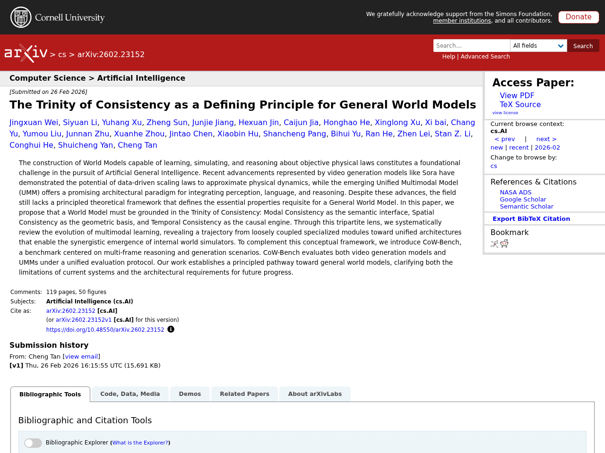
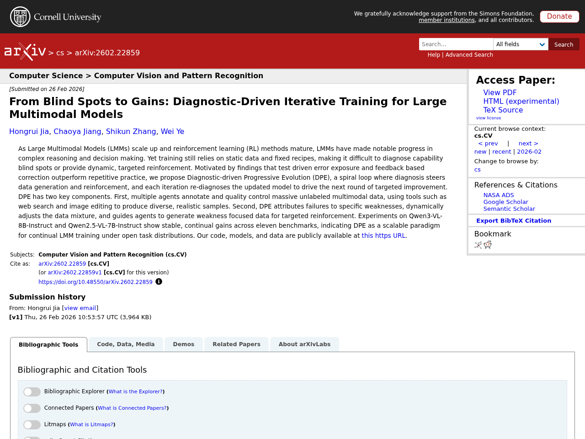
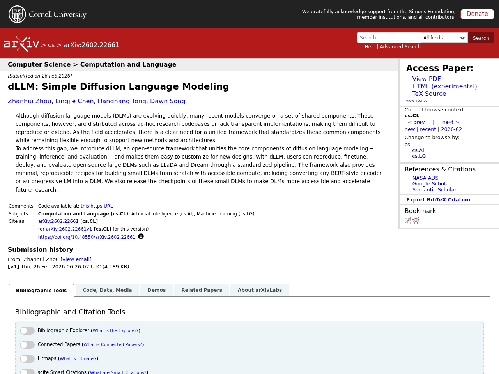

## はじめに

本記事は2026-03-03時点でのLLM関連の注目論文をまとめたものです。arXiv、Semantic Scholar、Hugging Face Daily Papersから自動収集した新着93件のうち、人気度の高い5件をピックアップし、Claude APIで日本語要約を生成しています。

## 1. The Trinity of Consistency as a Defining Principle for General World Models

- **著者**: Jingxuan Wei, Siyuan Li, Yuhang Xu, Zheng Sun, Junjie Jiang ほか
- **公開日**: 2026-02-26
- **ソース**: [huggingface](https://arxiv.org/abs/2602.23152)
- **arXiv ID**: 2602.23152
- **人気度スコア**: 191

### 要約

客観的な物理法則を学習・シミュレーション・推論できる汎用世界モデルの構築は、汎用人工知能の実現における根本的な課題である。本論文では、汎用世界モデルに必要な本質的性質を定義する理論的枠組みとして「一貫性の三位一体」を提案し、意味的インターフェースとしてのモーダル一貫性、幾何学的基盤としての空間一貫性、因果エンジンとしての時間一貫性の3要素を定義している。この三位一体の観点からマルチモーダル学習の発展を体系的にレビューし、疎結合な専門モジュールから統合アーキテクチャへと向かう軌跡を明らかにしている。さらに、マルチフレーム推論・生成シナリオに焦点を当てたベンチマークCoW-Benchを導入し、動画生成モデルと統合マルチモーダルモデルの両方を統一的な評価プロトコルで評価する手法を提示している。


The construction of World Models capable of learning, simulating, and reasoning about objective physical laws constitutes a foundational challenge in the pursuit of Artificial General Intelligence. Recent advancements represented by video generation models like Sora have demonstrated the potential of data-driven scaling laws to approximate physical dynamics, while the emerging Unified Multimodal Model (UMM) offers a promising architectural paradigm for integrating perception, language, and reasoning. Despite these advances, the field still lacks a principled theoretical framework that defines the essential properties requisite for a General World Model. In this paper, we propose that a World Model must be grounded in the Trinity of Consistency: Modal Consistency as the semantic interface, Spatial Consistency as the geometric basis, and Temporal Consistency as the causal engine. Through this tripartite lens, we systematically review the evolution of multimodal learning, revealing a trajectory from loosely coupled specialized modules toward unified architectures that enable the synergistic emergence of internal world simulators. To complement this conceptual framework, we introduce CoW-Bench, a benchmark centered on multi-frame reasoning and generation scenarios. CoW-Bench evaluates both video generation models and UMMs under a unified evaluation protocol. Our work establishes a principled pathway toward general world models, clarifying both the limitations of current systems and the architectural requirements for future progress.


## 2. From Blind Spots to Gains: Diagnostic-Driven Iterative Training for Large Multimodal Models

- **著者**: Hongrui Jia, Chaoya Jiang, Shikun Zhang, Wei Ye
- **公開日**: 2026-02-26
- **ソース**: [huggingface](https://arxiv.org/abs/2602.22859)
- **arXiv ID**: 2602.22859
- **人気度スコア**: 148

### 要約

大規模マルチモーダルモデル（LMM）の学習は静的データと固定レシピに依存しており、能力の盲点の診断や動的な強化が困難である。本研究では、診断が データ生成と強化学習を導き、各イテレーションで更新モデルを再診断して次の改善ラウンドを駆動するスパイラルループ「Diagnostic-driven Progressive Evolution（DPE）」を提案する。DPEは、複数エージェントがWeb検索や画像編集などのツールを用いて大量の未ラベルマルチモーダルデータにアノテーションと品質管理を行い、多様で現実的なサンプルを生成する。さらに、失敗を特定の弱点に帰属させ、データ混合比を動的に調整し、弱点に焦点を当てたデータ生成による targeted な強化を行う。Qwen3-VL-8B-InstructおよびQwen2.5-VL-7B-Instructを用いた実験では、11のベンチマークにわたり安定的かつ継続的な性能向上が確認され、オープンなタスク分布下での継続的LMM学習のスケーラブルなパラダイムとしてのDPEの有効性が示された。


As Large Multimodal Models (LMMs) scale up and reinforcement learning (RL) methods mature, LMMs have made notable progress in complex reasoning and decision making. Yet training still relies on static data and fixed recipes, making it difficult to diagnose capability blind spots or provide dynamic, targeted reinforcement. Motivated by findings that test driven error exposure and feedback based correction outperform repetitive practice, we propose Diagnostic-driven Progressive Evolution (DPE), a spiral loop where diagnosis steers data generation and reinforcement, and each iteration re-diagnoses the updated model to drive the next round of targeted improvement. DPE has two key components. First, multiple agents annotate and quality control massive unlabeled multimodal data, using tools such as web search and image editing to produce diverse, realistic samples. Second, DPE attributes failures to specific weaknesses, dynamically adjusts the data mixture, and guides agents to generate weakness focused data for targeted reinforcement. Experiments on Qwen3-VL-8B-Instruct and Qwen2.5-VL-7B-Instruct show stable, continual gains across eleven benchmarks, indicating DPE as a scalable paradigm for continual LMM training under open task distributions. Our code, models, and data are publicly available at https://github.com/hongruijia/DPE.


## 3. MobilityBench: A Benchmark for Evaluating Route-Planning Agents in Real-World Mobility Scenarios

- **著者**: Zhiheng Song, Jingshuai Zhang, Chuan Qin, Chao Wang, Chao Chen ほか
- **公開日**: 2026-02-26
- **ソース**: [huggingface](https://arxiv.org/abs/2602.22638)
- **arXiv ID**: 2602.22638
- **人気度スコア**: 102

### 要約

大規模言語モデル（LLM）を活用した経路計画エージェントは、自然言語によるインタラクションとツール連携を通じて日常の移動を支援する有望なパラダイムであるが、多様な経路要求やマッピングサービスの非決定性、再現性の制約により体系的な評価が困難であった。本研究では、実世界のモビリティシナリオにおけるLLMベースの経路計画エージェントを評価するためのスケーラブルなベンチマーク「MobilityBench」を提案する。MobilityBenchはAmapから収集された大規模な匿名化ユーザークエリから構築され、世界各都市にまたがる幅広い経路計画意図を網羅しており、再現可能なエンドツーエンド評価のために、ライブサービスからの環境変動を排除する決定論的APIリプレイサンドボックスを設計した。結果の妥当性を中心に、指示理解・計画・ツール使用・効率性を評価する多次元評価プロトコルを提案し、複数のLLMベースエージェントを評価した結果、基本的な情報検索や経路計画タスクでは十分な性能を示す一方、嗜好制約付き経路計画では大幅に性能が低下し、パーソナライズされたモビリティ応用における改善の余地が大きいことが明らかになった。


Route-planning agents powered by large language models (LLMs) have emerged as a promising paradigm for supporting everyday human mobility through natural language interaction and tool-mediated decision making. However, systematic evaluation in real-world mobility settings is hindered by diverse routing demands, non-deterministic mapping services, and limited reproducibility. In this study, we introduce MobilityBench, a scalable benchmark for evaluating LLM-based route-planning agents in real-world mobility scenarios. MobilityBench is constructed from large-scale, anonymized real user queries collected from Amap and covers a broad spectrum of route-planning intents across multiple cities worldwide. To enable reproducible, end-to-end evaluation, we design a deterministic API-replay sandbox that eliminates environmental variance from live services. We further propose a multi-dimensional evaluation protocol centered on outcome validity, complemented by assessments of instruction understanding, planning, tool use, and efficiency. Using MobilityBench, we evaluate multiple LLM-based route-planning agents across diverse real-world mobility scenarios and provide an in-depth analysis of their behaviors and performance. Our findings reveal that current models perform competently on Basic information retrieval and Route Planning tasks, yet struggle considerably with Preference-Constrained Route Planning, underscoring significant room for improvement in personalized mobility applications. We publicly release the benchmark data, evaluation toolkit, and documentation at https://github.com/AMAP-ML/MobilityBench .


## 4. dLLM: Simple Diffusion Language Modeling

- **著者**: Zhanhui Zhou, Lingjie Chen, Hanghang Tong, Dawn Song
- **公開日**: 2026-02-26
- **ソース**: [huggingface](https://arxiv.org/abs/2602.22661)
- **arXiv ID**: 2602.22661
- **人気度スコア**: 64

### 要約

拡散言語モデル（DLM）は急速に進化しているが、多くのモデルが共通コンポーネントを共有しているにもかかわらず、それらは個別の研究コードベースに散在しており、再現や拡張が困難である。この課題に対処するため、訓練・推論・評価というDLMの中核コンポーネントを統一し、新しい設計へのカスタマイズを容易にするオープンソースフレームワーク「dLLM」を提案する。dLLMにより、LLaDAやDreamなどのオープンソース大規模DLMの再現・ファインチューニング・デプロイ・評価を標準化されたパイプラインで実行できる。さらに、BERT系エンコーダや自己回帰型言語モデルをDLMに変換する手法を含む、少ない計算資源で小規模DLMをゼロから構築するための再現可能なレシピとチェックポイントも公開し、DLM研究のアクセシビリティ向上と発展の加速を目指す。


Although diffusion language models (DLMs) are evolving quickly, many recent models converge on a set of shared components. These components, however, are distributed across ad-hoc research codebases or lack transparent implementations, making them difficult to reproduce or extend. As the field accelerates, there is a clear need for a unified framework that standardizes these common components while remaining flexible enough to support new methods and architectures.
  To address this gap, we introduce dLLM, an open-source framework that unifies the core components of diffusion language modeling -- training, inference, and evaluation -- and makes them easy to customize for new designs. With dLLM, users can reproduce, finetune, deploy, and evaluate open-source large DLMs such as LLaDA and Dream through a standardized pipeline. The framework also provides minimal, reproducible recipes for building small DLMs from scratch with accessible compute, including converting any BERT-style encoder or autoregressive LM into a DLM. We also release the checkpoints of these small DLMs to make DLMs more accessible and accelerate future research.


## 5. OmniGAIA: Towards Native Omni-Modal AI Agents

- **著者**: Xiaoxi Li, Wenxiang Jiao, Jiarui Jin, Shijian Wang, Guanting Dong ほか
- **公開日**: 2026-02-26
- **ソース**: [huggingface](https://arxiv.org/abs/2602.22897)
- **arXiv ID**: 2602.22897
- **人気度スコア**: 51

### 要約

人間の知能は視覚・聴覚・言語にまたがるマルチモーダル知覚と複雑な推論・ツール使用を自然に統合しているが、現在のマルチモーダルLLMは主に二つのモダリティ間の相互作用（例：視覚と言語）に限定されており、汎用AIアシスタントに必要な統一的認知能力を欠いている。この課題を解決するため、動画・音声・画像のモダリティを横断した深い推論と複数ターンのツール実行を要するタスクでオムニモーダルエージェントを評価する包括的ベンチマーク「OmniGAIA」を提案する。OmniGAIAは新規のオムニモーダルイベントグラフ手法により構築され、実世界データからクロスモーダル推論と外部ツール統合を必要とする複雑なマルチホップクエリを生成する。さらに、ツール統合推論パラダイムと能動的オムニモーダル知覚を備えたネイティブオムニモーダル基盤エージェント「OmniAtlas」を提案し、後知恵誘導型木探索戦略で合成した軌跡データとOmniDPOによる細粒度エラー修正で訓練することで、既存オープンソースモデルのツール使用能力を効果的に向上させた。


Human intelligence naturally intertwines omni-modal perception -- spanning vision, audio, and language -- with complex reasoning and tool usage to interact with the world. However, current multi-modal LLMs are primarily confined to bi-modal interactions (e.g., vision-language), lacking the unified cognitive capabilities required for general AI assistants. To bridge this gap, we introduce OmniGAIA, a comprehensive benchmark designed to evaluate omni-modal agents on tasks necessitating deep reasoning and multi-turn tool execution across video, audio, and image modalities. Constructed via a novel omni-modal event graph approach, OmniGAIA synthesizes complex, multi-hop queries derived from real-world data that require cross-modal reasoning and external tool integration. Furthermore, we propose OmniAtlas, a native omni-modal foundation agent under tool-integrated reasoning paradigm with active omni-modal perception. Trained on trajectories synthesized via a hindsight-guided tree exploration strategy and OmniDPO for fine-grained error correction, OmniAtlas effectively enhances the tool-use capabilities of existing open-source models. This work marks a step towards next-generation native omni-modal AI assistants for real-world scenarios.


---

*この記事は自動生成されています。論文の詳細は各ソースURLをご参照ください。*