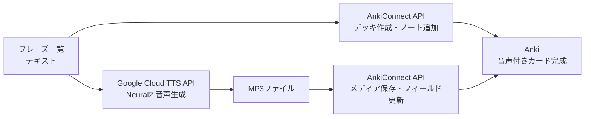

## はじめに

英語フレーズの暗記にAnkiを使っているが、カードの手動登録と音声添付が面倒で続かなくなることがある。[AnkiConnect](https://github.com/FooSoft/anki-connect)のREST APIと[Google Cloud Text-to-Speech](https://cloud.google.com/text-to-speech)のNeural2音声を組み合わせると、curlコマンドだけでカード登録から高品質な音声添付まで自動化できる。この記事ではその手順を記録する。

処理の全体像は以下の通り。



## 前提条件

| 項目 | 内容 |
|------|------|
| Anki | バージョン 23.10.0 以上 |
| AnkiConnect | プラグインコード `2055492159` |
| gcloud CLI | 認証済み |
| Google Cloud | Text-to-Speech API 有効化済み |

AnkiConnectのインストールは、Ankiの「ツール → アドオン → 新たにアドオンを取得」からコード `2055492159` を入力する。インストール後はAnkiの再起動が必要。AnkiConnectはポート8765でHTTPサーバーを起動し、JSON形式のリクエストを受け付ける。

Google Cloud Text-to-Speech APIの有効化は以下のコマンドで行う。

```bash
gcloud services enable texttospeech.googleapis.com
```

## AnkiConnect APIでカードを一括登録する

### 接続確認

まずAnkiConnectが動作しているか確認する。

```bash
curl -s http://localhost:8765 -X POST \
  -H "Content-Type: application/json" \
  -d '{"action": "version", "version": 6}'
```

```json
{"result": 6, "error": null}
```

### デッキの作成

`createDeck` アクションで新しいデッキを作成する。

```bash
curl -s http://localhost:8765 -X POST \
  -H "Content-Type: application/json" \
  -d '{
    "action": "createDeck",
    "version": 6,
    "params": {"deck": "英語会議フレーズ15"}
  }'
```

### モデル（ノートタイプ）の確認

カード追加前にモデル名とフィールド名を確認する。

```bash
# モデル一覧
curl -s http://localhost:8765 -X POST \
  -H "Content-Type: application/json" \
  -d '{"action": "modelNames", "version": 6}'

# フィールド一覧
curl -s http://localhost:8765 -X POST \
  -H "Content-Type: application/json" \
  -d '{
    "action": "modelFieldNames",
    "version": 6,
    "params": {"modelName": "Basic"}
  }'
```

### ノートの一括追加

`addNotes` アクションで複数ノートを一括登録する。以下は英語会議フレーズを日→英の瞬間英作文形式で登録する例。

```bash
curl -s http://localhost:8765 -X POST \
  -H "Content-Type: application/json" \
  -d '{
    "action": "addNotes",
    "version": 6,
    "params": {
      "notes": [
        {
          "deckName": "英語会議フレーズ15",
          "modelName": "Basic",
          "fields": {
            "Front": "聞き取れなかったとき、もう一度言ってもらうよう頼む",
            "Back": "Sorry, could you say that again?"
          },
          "tags": ["Week1", "聞き返す"]
        },
        {
          "deckName": "英語会議フレーズ15",
          "modelName": "Basic",
          "fields": {
            "Front": "相手の話すスピードが速すぎるとき、ゆっくり話してもらうよう頼む",
            "Back": "Could you slow down a bit?"
          },
          "tags": ["Week1", "聞き返す"]
        }
      ]
    }
  }'
```

レスポンスの `result` 配列に各ノートのIDが返る。`null` が含まれている場合は重複ノートがありスキップされたことを示す。

```json
{"result": [1772875633429, 1772875633437], "error": null}
```

カスタムモデルを使っている場合は、そのモデルのフィールドに合わせて `fields` を指定する。たとえば `Example`（例文）、`Synonyms`（類義表現）、`GrammarNote`（文法メモ）などのフィールドがあれば、それらも同時に登録できる。

## Google Cloud TTSで音声を生成する

### quota projectの設定

gcloud CLIのユーザー認証を使う場合、`x-goog-user-project` ヘッダーでquota projectを指定する必要がある。これがないと `PERMISSION_DENIED` エラーが返る。

```bash
TOKEN=$(gcloud auth print-access-token)
PROJECT=$(gcloud config get-value project 2>/dev/null)
```

### Neural2音声でMP3を生成

Google Cloud TTSのNeural2音声は、従来のStandard音声やWaveNet音声と比較して自然な発話が特徴。英語学習用途には十分な品質。

```bash
curl -s -X POST \
  -H "Authorization: Bearer $TOKEN" \
  -H "x-goog-user-project: $PROJECT" \
  -H "Content-Type: application/json" \
  -d '{
    "input": {"text": "Sorry, could you say that again? I missed the last part."},
    "voice": {"languageCode": "en-US", "name": "en-US-Neural2-J"},
    "audioConfig": {"audioEncoding": "MP3", "speakingRate": 0.9}
  }' \
  "https://texttospeech.googleapis.com/v1/text:synthesize" \
  | python3 -c "
import sys, json, base64
data = json.load(sys.stdin)
sys.stdout.buffer.write(base64.b64decode(data['audioContent']))
" > meeting_phrase_01.mp3
```

主なパラメータは以下の通り。

| パラメータ | 説明 | 値の例 |
|-----------|------|--------|
| `voice.name` | 音声モデル | `en-US-Neural2-J`（男性）、`en-US-Neural2-F`（女性） |
| `audioConfig.speakingRate` | 発話速度（0.25〜2.0） | `0.9`（やや遅め、学習向き） |
| `audioConfig.audioEncoding` | 出力形式 | `MP3`, `OGG_OPUS`, `LINEAR16` |

APIレスポンスの `audioContent` フィールドにbase64エンコードされた音声データが含まれるため、デコードしてファイルに書き出す。

### 無料枠

[Google Cloud TTS の料金ページ](https://cloud.google.com/text-to-speech/pricing)によると、Neural2音声は月100万バイトまで無料。英語フレーズ（ASCII文字）であれば1文字≒1バイトのため、個人の英語学習用途で無料枠を超えることはまずない。

## 音声ファイルをAnkiカードに添付する

### メディアファイルの保存

`storeMediaFile` アクションでMP3ファイルをAnkiのメディアフォルダに保存する。ファイルはbase64エンコードして渡す。

```bash
B64=$(base64 -i meeting_phrase_01.mp3)

curl -s http://localhost:8765 -X POST \
  -H "Content-Type: application/json" \
  -d "{
    \"action\": \"storeMediaFile\",
    \"version\": 6,
    \"params\": {
      \"filename\": \"meeting_phrase_01.mp3\",
      \"data\": \"$B64\"
    }
  }"
```

### ノートフィールドの更新

`findNotes` でノートIDを取得し、`updateNoteFields` でSoundフィールドに `[sound:ファイル名]` を設定する。

```bash
# ノートID取得
curl -s http://localhost:8765 -X POST \
  -H "Content-Type: application/json" \
  -d '{
    "action": "findNotes",
    "version": 6,
    "params": {"query": "deck:英語会議フレーズ15"}
  }'

# Soundフィールドを更新
curl -s http://localhost:8765 -X POST \
  -H "Content-Type: application/json" \
  -d '{
    "action": "updateNoteFields",
    "version": 6,
    "params": {
      "note": {
        "id": 1772875633429,
        "fields": {
          "Sound": "[sound:meeting_phrase_01.mp3]"
        }
      }
    }
  }'
```

### カードテンプレートの注意点

Soundフィールドに `[sound:ファイル名.mp3]` という形式で保存した場合、カードテンプレート側で `[sound:{{Sound}}]` と書くと二重ラップになり音声が再生されない。テンプレートでは `{{Sound}}` とだけ書く。

```
<!-- NG: 二重ラップで再生されない -->
[sound:{{Sound}}]

<!-- OK: フィールド値がそのまま展開される -->
{{Sound}}
```

## 一括処理スクリプト

上記の処理をまとめたシェルスクリプトの例を示す。フレーズ一覧のファイルからカード登録 → TTS生成 → 音声添付までを一気に実行する。

```bash
#!/bin/bash
set -euo pipefail

DECK="英語会議フレーズ15"
MODEL="Basic"
VOICE="en-US-Neural2-J"
RATE=0.9
TOKEN=$(gcloud auth print-access-token)
PROJECT=$(gcloud config get-value project 2>/dev/null)

# デッキ作成
curl -s http://localhost:8765 -X POST \
  -H "Content-Type: application/json" \
  -d "{\"action\": \"createDeck\", \"version\": 6, \"params\": {\"deck\": \"$DECK\"}}" > /dev/null

# フレーズ定義（TSV: 日本語<TAB>英語フレーズ<TAB>例文<TAB>タグ）
while IFS=$'\t' read -r front back example tag; do
  # ノート追加
  escaped_back=$(printf '%s' "$back" | python3 -c "import sys,json; print(json.dumps(sys.stdin.read()))")
  escaped_front=$(printf '%s' "$front" | python3 -c "import sys,json; print(json.dumps(sys.stdin.read()))")

  note_id=$(curl -s http://localhost:8765 -X POST \
    -H "Content-Type: application/json" \
    -d "{
      \"action\": \"addNote\",
      \"version\": 6,
      \"params\": {
        \"note\": {
          \"deckName\": \"$DECK\",
          \"modelName\": \"$MODEL\",
          \"fields\": {\"Front\": $escaped_front, \"Back\": $escaped_back},
          \"tags\": [\"$tag\"]
        }
      }
    }" | python3 -c "import sys,json; print(json.load(sys.stdin)['result'])")

  echo "Added note: $note_id - $front"

  # TTS生成
  escaped_example=$(printf '%s' "$example" | python3 -c "import sys,json; print(json.dumps(sys.stdin.read()))")
  fname="phrase_${note_id}.mp3"

  curl -s -X POST \
    -H "Authorization: Bearer $TOKEN" \
    -H "x-goog-user-project: $PROJECT" \
    -H "Content-Type: application/json" \
    -d "{
      \"input\": {\"text\": $escaped_example},
      \"voice\": {\"languageCode\": \"en-US\", \"name\": \"$VOICE\"},
      \"audioConfig\": {\"audioEncoding\": \"MP3\", \"speakingRate\": $RATE}
    }" \
    "https://texttospeech.googleapis.com/v1/text:synthesize" \
    | python3 -c "import sys,json,base64; d=json.load(sys.stdin); sys.stdout.buffer.write(base64.b64decode(d['audioContent']))" \
    > "/tmp/$fname"

  # Ankiにメディア保存 + フィールド更新
  b64=$(base64 -i "/tmp/$fname")
  curl -s http://localhost:8765 -X POST \
    -H "Content-Type: application/json" \
    -d "{\"action\": \"storeMediaFile\", \"version\": 6, \"params\": {\"filename\": \"$fname\", \"data\": \"$b64\"}}" > /dev/null

  curl -s http://localhost:8765 -X POST \
    -H "Content-Type: application/json" \
    -d "{\"action\": \"updateNoteFields\", \"version\": 6, \"params\": {\"note\": {\"id\": $note_id, \"fields\": {\"Sound\": \"[sound:$fname]\"}}}}" > /dev/null

  echo "  -> TTS attached: $fname"
done < phrases.tsv
```

入力ファイル `phrases.tsv` の形式は以下の通り。

```
聞き取れなかったとき、もう一度言ってもらうよう頼む	Sorry, could you say that again?	Sorry, could you say that again? I missed the last part.	Week1
相手の話すスピードが速すぎるとき、ゆっくり話してもらうよう頼む	Could you slow down a bit?	Could you slow down a bit? I want to make sure I'm following.	Week1
```

## まとめ

- AnkiConnect APIはcurlで手軽に操作でき、デッキ作成・ノート追加・メディア添付をプログラマブルに実行できる
- Google Cloud TTS Neural2音声は自然な発話品質で、月100万バイトの無料枠があるため個人の英語学習用途には十分
- カードテンプレートのSoundフィールドの扱い（`{{Sound}}` vs `[sound:{{Sound}}]`）には注意が必要

## 参考資料






