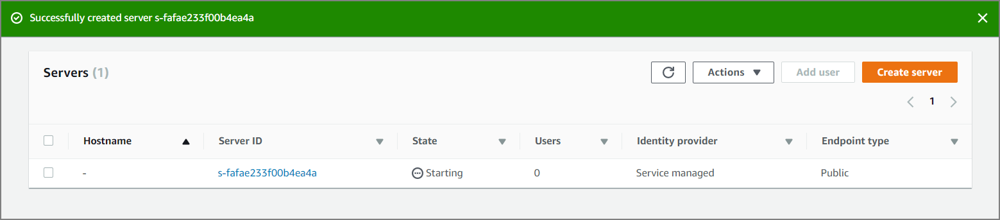

awscliではなくsftpコマンドでS3にアップロードしたい！そういうときのマネージドサービス。

#### SFTPサーバの起動/作成

***

サービス一覧からAWS Transfer fot SFTPを選択して"Creaete Server"をクリック


Endpoint configurationでEndpoint typeを選択する。ここではPublicを選択。Logging RoleやTagは必要に応じて。





#### ユーザの作成

***

ロールを指定するがこの時S3のアクセス権が必要。 AssumeRole が必要だったはず。

> SFTP のための IAM ポリシーおよびロールの作成 - AWS Transfer for SFTP [https://docs.aws.amazon.com/ja_jp/transfer/latest/userguide/requirements-roles.html](https://docs.aws.amazon.com/ja_jp/transfer/latest/userguide/requirements-roles.html)


#### ユーザを作成する時に必要な登録用の鍵を作る

***

登録した公開鍵をユーザ作成画面で登録する

```sh
[ec2-user@walt-dev-ec2 ~]$ ssh-keygen -t rsa
Generating public/private rsa key pair.
Enter file in which to save the key (/home/ec2-user/.ssh/id_rsa): 
Enter passphrase (empty for no passphrase): 
Enter same passphrase again: 
Your identification has been saved in /home/ec2-user/.ssh/id_rsa.
Your public key has been saved in /home/ec2-user/.ssh/id_rsa.pub.
The key fingerprint is:
SHA256:FGSySPzbCkxTDDiX/NYhnKP2ko/CTIrR2r/lZef83k4 ec2-user@walt-dev-ec2
```

#### 接続

***

作成した鍵を使ってsftpを実行。接続できた。

```sh
[ec2-user@walt-dev-ec2 ~]$ sftp -i .ssh/id_rsa sftp-user@s-9ec720a3add94f11a.server.transfer.ap-northeast-1.amazonaws.com
Connected to s-9ec720a3add94f11a.server.transfer.ap-northeast-1.amazonaws.com.
sftp> 
sftp> ls -l
drwxr--r--   1        -        -        0 Jan  1  1970 pluto-dev-s3-test
drwxr--r--   1        -        -        0 Jan  1  1970 z3-cloudtrail-s3-test

```


