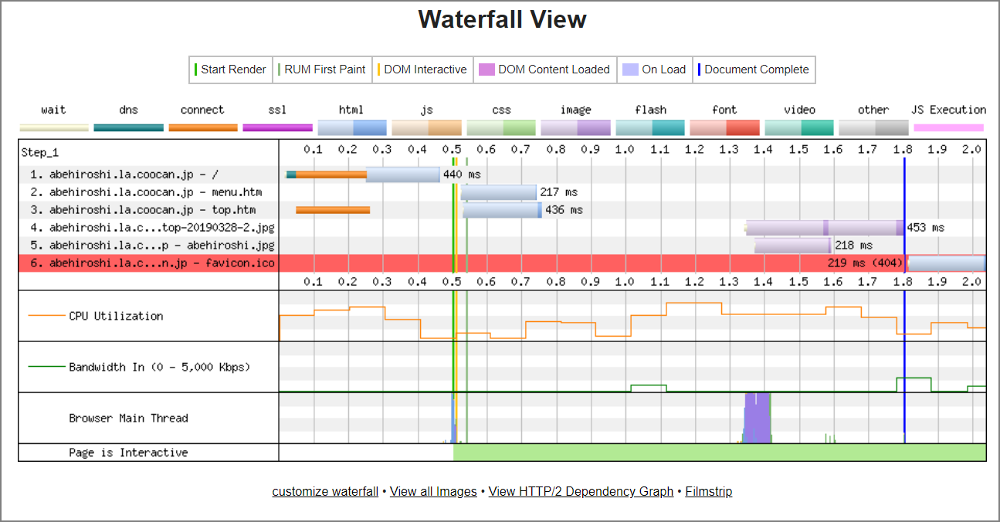

#### メリット

***

- 読み込み速度が高速

- Pythonベース

- Github Pagesにホストするのでコストが掛からない。

- Git関連の知識が（多少）付く

- ~~構築やカスタマイズがめんどくさいので~~自分のブログ感が出る

- Github上で自動的にバージョン管理

- 記事の編集はMarkdownだけで完結する（はてなは最終的には ブログサイト 側を更新する必要があった） 

#### デメリット

***

- 記事作成毎にHTML生成が必要

- 管理画面無い（CUIベースで出来るというメリットも。）

- 記事のカテゴリーを一つしか選べない

- ネット上にあまり日本語情報がないので英語マニュアルを読む必要がある（[公式ドキュメント](http://docs.getpelican.com/en/stable/)は充実している）

- PelicanのThemesやコミュニティが下火気味?

- 記事生成処理はPelicanをインストールした環境で行う必要がある

- URLの自動リンクがされない（テーマによる？既存のプラグインは確認できない）

#### その他

***

- 独自ドメインは設定可能
- Google Analyticsも設定可能
- SEOは現在のところ不明
- 動的ページを生成できない。問い合わせフォームとかは設置できない。（Google Adsenceを行う場合はアウトかも）

#### おまけ

***

WebPageTestでPerformanceを確認してみた

> WebPageTest - Website Performance and 	Optimization Test [https://www.webpagetest.org/](https://www.webpagetest.org/)

#### 結論

静的サイト、めちゃ早い  

- #### 当サイト（[https://zatoima.github.io/](https://zatoima.github.io/)）

***

- #### 阿部寛のホームページ [http://abehiroshi.la.coocan.jp/]( http://abehiroshi.la.coocan.jp/)

***

