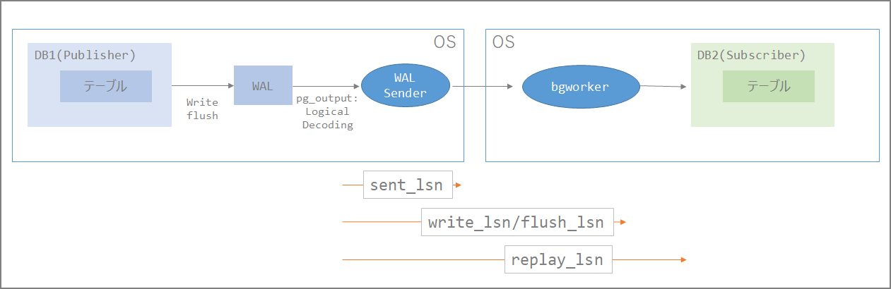

#### はじめに

***

論理レプリケーションを行う時の遅延監視について整理してみる。環境はAWSのAurora、及びRDSのPostgreSQL互換を使用。バージョンは10.7。

<br/>

#### WALの読み込み位置の確認

***

```sql
repdb=> select pg_current_wal_lsn();
-[ RECORD 1 ]------+----------
pg_current_wal_lsn | 0/4F94888
```

<br/>

#### レプリケーション遅延の確認

***

Publisher側でpg_stat_replicationビューを確認して確認が可能。

```sql
\x
select * from pg_stat_replication;

repdb=> select * from pg_stat_replication;
-[ RECORD 1 ]----+------------------------------
pid              | 19407
usesysid         | 16393
usename          | postgres
application_name | auroratopostgresql
client_addr      | xxx.xxx.xxx.xx
client_hostname  | 
client_port      | 46478
backend_start    | 2019-12-14 09:24:19.187306+00
backend_xmin     | 
state            | streaming
sent_lsn         | 0/4F67640
write_lsn        | 0/4F67640
flush_lsn        | 0/4F67640
replay_lsn       | 0/4F67640
write_lag        | 00:00:01.582706
flush_lag        | 00:00:01.985095
replay_lag       | 00:00:01.582706
sync_priority    | 0
sync_state       | async

repdb=> 
```

WALログの位置が重要。sent_lsn、write_lsn、flush_lsn、replay_lsn等から位置が特定できる。

| 列         | 型     | 説明                                                         |
| ---------- | ------ | ------------------------------------------------------------ |
| sent_lsn   | pg_lsn | この接続で送信された最後の先行書き込みログの位置です。       |
| write_lsn  | pg_lsn | このスタンバイサーバによってディスクに書き出された最後の先行書き込みログ位置です。 |
| flush_lsn  | pg_lsn | このスタンバイサーバによってディスクに吐き出された最後の先行書き込みログ位置です。 |
| replay_lsn | pg_lsn | このスタンバイサーバ上のデータベースに再生された最後の先行書き込みログ位置です。 |

> 28.2. 統計情報コレクタ https://www.postgresql.jp/document/10/html/monitoring-stats.html#PG-STAT-REPLICATION-VIEW

sent_lsn、write_lsn、flush_lsn、replay_lsnは下記のような関係性だと予想。（**<u>要検証</u>**）ここのlsnの位置を使うことで、Publisher側の問題なのか、ネットワークの問題なのか、Subscriberの適用の問題なのかがわかる。



また、stateからもWAL Senderの状態がわかる。

> WAL送信サーバの現在の状態です。 取り得る値は以下の通りです。
>
> - startup: このWAL送信サーバは起動するところです。
> - catchup: このWAL送信サーバが接続しているスタンバイはプライマリに追いつこうとしています。
> - streaming: このWAL送信サーバは、接続先のスタンバイサーバがプライマリに追いついた後、変更をストリーミングしています。
> - backup: このWAL送信サーバはバックアップを送信しています。
> - stopping: このWAL送信サーバは停止するところです。

とは言え、<u>遅延確認という観点だとpg_stat_replicationの更新頻度が 『write or flush lsnの位置が変更があったとき』、もしくは 『"wal_receiver_status_interval"で指定された秒数』となるため、後述の方法を使って判断した方が良い</u>と考える。wal_receiver_status_intervalはデフォルト10秒のため、WALの適用が終わっているにも関わらず、更新されないという自体が起きうる。wal_receiver_status_intervalの10秒が経過後、pg_stat_replicationを確認したタイミングでようやくわかる。wal_receiver_status_intervalを調整した環境や常にレプリケーションが走っている状況の場合は有用のはず。

PostgreSQLのLSNは16進数となるので一見したところ位置の比較が不明な場合があるので、その場合は「pg_wal_lsn_diff」関数を使う。出力される情報はバイトであることに注意。

> https://www.postgresql.jp/document/10/html/functions-admin.html
>
> pg_wal_lsn_diffは、2つの先行書き込みログの位置の差分をバイト数で算出します。 この関数はpg_stat_replicationや[表 9.79](https://www.postgresql.jp/document/10/html/functions-admin.html#FUNCTIONS-ADMIN-BACKUP-TABLE)に示される関数と併用することで、レプリケーションの遅延の確認に使用できます。

```sql
SELECT
    pg_wal_lsn_diff(sent_lsn,write_lsn) write_diff,
    pg_wal_lsn_diff(sent_lsn,flush_lsn) flush_diff,
    pg_wal_lsn_diff(sent_lsn,replay_lsn) replay_diff
FROM
    pg_stat_replication;
```

1.) 差分がある場合：

```sql
repdb=> select pg_wal_lsn_diff(sent_lsn,write_lsn) write_diff, pg_wal_lsn_diff(sent_lsn, flush_lsn) flush_diff, pg_wal_lsn_diff(sent_lsn,replay_lsn) replay_diff from pg_stat_replication;
-[ RECORD 1 ]---------
write_diff  | 26749408
flush_diff  | 26749408
replay_diff | 26749408
```

2.) 差分がない場合：

```sql
repdb=> select pg_wal_lsn_diff(sent_lsn,write_lsn) write_diff, pg_wal_lsn_diff(sent_lsn, flush_lsn) flush_diff, pg_wal_lsn_diff(sent_lsn,replay_lsn) replay_diff from pg_stat_replication;
-[ RECORD 1 ]--
write_diff  | 0
flush_diff  | 0
replay_diff | 0
```

<br/>

Subscriber側で確認する方法としては下記がある。時間がわかるので直感的にわかりやすい。

```sql
repdb=> select * from pg_stat_subscription;
-[ RECORD 1 ]---------+------------------------------
subid                 | 16425
subname               | auroratopostgresql
pid                   | 15008
relid                 | 
received_lsn          | 0/4F87048
last_msg_send_time    | 2019-12-14 09:40:29.125815+00
last_msg_receipt_time | 2019-12-14 09:40:29.135405+00
latest_end_lsn        | 0/4F87048
latest_end_time       | 2019-12-14 09:40:29.125815+00
```


