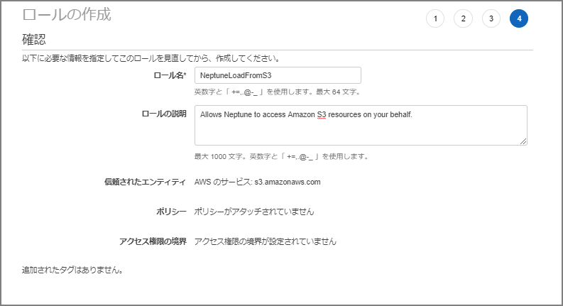
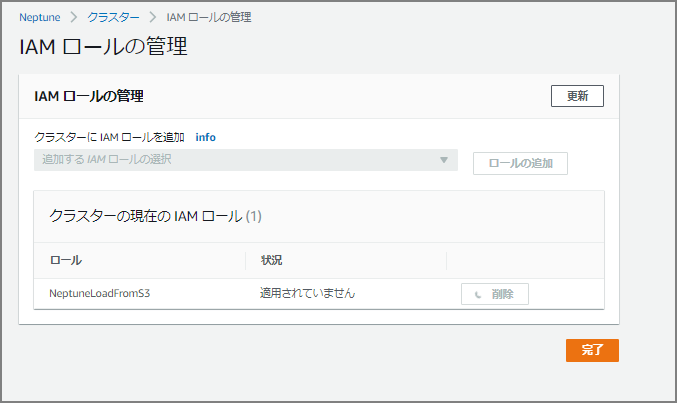
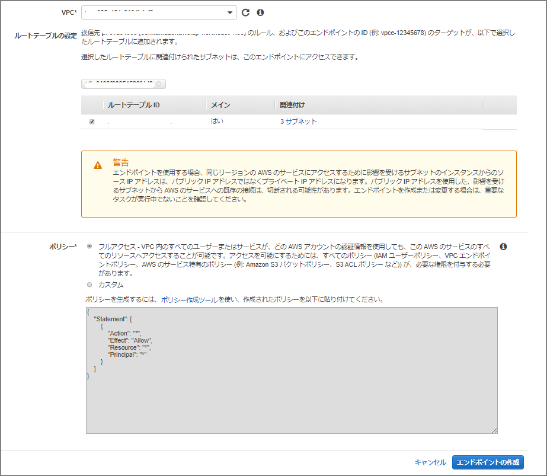

### はじめに

AWSの完全マネージド型のグラフデータベースサービスであるNeptuneを触ってみようと思う。インスタンス作成から`RDF`形式のデータロード、及び`SPARQL`を使用して単純なクエリ発行までやってみる。

グラフデータベースとは？Amazon Neptuneとは？については別記事でまとめたい。

下記stepで実施する。

1. インスタンスの作成
2. IAMロール作成、ロールのNeptuneへのアタッチ、S3VPCエンドポイントの設定
3. S3からデータのロード
4. RDF4J コンソール、HTTP REST エンドポイントを使用してロードしたデータの確認

前提条件

- VPCやS3の事前作成

### インスタンスの作成

#### 「データベースの作成」を選択


#### 「DB詳細の指定」を入力。

今回は現時点の最新のバージョンである「Neptune 1.0.2.1.R4」を指定。インスタンス作成後のMulti-AZへの変更は現段階では出来ないので必要に応じてこのタイミングで選択する。


#### 続きを入力。

RDSやAuroraと同じような入力項目。


「データベースの作成」ボタンをクリック後に作成が始まるので少々待つ。


大体5分～10分くらいで作成は完了した。


### 「IAMロールとS3VPCエンドポイントの設定」

データロードのための下準備としてIAMロールとS3 VPCエンドポイントの設定を行う。

> 前提条件: IAM ロールと Amazon S3 アクセス - Amazon Neptune https://docs.aws.amazon.com/ja_jp/neptune/latest/userguide/bulk-load-tutorial-IAM.html

IAMの画面から「ロールの作成」を選択


S3を選択


「`AmazonS3ReadOnlyAccess`」を選択してポリシーをアタッチする。


必要に応じて


ロール名は「NeptuneLoadFromS3」とした。



作成したロールの画面に移動する。


「信頼関係」-「信頼関係の編集」へと移動して下記を上書きして貼り付ける。


```json
{
  "Version": "2012-10-17",
  "Statement": [
    {
      "Sid": "",
      "Effect": "Allow",
      "Principal": {
        "Service": [
          "rds.amazonaws.com"
        ]
      },
      "Action": "sts:AssumeRole"
    }
  ]
}
```


### 「Amazon Neptune クラスターに IAM ロール」を追加する

Neptuneのクラスタに移動して「IAMロールの管理」を選択。


先程作成したIAMロール(`NeptuneLoadFromS3`)を追加する。



### S3 VPCエンドポイントを作成

S3からNeptuneにロードする際にVPCエンドポイントが必要なのでVPCエンドポイントを設定する。

エンドポイントの作成画面で「com.amazonaws.ap-northeast-1.s3」を選択する。（今回はTokyoリージョンなので`ap-northeast-1`だが、他リージョンの場合はリージョン名が異なる。）


VPCやルートテーブルを指定する



### S3からNeptuneへのデータのロード

ここまででS3からNeptuneへロードする準備が出来た。ロードするデータは http://rdf.geospecies.org のデータを使用することにする。rdfxml形式のRDFデータのサンプルをS3の所定のバケットにアップロード

```sh
[ec2-user@bastin nep-tool]$ curl -O http://rdf.geospecies.org/geospecies.rdf.gz
  % Total    % Received % Xferd  Average Speed   Time    Time     Time  Current
                                 Dload  Upload   Total   Spent    Left  Speed
  0     0    0     0    0     0      0      0 --:--:-- --:--:-- --:--:--     0
100 8891k  100 8891k    0     0  3405k      0  0:00:02  0:00:02 --:--:-- 3404k
[ec2-user@bastin nep-tool]$ 
[ec2-user@bastin nep-tool]$ ls -l geospecies.rdf.gz
-rw-rw-r-- 1 ec2-user ec2-user 9105109 Jan 28 08:16 geospecies.rdf.gz
[ec2-user@bastin nep-tool]$ aws s3 cp geospecies.rdf.gz s3://nep-s3-xxxx/
upload: ./geospecies.rdf.gz to s3://nep-s3-xxxx/geospecies.rdf.gz 
[ec2-user@bastin nep-tool]$   
```

下記コマンドでデータをロードする。`エンドポイント`、`source`、`format`、`iamRoleArn`を必要に応じて変更が必要。

RDFの場合のformatは他にも`turtle`や`ntriples`なども選択可能。

> ロードデータ形式 - Amazon Neptune https://docs.aws.amazon.com/ja_jp/neptune/latest/userguide/bulk-load-tutorial-format.html

```sh
curl -X POST \
    -H 'Content-Type: application/json' \
    https://neptest.xxxxxxxxxxxx.ap-northeast-1.neptune.amazonaws.com:8182/loader -d '
    {
      "source" : "s3://nep-s3-xxxx/geospecies.rdf.gz", 
      "format" : "rdfxml",
      "iamRoleArn" : "arn:aws:iam::xxxxxxxxx:role/NeptuneLoadFromS3",
      "region" : "ap-northeast-1",
      "failOnError" : "FALSE",
      "parallelism" : "HIGH"
    }'
```

実行後、下記が表示される。状況確認に`loadId`が必要なので控えておく。

```sh
{
    "status" : "200 OK",
    "payload" : {
        "loadId" : "eff1268f-17ab-473a-b845-c2d91a317c01"
    }

```

データロードのステータス確認。先程取得した`loadId`を指定する

```sh
curl -G 'https://neptest.xxxxxxxxxxxx.ap-northeast-1.neptune.amazonaws.com:8182/loader/eff1268f-17ab-473a-b845-c2d91a317c01'
```

##### 進行中の出力

```json
[ec2-user@bastin nep-tool]$ curl -G 'https://neptest.xxxxxxxxxxxx.ap-northeast-1.neptune.amazonaws.com:8182/loader/eff1268f-17ab-473a-b845-c2d91a317c01'
{
    "status" : "200 OK",
    "payload" : {
        "feedCount" : [
            {
                "LOAD_IN_PROGRESS" : 1
            }
        ],
        "overallStatus" : {
            "fullUri" : "s3://nep-s3-xxxx/geospecies.rdf.gz",
            "runNumber" : 1,
            "retryNumber" : 0,
            "status" : "LOAD_IN_PROGRESS",
            "totalTimeSpent" : 148,
            "startTime" : 1580199498,
            "totalRecords" : 2130000,
            "totalDuplicates" : 0,
            "parsingErrors" : 0,
            "datatypeMismatchErrors" : 0,
            "insertErrors" : 0
        }
    }
}
```

##### ロード完了の出力

```json
[ec2-user@bastin nep-tool]$ curl -G 'https://neptest.xxxxxxxxxxxx.ap-northeast-1.neptune.amazonaws.com:8182/loader/eff1268f-17ab-473a-b845-c2d91a317c01'
{
    "status" : "200 OK",
    "payload" : {
        "feedCount" : [
            {
                "LOAD_COMPLETED" : 1
            }
        ],
        "overallStatus" : {
            "fullUri" : "s3://nep-s3-xxxx/geospecies.rdf.gz",
            "runNumber" : 1,
            "retryNumber" : 0,
            "status" : "LOAD_COMPLETED",
            "totalTimeSpent" : 149,
            "startTime" : 1580199498,
            "totalRecords" : 2201532,
            "totalDuplicates" : 0,
            "parsingErrors" : 0,
            "datatypeMismatchErrors" : 0,
            "insertErrors" : 0
        }
    }
```

各フィールドの説明は下記の通り。今回の例では「**<u>2,201,532</u>**」行のロードに「**<u>149</u>**」秒掛かっていることがわかる。

> Neptune Loader Get-Status API - Amazon Neptune https://docs.aws.amazon.com/ja_jp/neptune/latest/userguide/load-api-reference-status.html

| フィールド             | 説明                                                         |
| ---------------------- | ------------------------------------------------------------ |
| fullUri                | ロードされる 1 つ以上のファイルの URI。形式: s3://bucket/key |
| runNumber              | このロードまたはフィードの実行数。これは、ロードが再開されると増加します。 |
| retryNumber            | このロードまたはフィードの再試行回数。これは、ローダーがフィードまたはロードを自動的に再試行するときに増加されます。 |
| status                 | ロードあるいはフィードの返されたステータス。LOAD_COMPLETED はロードが問題なく成功したことを示します。 |
| totalTimeSpent         | ロードまたはフィードのデータの解析や挿入に費やした時間 (秒単位)。これには、ソースファイルのリストを取得するのに費やされた時間は含まれません。 |
| totalRecords           | ロードされた、またはロードしようとした全レコード。           |
| totalDuplicates        | 発生した重複レコードの数。                                   |
| parsingErrors          | 発生した解析エラーの数。                                     |
| datatypeMismatchErrors | 指定されたデータとデータ型が一致しないレコードの数。         |
| insertErrors           | エラーのために挿入できなかったレコードの数。                 |


### Neptuneへのクエリ発行

データロードまで出来たのでクエリを発行する。

#### HTTP REST エンドポイントを使用する場合

> HTTP REST エンドポイントを使用して Neptune DB インスタンスに接続する - Amazon Neptune https://docs.aws.amazon.com/ja_jp/neptune/latest/userguide/access-graph-sparql-http-rest.html

```sh
curl -X POST --data-binary 'query=select ?s ?p ?o where {?s ?p ?o} limit 10' https://neptest.xxxxxxxxxxxx.ap-northeast-1.neptune.amazonaws.com:8182/sparql
```

##### 実行結果

```json
[ec2-user@bastin nep-tool]$ curl -X POST --data-binary 'query=select ?s ?p ?o where {?s ?p ?o} limit 10' https://neptest.xxxxxxxxxxxx.ap-northeast-1.neptune.amazonaws.com:8182/sparql
{
  "head" : {
    "vars" : [ "s", "p", "o" ]
  },
  "results" : {
    "bindings" : [ {
      "s" : {
        "type" : "uri",
        "value" : "http://lod.geospecies.org/ses/uRtpv"
      },
      "p" : {
        "type" : "uri",
        "value" : "http://rdf.geospecies.org/ont/geospecies#isUnexpectedIn"
      },
      "o" : {
        "type" : "uri",
        "value" : "http://sws.geonames.org/5001836/"
      }
～省略～
```


#### RDF4J コンソールを使用する場合

> RDF4J コンソールを使用して Neptune DB インスタンスに接続する - Amazon Neptune https://docs.aws.amazon.com/ja_jp/neptune/latest/userguide/access-graph-sparql-rdf4j-console.html

[RDF4J のサイト](https://rdf4j.org/download/)からRDF4J SDKをダウンロード


特定のEC2にダウンロードしたzipファイルをアップロードする。

```sh
[ec2-user@bastin nep-tool]$ ls -l
total 104740
-rw-r--r-- 1 ec2-user ec2-user 98147430 Jan 25 06:16 eclipse-rdf4j-3.0.4-sdk.zip
-rw-rw-r-- 1 ec2-user ec2-user  9105109 Jan 28 08:16 geospecies.rdf.gz
```

zipファイルをunzip後に、bin配下に存在する `console.sh`を実行する

```sh
[ec2-user@bastin nep-tool]$ ./eclipse-rdf4j-3.0.4/bin/console.sh
08:37:35.639 [main] DEBUG org.eclipse.rdf4j.common.platform.PlatformFactory - os.name = linux
08:37:35.652 [main] DEBUG org.eclipse.rdf4j.common.platform.PlatformFactory - Detected Posix platform
Connected to default data directory
RDF4J Console 3.0.4+47737c0

3.0.4+47737c0
Type 'help' for help.
> 
```

Neptune DB インスタンス に SPARQL リポジトリを作成。

```sh
create sparql
```

下記情報の入力を求められるので入力する。未確認だがリードレプリカを作った場合はここの「SPARQL クエリのエンドポイント」と「SPARQL 更新エンドポイント」をマスタとリードレプリカに分けるべきなのではないかと推測。

| 変数名                                                       | 値                                        |
| ------------------------------------------------------------ | ----------------------------------------- |
| SPARQL クエリのエンドポイント                                | https://your-neptune-endpoint:port/sparql |
| SPARQL 更新エンドポイント                                    | https://your-neptune-endpoint:port/sparql |
| ローカルリポジトリ ID [endpoint@localhost]                   | neptune                                   |
| リポジトリタイトル [SPARQL エンドポイントリポジトリ  @localhost] | Neptune  DB instance                      |

```sh
> create sparql
Please specify values for the following variables:
SPARQL query endpoint: https://neptest.xxxxxxxxxxxx.ap-northeast-1.neptune.amazonaws.com:8182/sparql
SPARQL update endpoint: https://neptest.xxxxxxxxxxxx.ap-northeast-1.neptune.amazonaws.com:8182/sparql
Local repository ID [endpoint@localhost]: neptune
Repository title [SPARQL endpoint repository @localhost]: neptune

Repository created
```

Neptune インスタンスに接続する。接続後はプロンプトにローカルリポジトリ IDが表示される。

```
> open neptune
Opened repository 'neptune'
neptune> 
```

HTTP REST エンドポイントを使用して実行した場合と同様のクエリを実行してみる。

```sh
neptune> sparql select ?s ?p ?o where {?s ?p ?o} limit 10
Evaluating SPARQL query...
+------------------------+------------------------+------------------------+
| s                      | p                      | o                      |
+------------------------+------------------------+------------------------+
| <http://lod.geospecies.org/ses/zJIK4>| <http://rdf.geospecies.org/ont/geospecies#hasScientificNameAuthorship>| "(LeConte, 1866)"^^xsd:string|
| <http://lod.geospecies.org/ses/zJIK4>| <http://rdf.geospecies.org/ont/geospecies#hasScientificName>| "Iphthiminus opacus (LeConte, 1866)"^^xsd:string|
| <http://lod.geospecies.org/ses/zJIK4>| <http://rdf.geospecies.org/ont/geospecies#isExpectedIn>| <http://sws.geonames.org/6255149/>|
| <http://lod.geospecies.org/ses/zJIK4>| <http://rdf.geospecies.org/ont/geospecies#isExpectedIn>| <http://sws.geonames.org/5279468/>|
| <http://lod.geospecies.org/ses/zJIK4>| <http://rdf.geospecies.org/ont/geospecies#hasNomenclaturalCode>| <http://rdf.geospecies.org/ont/geospecies#NomenclaturalCode_ICZN>|
| <http://lod.geospecies.org/ses/zJIK4>| <http://rdf.geospecies.org/ont/geospecies#isUnknownAboutIn>| <http://sws.geonames.org/4862182/>|
| <http://lod.geospecies.org/ses/zJIK4>| <http://rdf.geospecies.org/ont/geospecies#isUnknownAboutIn>| <http://sws.geonames.org/5037779/>|
| <http://lod.geospecies.org/ses/zJIK4>| <http://rdf.geospecies.org/ont/geospecies#isUnknownAboutIn>| <http://sws.geonames.org/5001836/>|
| <http://lod.geospecies.org/ses/zJIK4>| <http://rdf.geospecies.org/ont/geospecies#isUnknownAboutIn>| <http://sws.geonames.org/2635167/>|
| <http://lod.geospecies.org/ses/zJIK4>| <http://rdf.geospecies.org/ont/geospecies#hasSubfamilyName>| "Coelometopinae"^^xsd:string|
+------------------------+------------------------+------------------------+
10 result(s) (1268 ms)
neptune> 

```

