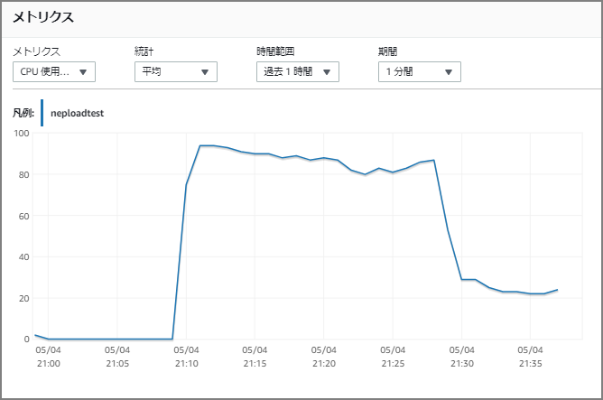

### 目的

gzip形式の圧縮ファイルをサポートしているとあったので、単純な興味からS3からのNeptuneへのバルクロードの時間比較をしてみた。

> ロードデータ形式 - Amazon Neptune https://docs.aws.amazon.com/ja_jp/neptune/latest/userguide/bulk-load-tutorial-format.html
>
> Neptune は、gzip 形式の単一ファイルの圧縮をサポートしています。ファイル名には .gz 拡張子を付ける必要があり、UTF-8 形式でエンコードされた単一のテキストファイルを含む必要があります。複数のファイルをロードできますが、それぞれは個別の .gz ファイル (非圧縮のテキストファイル) に含まれている必要があります。アーカイブファイル (例: .tar、.tar.gz、および .tgz) はサポートされていません。

ちなみに、Redshiftへのロード時の圧縮ファイルと非圧縮ファイルの差異はこんな感じらしい。（この記事を見てNeptuneではどうなのか？が気になった。）

> 【新機能】Redshift COPY/UNLOADのBZIP2ファイル対応を試してみました | Developers.IO https://dev.classmethod.jp/articles/amazon-redshift-bzip2-support/#toc-4

### 前提

`db.r5.4xlarge`で実行。`parallelism` ではHIGHを指定。特に指定しなくてもデフォルトはHIGHで動作する。HIGHの場合のCPU使用率は80％～100％で推移をしていた。

> https://docs.aws.amazon.com/ja_jp/neptune/latest/userguide/load-api-reference-load.html
>
> \> Neptune ローダーのリクエストパラメータ
>
> LOW – 使用されるスレッドの数は、コア数を 8 で割った値です。
>
> MEDIUM – 使用されるスレッドの数は、コア数を 2 で割った値です。
>
> HIGH – 使用されるスレッドの数は、コア数と同じです。
>
> OVERSUBSCRIBE – 使用されるスレッドの数は、コア数に 2 を乗算した値です。この値を使用する場合、バルクローダーは利用可能なすべてのリソースを消費します。

### 結果

トリプル数が1000万件だと有意な差異が無かった。一方1億トリプルの場合はデータロード時間に150秒の差異が出た。

|                | パラレリズム | 圧縮   | データロード | データ削除(drop all) |
| -------------- | ------------ | ------ | ------------ | -------------------- |
| 1000万トリプル | HIGH         | 非圧縮 | 139秒        | 420秒                |
| 1000万トリプル | HIGH         | 圧縮   | 140秒        | 417秒                |
| 1億トリプル    | HIGH         | 非圧縮 | 1169秒       | 4866秒               |
| 1億トリプル    | HIGH         | 圧縮   | 1303秒       | 4844秒               |

CPU使用率は`parallelism` をHIGHで実行していることもあって、ロード実行時はは80％～100％の間で推移していた。データ削除は`drop all`で実行したが、こちらの場合はシングルスレッドでdropしているためか約20％で推移をしていた。



なお、ロード時間を短くするためには下記のベストプラクティスのページにもある通り、一時的にスケールアップした上でロードするのが良い。その分パラレル化されてロード時間が短くなる。

> Amazon Neptune の基本的な運用についてのガイドライン - Amazon Neptune https://docs.aws.amazon.com/ja_jp/neptune/latest/userguide/best-practices-general-basic.html#best-practices-loader-tempinstance
>
> 一時的に大きなインスタンスを使用してロード時間を短縮

### 実行時のコマンドと結果

以下は実行した際のコマンドと実行結果を参考までに。

#### 1000万件のトリプル（非圧縮）

##### S3からのバルクロード

```
curl -X POST \
    -H 'Content-Type: application/json' \
    https://xxxxxxxxx.xxxxxxxxx.ap-northeast-1.neptune.amazonaws.com:8182/loader -d '
    {
      "source" : "s3://xxxxxxxxxx/non-compression/rdf-test.nq", 
      "format" : "nquads",
      "iamRoleArn" : "arn:aws:iam::xxxxxxxxxx:role/NeptuneLoadFromS3",
      "region" : "ap-northeast-1",
      "failOnError" : "FALSE",
      "parallelism" : "HIGH"
    }'
```

##### S3からのバルクロードのステータス確認

```
curl -G 'https://xxxxxxxxx.xxxxxxxxx.ap-northeast-1.neptune.amazonaws.com:8182/loader/4b197f60-9239-4ab3-8b21-6a320930df51'
{
    "status" : "200 OK",
    "payload" : {
        "feedCount" : [
            {
                "LOAD_COMPLETED" : 1
            }
        ],
        "overallStatus" : {
            "fullUri" : "s3://xxxxxxxxxx/non-compression/rdf-test.nq",
            "runNumber" : 1,
            "retryNumber" : 0,
            "status" : "LOAD_COMPLETED",
            "totalTimeSpent" : 139,
            "startTime" : 1588592100,
            "totalRecords" : 10000000,
            "totalDuplicates" : 0,
            "parsingErrors" : 0,
            "datatypeMismatchErrors" : 0,
            "insertErrors" : 0
        }
    }
}
```

##### データ削除

```
curl -X POST --data-binary 'update=drop all' https://xxxxxxxxx.xxxxxxxxx.ap-northeast-1.neptune.amazonaws.com:8182/sparql
[
{
    "type" : "UpdateEvent",
    "totalElapsedMillis" : 420916,
    "elapsedMillis" : 420915,
    "connFlush" : 0,
    "batchResolve" : 0,
    "whereClause" : 0,
    "deleteClause" : 0,
    "insertClause" : 0
},
{
    "type" : "Commit",
    "totalElapsedMillis" : 421169
}
]
```

#### 1000万件のトリプル（圧縮）

##### S3からのバルクロード

```
curl -X POST \
    -H 'Content-Type: application/json' \
    https://xxxxxxxxx.xxxxxxxxx.ap-northeast-1.neptune.amazonaws.com:8182/loader -d '
    {
      "source" : "s3://xxxxxxxxxx/compression/rdf-test.nq.gz", 
      "format" : "nquads",
      "iamRoleArn" : "arn:aws:iam::xxxxxxxxxx:role/NeptuneLoadFromS3",
      "region" : "ap-northeast-1",
      "failOnError" : "FALSE",
      "parallelism" : "HIGH"
    }'
```

##### S3からのバルクロードのステータス確認

```
curl -G 'https://xxxxxxxxx.xxxxxxxxx.ap-northeast-1.neptune.amazonaws.com:8182/loader/f1e8303c-077b-44f8-a6f2-c1b65a6f61e6'
{
    "status" : "200 OK",
    "payload" : {
        "feedCount" : [
            {
                "LOAD_COMPLETED" : 1
            }
        ],
        "overallStatus" : {
            "fullUri" : "s3://xxxxxxxxxx/compression/rdf-test.nq.gz",
            "runNumber" : 1,
            "retryNumber" : 0,
            "status" : "LOAD_COMPLETED",
            "totalTimeSpent" : 140,
            "startTime" : 1588592750,
            "totalRecords" : 10000000,
            "totalDuplicates" : 0,
            "parsingErrors" : 0,
            "datatypeMismatchErrors" : 0,
            "insertErrors" : 0
        }
    }
}
```

##### データ削除

```
curl -X POST --data-binary 'update=drop all' https://xxxxxxxxx.xxxxxxxxx.ap-northeast-1.neptune.amazonaws.com:8182/sparql
[
{
    "type" : "UpdateEvent",
    "totalElapsedMillis" : 417666,
    "elapsedMillis" : 417665,
    "connFlush" : 0,
    "batchResolve" : 0,
    "whereClause" : 0,
    "deleteClause" : 0,
    "insertClause" : 0
},
{
    "type" : "Commit",
    "totalElapsedMillis" : 417913
}
]
```

#### 1億件のトリプル（非圧縮）

##### S3からのバルクロード

```
curl -X POST \
    -H 'Content-Type: application/json' \
    https://xxxxxxxxx.xxxxxxxxx.ap-northeast-1.neptune.amazonaws.com:8182/loader -d '
    {
      "source" : "s3://xxxxxxxxxx/non-compression/neptune-load.nq", 
      "format" : "nquads",
      "iamRoleArn" : "arn:aws:iam::xxxxxxxxxx:role/NeptuneLoadFromS3",
      "region" : "ap-northeast-1",
      "failOnError" : "FALSE",
      "parallelism" : "HIGH"
    }'
```

##### S3からのバルクロードのステータス確認

```
curl -G 'https://xxxxxxxxx.xxxxxxxxx.ap-northeast-1.neptune.amazonaws.com:8182/loader/56d84748-5b1c-4ff6-945c-15899da10c62'
{
    "status" : "200 OK",
    "payload" : {
        "feedCount" : [
            {
                "LOAD_COMPLETED" : 1
            }
        ],
        "overallStatus" : {
            "fullUri" : "s3://xxxxxxxxxx/non-compression/neptune-load.nq",
            "runNumber" : 1,
            "retryNumber" : 0,
            "status" : "LOAD_COMPLETED",
            "totalTimeSpent" : 1169,
            "startTime" : 1588594197,
            "totalRecords" : 100000000,
            "totalDuplicates" : 0,
            "parsingErrors" : 0,
            "datatypeMismatchErrors" : 0,
            "insertErrors" : 0
        }
    }
}
```

##### データ削除

```
curl -X POST --data-binary 'update=drop all' https://xxxxxxxxx.xxxxxxxxx.ap-northeast-1.neptune.amazonaws.com:8182/sparql
[
{
    "type" : "UpdateEvent",
    "totalElapsedMillis" : 4866624,
    "elapsedMillis" : 4866623,
    "connFlush" : 0,
    "batchResolve" : 0,
    "whereClause" : 0,
    "deleteClause" : 0,
    "insertClause" : 0
},
{
    "type" : "Commit",
    "totalElapsedMillis" : 4871394
}
]
```

#### 1億件のトリプル（圧縮）

##### S3からのバルクロード

```
curl -X POST \
    -H 'Content-Type: application/json' \
    https://xxxxxxxxx.xxxxxxxxx.ap-northeast-1.neptune.amazonaws.com:8182/loader -d '
    {
      "source" : "s3://xxxxxxxxxx/compression/neptune-load.nq.gz", 
      "format" : "nquads",
      "iamRoleArn" : "arn:aws:iam::xxxxxxxxxx:role/NeptuneLoadFromS3",
      "region" : "ap-northeast-1",
      "failOnError" : "FALSE",
      "parallelism" : "HIGH"
    }'
```

##### S3からのバルクロードのステータス確認

```
curl -G 'https://xxxxxxxxx.xxxxxxxxx.ap-northeast-1.neptune.amazonaws.com:8182/loader/b7e34c0c-bf49-42d6-885b-34e58fed19c0'
{
    "status" : "200 OK",
    "payload" : {
        "feedCount" : [
            {
                "LOAD_COMPLETED" : 1
            }
        ],
        "overallStatus" : {
            "fullUri" : "s3://xxxxxxxxxx/compression/neptune-load.nq.gz",
            "runNumber" : 1,
            "retryNumber" : 0,
            "status" : "LOAD_COMPLETED",
            "totalTimeSpent" : 1303,
            "startTime" : 1588600418,
            "totalRecords" : 100000000,
            "totalDuplicates" : 0,
            "parsingErrors" : 0,
            "datatypeMismatchErrors" : 0,
            "insertErrors" : 0
        }
    }
}
```

##### データ削除

```
curl -X POST --data-binary 'update=drop all' https://xxxxxxxxx.xxxxxxxxx.ap-northeast-1.neptune.amazonaws.com:8182/sparql
[
{
    "type" : "UpdateEvent",
    "totalElapsedMillis" : 4844456,
    "elapsedMillis" : 4844455,
    "connFlush" : 0,
    "batchResolve" : 0,
    "whereClause" : 0,
    "deleteClause" : 0,
    "insertClause" : 0
},
{
    "type" : "Commit",
    "totalElapsedMillis" : 4848418
}
]
```


