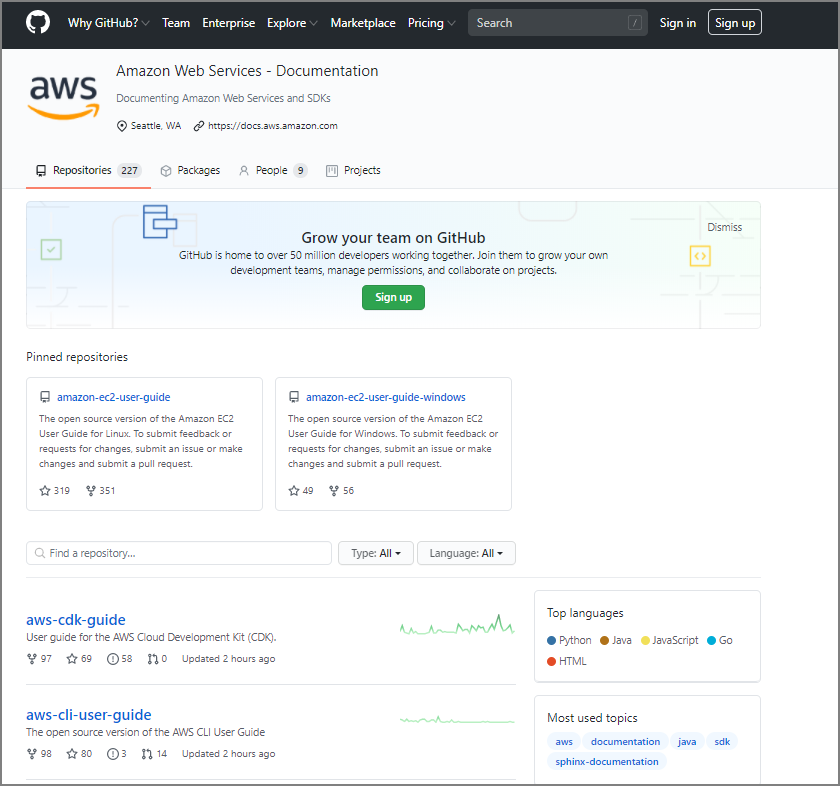

Pythonスクリプト実行時に、対象ディレクトリを入力して、その配下のディレクトリに配置されている画像ファイル一式(png、jpeg)の外枠をグレーの枠を付けるスクリプト。既存のファイル名で再保存するので元の画像ファイルが消えてしまうことに注意。

このブログは背景が白なので、画像が白ベースの場合、どこが境界線か分かりづらく画像が見にくかったので、フレームを付けることにしました。Windows上で実行することを想定。

### Pythonスクリプト

```python
import os
from pathlib import Path
from PIL import Image, ImageDraw

def main():
    pic_flame()

def pic_flame():

    print('画像を変更したい対象ディレクトリを入力してください')
    dir_path = input('>> ')
    
    #末尾のスラッシュ有無を確認し、スラッシュを付与
    if(dir_path[-1:]!="\\"):
        dir_path=dir_path + '\\'
        print(dir_path)

    outline_color = (128, 128, 128)   # 枠線の色(R,G,B)で指定
    outline_width = 2 #枠線の太さを指定

    for f in Path(dir_path).rglob('*'):
        if Path.is_file(f):
            try:
                im = Image.open(f)
                w, h = im.size
                draw = ImageDraw.Draw(im)
                draw.rectangle((0, 0, w-1, h-1), outline = outline_color, width=outline_width)
                im.save(f)
                print(f)
            except:
                continue
        
if __name__ == '__main__':
    main()

```

### 実行結果

```
C:\Users\imazaj>python C:\py\pic_flame_v2.py
画像を変更したい対象ディレクトリを入力してください
>> C:\hugo\zatoima.github.io\content\post
C:\hugo\zatoima.github.io\content\post\
C:\hugo\zatoima.github.io\content\post\2019-06-22-Oracle Database 19cインストール\image-20191121171602652.png
C:\hugo\zatoima.github.io\content\post\2019-06-22-Oracle Database 19cインストール\image-20191121171608425.png
～中略～
C:\hugo\zatoima.github.io\content\post\2020-09-04-AWSのドキュメントの更新履歴をgithubで確認する\image-20200903144448386.png
C:\hugo\zatoima.github.io\content\post\2020-09-04-AWSのドキュメントの更新履歴をgithubで確認する\image-20200903144451541.png
C:\hugo\zatoima.github.io\content\post\2020-09-04-AWSのドキュメントの更新履歴をgithubで確認する\image-20200903144632795.png
C:\hugo\zatoima.github.io\content\post\2020-09-04-AWSのドキュメントの更新履歴をgithubで確認する\image-20200903145022613.png
C:\hugo\zatoima.github.io\content\post\2020-09-30-EC2のハイパースレッディングを無効化する方法\image-20200919224823587.png

```

### 画像の編集結果

