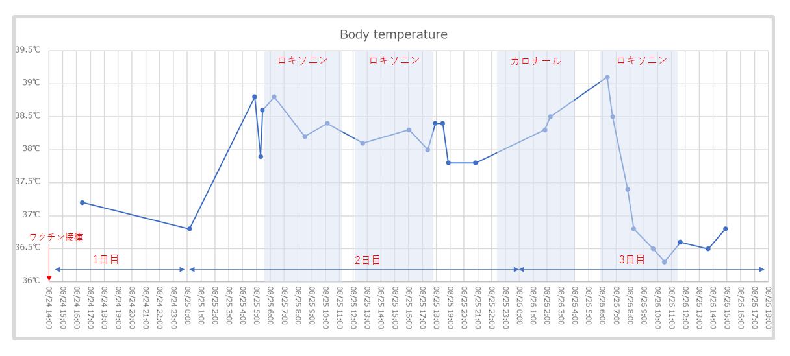
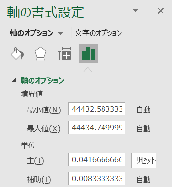

意外とパッとわからなかったのでメモ。

↓のようにx軸（横軸）を1時間ごとのグラフを作りたい。対象のデータ自体は全て揃っておらず、任意のタイミングでのみ取得している前提。

グラフ自体は折れ線グラフではなく散布図として、軸の書式設定の単位で1時間ごとのシリアル値を示す「0.041666666666」とする。ここのシリアル値を変更することでX軸の単位を変更することが出来る。

参考

> エクセル グラフ 時間: エクセルの基本操作と小技 http://excelwaza.seesaa.net/article/371155163.html
