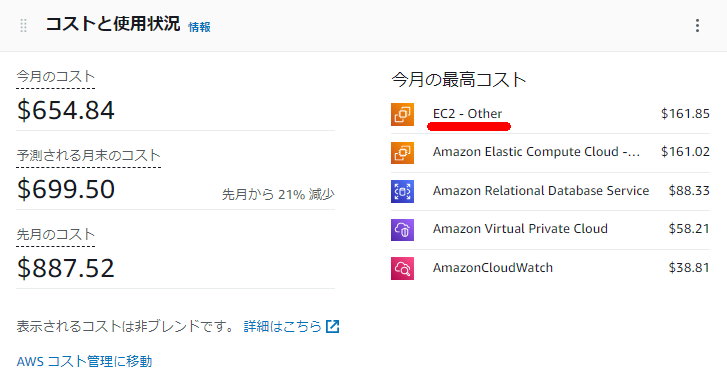

### やりたいこと

AWSのコストで「EC2-Other」が高い場合があり、この内訳をAWS CLIベースでサクッと確認したい。



### GUIベースでは？

「EC2-Other」の中で具体的に何に費用が掛かっているかについてはCost Explolerのフィルターで`サービス`とグループ化の条件で`使用タイプ`を選択することで内訳を確認が出来る


### AWS CLIで実現する

これをCLIで実現する際には下記のコマンドを実行する。各オプションの詳細はリファレンスを要確認。

> [get\-cost\-and\-usage — AWS CLI 1\.22\.46 Command Reference](https://docs.aws.amazon.com/cli/latest/reference/ce/get-cost-and-usage.html)

フィルター用のファイルを作成する。今回はKeyとValuesにそれぞれ下記を設定

```sh

cat << EOF > ce_filter.json
{
  "Dimensions": {
    "Key": "SERVICE",
    "Values": ["EC2 - Other"]
  }
}
EOF
```

`--filter`に上記で作成したファイルを指定しつつ、`  --group-by`で使用タイプを設定する。後は高コストな使用タイプ順に出力する。ダブルクォーテーションで囲まれててうまくソート出来ていなかったので、awkでごにょごにょしている。

```sh
aws ce get-cost-and-usage \
    --time-period Start=2022-01-01,End=2022-01-30 \
    --granularity MONTHLY  \
    --metrics UnblendedCost \
    --group-by Type=DIMENSION,Key=USAGE_TYPE \
    --filter file://ce_filter.json | jq -r '.ResultsByTime[].Groups[] | [(.Keys[]), .Metrics.UnblendedCost.Amount] | @csv' | awk -F\" '{print $2,$3,$4}'  | sort -r -k 2 | head -n 10
```

##### 実行結果

```sh
[ec2-user@bastin ~]$ aws ce get-cost-and-usage \
>     --time-period Start=2022-01-01,End=2022-01-30 \
>     --granularity MONTHLY  \
>     --metrics UnblendedCost \
>     --group-by Type=DIMENSION,Key=USAGE_TYPE \
>     --filter file://ce_filter.json | jq -r '.ResultsByTime[].Groups[] | [(.Keys[]), .Metrics.UnblendedCost.Amount] | @csv' | awk -F\" '{print $2,$3,$4}'  | sort -r -k 2 | head -n 10
APN1-NatGateway-Hours , 85.932
APN1-EBS:VolumeUsage.gp3 , 61.2496773819
APN1-EBS:VolumeUsage.gp2 , 14.5525795272
APN1-NatGateway-Bytes , 0.1139805019
APN1-USE1-AWS-Out-Bytes , 0.000031066
APN1-USW2-AWS-Out-Bytes , 0.0000110895
APN1-APS1-AWS-Out-Bytes , 0.0000010102
APN1-USW1-AWS-Out-Bytes , 0.0000002506
APN1-APS3-AWS-Out-Bytes , 0.0000001677
APN1-APN2-AWS-Out-Bytes , 0.0000001634
[ec2-user@bastin ~]$ 
```

