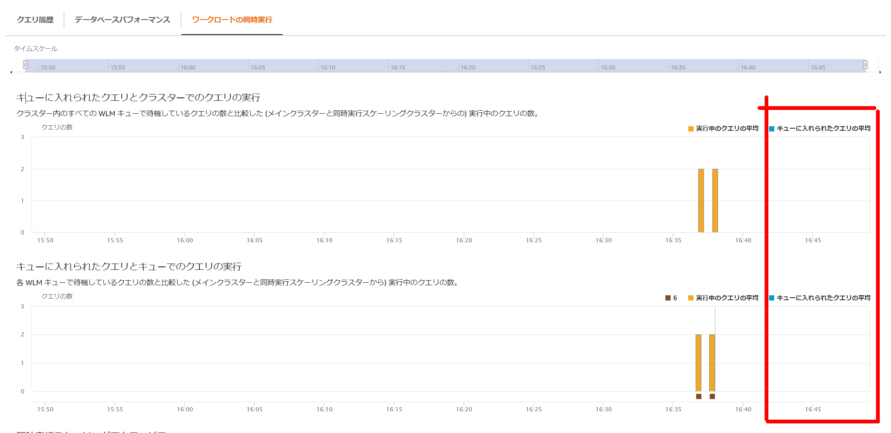

### Python UDFとは

- [スカラー Python UDF の作成 \- Amazon Redshift](https://docs.aws.amazon.com/ja_jp/redshift/latest/dg/udf-creating-a-scalar-udf.html)

Redshiftには、関数が呼び出されると実行され、単一値を返す Python プログラムを実行出来る。

Python UDFの作成自体は`create funtion`を使用する

```sql
create OR REPLACE function testudfpython (a float, b float)
  returns float
stable
as $$  
  import time
  if a > b:
    c = a + b
  elif a < b:
    c = a * b
  else:
    return 0
  return c
$$ language plpythonu;
```

テスト用テーブルの作成

```sql
drop table testtable;
create table testtable(a numeric,b numeric,c numeric);
insert into testtable values(1,1,1);
insert into testtable values(2,4,6);
insert into testtable values(4,8,12);
```

```sql
mydb=# select * from testtable;
 a | b | c  
---+---+----
 1 | 1 |  1
 2 | 4 |  6
 4 | 8 | 12
(3 rows)
```

Python UDFの実行

```sql
select testudfpython(b,c) from testtable where a=4;
select testudfpython(b,c) from testtable where a=2;
```

実行結果

```sql
mydb=# select testudfpython(b,c) from testtable where a=4;
 testudfpython 
---------------
            96
(1 row)

mydb=# select testudfpython(b,c) from testtable where a=2;
 testudfpython 
---------------
            24
(1 row)
```

### Python UDFの制約

Amazon Redshift Python UDF には以下の制約がある。

> - Python UDF は、ネットワークにアクセスすることもファイルシステムに読み書きすることもできません。
> - ユーザーがインストールする Python ライブラリの合計サイズは 100 MB を超えられません。
> - 1 つのクラスターで同時に実行できる Python UDF の数は、そのクラスターの合計同時実行レベルの 4 分の 1 に制限されています。たとえば、クラスターの同時実行レベルが 15 に設定されている場合は、最大で 3 つの UDF を同時に実行できます。この制限に達すると、UDF はワークロード管理キュー内で実行されるのを待ちます。SQL UDF に同時実行の制限はありません。詳細については、「[ワークロード管理の実装](https://docs.aws.amazon.com/ja_jp/redshift/latest/dg/cm-c-implementing-workload-management.html)」を参照してください。
> - Amazon Redshift で Python UDF を使用する場合、SUPER および HLLSKETCH データタイプはサポートされせん。

特に同時実行数に関してだが、マニュアルの記載を見ると同時実行数を設定した1/4まで実行出来るように見受けられるが、同時実行数を設定するのはManual WLMであり、デフォルトのWLMの場合がどうなのかは記載がない。

強制的にSleepするPython UDFを作成して複数クライアントから実行してみる。この状態のキューの状態も合わせて確認する。

```sql
create OR REPLACE function testudfpython (a float, b float)
  returns float
stable
as $$  
  import time
  time.sleep(90)
  if a > b:
    c = a + b
  elif a < b:
    c = a * b
  else:
    return 0
  return c
$$ language plpythonu;
```

#### 確認結果①

Auto WLMの場合で複数セッションからPython UDFを実行した場合、同時実行数は「1」のようだ。Sleepを90秒入れているため2つめのセッションで180秒掛かっている。


#### 確認結果②：キューの状態とクエリの状態を確認

```
psql -h redshift-ra3.ciwori21oiel.ap-northeast-1.redshift.amazonaws.com -U benchuser -d mydb -p 5439 -f /home/ec2-user/amazon-redshift-utils/src/AdminScripts/queuing_queries.sql
psql -h redshift-ra3.ciwori21oiel.ap-northeast-1.redshift.amazonaws.com -U benchuser -d mydb -p 5439 -f /home/ec2-user/amazon-redshift-utils/src/AdminScripts/top_queries.sql
```

該当するクエリは無し。あくまでPython UDFであり、SQLということでもないので上がってこないらしい。

#### 確認結果③：マネージメントコンソールからのキューの状態

実行しているSQLとしては上がってくるが、キューに入るわけではないようだ。




### 結論

Auto WLMの場合、同時実行数は1となっている。複数クライアントから実行するようなPython UDFには注意が必要。（そもそも個人的にはデータベース側にロジックを持たせるのはあまり好きではない。こういうUDFやストアド等。）

