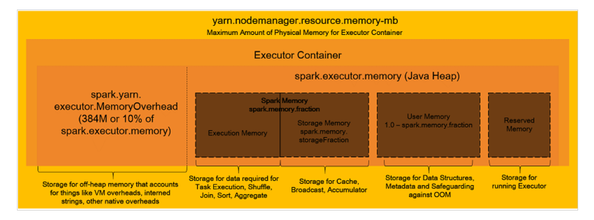

### Sparkの全体像

Executorとかパーティションの概念のような前提となるようなSparkの構成要素

- [Apache Sparkの構成要素、概要、用語について \| my opinion is my own](https://zatoima.github.io/aws-emr-spark-concept-component.html)
- [Spark on EMRの基礎をおさらいする \- Qiita](https://qiita.com/uryyyyyyy/items/34f3d228f339b32e6fb0?utm_source=pocket_mylist)

### Sparkのメモリ管理の全体像

- [Amazon EMR で Apache Spark アプリケーションのメモリをうまく管理するためのベストプラクティス \| Amazon Web Services ブログ](https://aws.amazon.com/jp/blogs/news/best-practices-for-successfully-managing-memory-for-apache-spark-applications-on-amazon-emr/)



### メモリ管理のパラメータ

上記ブログに記載がある`spark.dynamicAllocation.enabled`を`False`にした場合の各インスタンスタイプとノード数に合わせた各パラメータの計算。計算式については[このExcel](https://github.com/zatoima/zatoima.github.io/blob/master/content/post/2022-03-13-EMR%20Spark%E3%81%AE%E3%83%A1%E3%83%A2%E3%83%AA%E9%96%A2%E9%80%A3%E3%81%AE%E3%83%91%E3%83%A9%E3%83%A1%E3%83%BC%E3%82%BF%E8%A8%AD%E5%AE%9A/Spark%E3%83%A1%E3%83%A2%E3%83%AA%E8%A8%88%E7%AE%97%E3%83%A1%E3%83%A2.xlsx)に埋め込んである。黄色セル部分を各インスタンスタイプや実際の環境に合わせて変えれば自動計算してくれるはず。

あくまで初期サイジングとして実施すべきであって適宜チューニングの余地がありｍ特にパーティション数については実際に動かして決めるべき。

| インスタンスタイプ                                           | r5.12xlarge | m5.8xlarge |
| ------------------------------------------------------------ | ----------- | ---------- |
| vCPU                                                         | 48          | 32         |
| メモリ                                                       | 384         | 128        |
| ノード数                                                     | 5           | 5          |
| spark.executor.cores：エグゼキュータあたりの仮想コアの数     | 5           | 5          |
| spark.executor.memory：Executorが使用するメモリのサイズ      | 9g          | 6g         |
| spark.yarn.executor.memoryOverhead：Executorが使用するメモリ分のオーバーヘッドのサイズ | 1g          | 1g         |
| spark.driver.memory：Driverのために使用するメモリのサイズ    | 9g          | 6g         |
| spark.driver.cores：Driverのために使用する仮想コアの数       | 5           | 5          |
| spark.executor.instances ：インスタンスあたりのExecutorの数  | 44          | 29         |
| spark.default.parallelism：Partition数のデフォルト値         | 440         | 290        |

### その他のパラメータ

その他パラメータについてはブログ側に記載されているパラメータと、Spark側のマニュアルと見比べつつ、必要なものついて設定すれば良いと思う。

```json
[
  {
    "Classification": "yarn-site",
    "Properties": {
      "yarn.nodemanager.vmem-check-enabled": "false",
      "yarn.nodemanager.pmem-check-enabled": "false"
    }
  },
  {
    "Classification": "spark",
    "Properties": {
      "maximizeResourceAllocation": "false"
    }
  },
  {
    "Classification": "spark-defaults",
    "Properties": {
      "spark.driver.memory": "39G",
      "spark.driver.cores": "5",
      "spark.executor.memory": "39G",
      "spark.executor.cores": "5",
      "spark.executor.instances": "14",
      "spark.executor.memoryOverhead": "5G",
      "spark.driver.memoryOverhead": "5G",
      "spark.default.parallelism": "140",
      "spark.sql.shuffle.partitions": "140",

      "spark.network.timeout": "800s",
      "spark.executor.heartbeatInterval": "60s",
      "spark.dynamicAllocation.enabled": "false",
      "spark.memory.fraction": "0.80",
      "spark.memory.storageFraction": "0.30",
      "spark.executor.extraJavaOptions": "-XX:+UseG1GC -XX:+UnlockDiagnosticVMOptions -XX:+G1SummarizeConcMark -XX:InitiatingHeapOccupancyPercent=35 -verbose:gc -XX:+PrintGCDetails -XX:+PrintGCDateStamps -XX:OnOutOfMemoryError='kill -9 %p'",
      "spark.driver.extraJavaOptions": "-XX:+UseG1GC -XX:+UnlockDiagnosticVMOptions -XX:+G1SummarizeConcMark -XX:InitiatingHeapOccupancyPercent=35 -verbose:gc -XX:+PrintGCDetails -XX:+PrintGCDateStamps -XX:OnOutOfMemoryError='kill -9 %p'",
      "spark.yarn.scheduler.reporterThread.maxFailures": "5",
      "spark.storage.level": "MEMORY_AND_DISK_SER",
      "spark.rdd.compress": "true",
      "spark.shuffle.compress": "true",
      "spark.shuffle.spill.compress": "true",
      "spark.serializer": "org.apache.spark.serializer.KryoSerializer"
    }
  }
]
```

### 参考資料

[Apache Hadoop 3\.3\.1 – Using Memory Control in YARN](https://hadoop.apache.org/docs/current/hadoop-yarn/hadoop-yarn-site/NodeManagerCGroupsMemory.html)

[Configuration \- Spark 3\.2\.1 Documentation](https://spark.apache.org/docs/latest/configuration.html)

[アプリケーションの設定 \- Amazon EMR](https://docs.aws.amazon.com/ja_jp/emr/latest/ReleaseGuide/emr-configure-apps.html)

- [Amazon EMR で Apache Spark アプリケーションのメモリをうまく管理するためのベストプラクティス \| Amazon Web Services ブログ](https://aws.amazon.com/jp/blogs/news/best-practices-for-successfully-managing-memory-for-apache-spark-applications-on-amazon-emr/)
