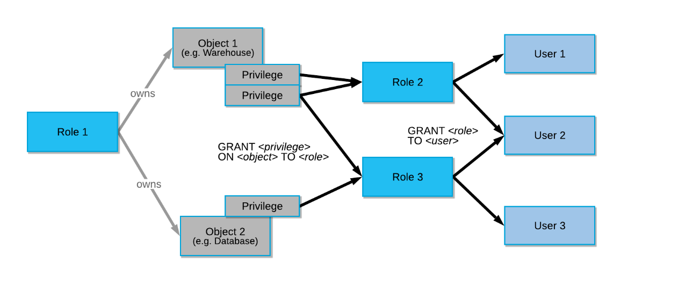

### SnowPro Core 認定試験ガイド

-----

Snowflake 認定資格 | Snowflake 【スノーフレイク】 https://www.snowflake.com/certifications/?lang=ja

### 1.0 分野：アカウントとセキュリティ

1.1 Snowflakeアカウントを管理する方法について説明する。

- アカウント使用状況
  - [アカウントの使用 — Snowflake Documentation](https://docs.snowflake.com/ja/sql-reference/account-usage.html#querying-the-account-usage-views)

- 情報スキーマ
  - INFORMATION_SCHEMA
    - アカウントで作成されたオブジェクトに関する広範なメタデータ情報を提供するシステム定義のビューとテーブル関数のセットで構成
    - [Snowflake Information Schema — Snowflake Documentation](https://docs.snowflake.com/ja/sql-reference/info-schema.html#list-of-views)


1.2 セキュリティの原則の概要を説明する。

- 多要素認証（MFA）

  - Duo MobileでMFA設定する
    - コンソール、Snowsqlなどで認証が必要となる

- データ暗号化
  - https://docs.snowflake.com/ja/user-guide/security-encryption.html
  - https://docs.snowflake.com/ja/user-guide/security-encryption-manage.html
  - https://dev.classmethod.jp/articles/snowflake-data-encryption/
    - AES256暗号化
      - エンドツーエンド暗号化（E2EE）は、データを保護する方法であり、保存データまたはSnowflakeとの間で転送中のデータを暗号化する
- ネットワークセキュリティとポリシー
  - 継続的なデータ保護
    - https://docs.snowflake.com/ja/user-guide/data-cdp.html
      - ネットワークポリシー
        - IP許可リスト
- アクセス制御
  - https://docs.snowflake.com/ja/user-guide/security-access-control.html

    - **任意アクセス制御（DAC）：** 各オブジェクトに所有者がおり、所有者はそのオブジェクトへのアクセスを許可できます。

    - **ロールベースのアクセス制御（RBAC）：** アクセス権限がロールに割り当てられ、ロールはユーザーに割り当てられます。

    - 

    - システム定義のロール

      - | ロール名      | 役割                                                         | 説明                                                         |
        | ------------- | ------------------------------------------------------------ | ------------------------------------------------------------ |
        | SYSADMIN      | アカウントでウェアハウスとデータベース（およびその他のオブジェクト）を作成する権限を持つロール |                                                              |
        | ORGADMIN      | 組織レベルで運用を管理するロール                             | ・組織内に アカウントを作成 できます。     ・組織内のすべてのアカウント（SHOW ORGANIZATION ACCOUNTS を使用）と、組織で有効になっているすべてのリージョン（SHOW  REGIONS を使用）を表示できます。     ・組織全体の 使用情報 を表示できます。 |
        | ACCOUNTADMIN  | SYSADMIN および SECURITYADMIN システム定義のロールをカプセル化するロール | システムの最上位のロールであり、アカウント内の限られた/制御された数のユーザーにのみ付与する必要がある          ・アカウントでウェアハウスとデータベース（およびその他のオブジェクト）を作成する権限を持つロール     ・オブジェクトの付与をグローバルに管理し、ユーザーとロールを作成、モニター、管理できるロール |
        | SECURITYADMIN | オブジェクトの付与をグローバルに管理し、ユーザーとロールを作成、モニター、管理できるロール | ・MANAGE GRANTS  セキュリティ権限が付与されており、付与の取り消しを含め、あらゆる付与を変更できます。     ・システムロール階層を介して USERADMIN ロールの権限を継承します（つまり、 USERADMIN ロールを SECURITYADMIN  に付与）。 |
        | USERADMIN     | ユーザーとロールの管理のみに専用のロール                     | ・CREATE USERおよびCREATE  ROLEのセキュリティ権限が付与されています。     ・アカウントにユーザーとロールを作成できます。 |
        | PUBLIC        | アカウント内のすべてのユーザーおよびすべてのロールに自動的に付与される疑似ロール | 通常、このロールは、明示的なアクセス制御が不要で、すべてのユーザーがアクセスに関して平等であると見なされる場合に使用されます。 |
- フェデレーション認証

  - https://docs.snowflake.com/ja/user-guide/admin-security-fed-auth-overview.html
  - https://dev.classmethod.jp/articles/snowflake-configuring-auth0-as-an-identity-provider/

- シングルサインオン（SSO）

  - AzureADやOkta等を使ってSSOを設定できる
    - https://docs.snowflake.com/ja/user-guide/oauth-azure.html
    - https://docs.snowflake.com/ja/user-guide/oauth-okta.html
    - https://qiita.com/manabian/items/1384c43a9398bf325f1d


1.3 Snowflakeで使用されるエンティティとロールを定義する。

- 権限を付与および取り消す方法の概要を説明する

  ```
  CREATE ROLE test_role;
  GRANT USAGE ON DATABASE citibike TO ROLE test_role;
  GRANT USAGE ON DATABASE weather TO ROLE test_role;
  
  revoke role aaaa from role vvvv;
  ```

  ロールの階層と権限の継承について説明する

  - ロール
    - https://docs.snowflake.com/ja/user-guide/security-access-control-overview.html#system-defined-roles
    - 上のアクセス制御と同じなはず

1.4 Snowflakeの各エディションに関連するセキュリティ機能について説明する。

- データマスキング
  - ダイナミックデータマスキング
    - https://knowledge.insight-lab.co.jp/snowflake/dynamic-data-masking
    - https://dev.classmethod.jp/articles/20211117-snowflake-governance-functions/
    - https://docs.snowflake.com/ja/user-guide/security-column-intro.html


1.5 Snowflakeのデータガバナンス機能の概要を説明する

- データマスキング
  - 上記と同様

- アカウント使用状況ビュー
  - アカウントの使用 — Snowflake Documentation

- 外部トークン化
  - カラム（列）ベースのセキュリティ機能で、対象カラムの値をtokenizationする
    - Third-party製品の関数が必要
    - https://docs.snowflake.com/ja/user-guide/security-column-ext-token.html


### 2.0 分野：仮想ウェアハウス

2.1 コンピューティングの原則の概要を説明する。

- クレジット使用状況と請求
  - https://docs.snowflake.com/ja/user-guide/admin-usage-billing.html
  - https://dev.classmethod.jp/articles/snowflake-credits-used-webui/
  - https://dev.classmethod.jp/articles/create-a-user-only-check-billing/

- 同時実行
  - 各クエリのサイズと複雑さによって決定する
    - クエリを処理するのに十分なリソースがウェアハウスにない場合、クエリはキューに入れられ、保留中のリソースは実行中の他のクエリが完了すると利用可能になる
      - 同時実行を上げるためにはマルチクラスタ化する（Enterprise Edition以上が必要）
  - https://docs.snowflake.com/ja/user-guide/warehouses-overview.html#query-processing-and-concurrency
  
- キャッシング
  
  - | #    | キャッシュ名         | キャッシュ対象                           | 使用可能なユーザー                             | 保存レイヤー        | 有効期間             |
    | ---- | -------------------- | ---------------------------------------- | ---------------------------------------------- | ------------------- | -------------------- |
    | 1    | 結果キャッシュ       | クエリの結果                             | クエリが実行された同じロールのすべてのユーザー | Snowflake           | 24時間               |
    | 2    | メタデータキャッシュ | テーブルに関する情報                     | すべてのユーザー                               | Snowflake           | 常に                 |
    | 3    | データキャッシュ     | クエリ結果のファイルヘッダとカラムデータ | 同じ仮想ウェアハウスを実行したユーザー         | ウェアハウス（SSD） | ウェアハウスの稼働中 |
  
    ### 注意事項
  
    #### 結果キャッシュ
  
    > https://docs.snowflake.com/ja/user-guide/querying-persisted-results.html#retrieval-optimization
    >
    > 通常、次の条件の **すべて** が満たされる場合、クエリ結果が再利用されます。
    >
    > - 新しいクエリは、以前に実行したクエリと構文的に一致する。
    > - クエリには、実行時に評価する必要のある関数が含まれていない（例: [CURRENT_TIMESTAMP()](https://docs.snowflake.com/ja/sql-reference/functions/current_timestamp.html) および [UUID_STRING()](https://docs.snowflake.com/ja/sql-reference/functions/uuid_string.html)）。 [CURRENT_DATE()](https://docs.snowflake.com/ja/sql-reference/functions/current_date.html) 関数はこのルールの例外です。CURRENT_DATE() は実行時に評価されますが、 CURRENT_DATE() を使用するクエリは、クエリ再利用機能を引き続き使用できます。
    > - クエリには、 [ユーザー定義関数（UDFs）](https://docs.snowflake.com/ja/sql-reference/udf-overview.html) または [外部関数](https://docs.snowflake.com/ja/sql-reference/external-functions.html) が含まれていない。
    > - クエリ結果に寄与するテーブルデータが変更されていない。
    > - 以前のクエリの永続化された結果が引き続き利用可能である。
    > - キャッシュされた結果にアクセスするロールには、必要な権限がある。
    >   - クエリが SELECT クエリの場合、クエリを実行するロールには、キャッシュされたクエリで使用されるすべてのテーブルに必要なアクセス権限が必要です。
    >   - クエリが SHOW クエリの場合、クエリを実行するロールは、キャッシュされた結果を生成したロールと一致する必要があります。
    > - 結果の生成方法に影響する構成オプションが変更されていない。
    > - テーブル内にある他のデータ変更によって、テーブルのマイクロパーティションが変更されていない（例: 再クラスタ化または統合化）。
  
    > これらの条件をすべて満たしても、Snowflakeがクエリ結果を再利用することは **保証されません**。
  
  - https://dev.classmethod.jp/articles/snowflake-cache-three/
  - https://docs.snowflake.com/ja/user-guide/querying-persisted-results.html
  - https://qiita.com/manabian/items/dffa2123a40191d8e440
  - https://zenn.dev/aaizawa/articles/2b06dd50d56438
  


2.2 仮想ウェアハウスのベストプラクティスを説明する。

- スケールアップとスケールアウト
  - タイプの変更とマルチクラスタ

- 仮想ウェアハウスのタイプ
- 管理/監視
  - https://docs.snowflake.com/ja/user-guide/warehouses-load-monitoring.html
  - https://dev.classmethod.jp/articles/snowflake-warehouses-load-monitoring/
  - https://datumstudio.jp/blog/0406_snowalert_snowflake_19/


### 3.0 分野：データ移動

3.1 データのロードに使用されるさまざまなコマンドと、それらをいつ使用する必要があるかについての概要を説明する。

- COPY
- INSERT
- PUT
- GET
- VALIDATE


3.2 連続データロード方法と比較してバルクを定義する。

- COPY
- Snowpipe


3.3 データをロードするときに考慮すべきベストプラクティスを定義する。

- ファイルサイズ
- フォルダー
  - [データのロードの概要](https://docs.snowflake.com/ja/user-guide/data-load-overview.html)
  - [データロード機能の概要](https://docs.snowflake.com/ja/user-guide/intro-summary-loading.html)
  - [データロードに関する考慮事項](https://docs.snowflake.com/ja/user-guide/data-load-considerations.html)


3.4 Snowflakeからローカルストレージまたはクラウドストレージの場所にデータをアンロードする方法の概要を説明する。

- Snowflakeからデータをアンロードする際にサポートされているファイル形式を定義する
  - https://docs.snowflake.com/ja/user-guide/data-unload-prepare.html
    - JSON、Parquet
    - 区切り（CSV、TSV など）
    - 常に UTF-8を使用してエンコード

  - データをアンロードするときに考慮すべきベストプラクティスを定義する
    - [データのアンロードの概要](https://docs.snowflake.com/ja/user-guide/data-unload-overview.html)
    - [データのアンロード機能の概要](https://docs.snowflake.com/ja/user-guide/intro-summary-unloading.html)
    - [データのアンロードに関する考慮事項](https://docs.snowflake.com/ja/user-guide/data-unload-considerations.html)

3.5 半構造化データの操作方法とロード方法を説明する。

- サポートされているファイル形式
  - JSON、Avro、 ORC、Parquet、XML 
  - [半構造化データの概要 — Snowflake Documentation](https://docs.snowflake.com/ja/user-guide/semistructured-intro.html#loading-semi-structured-data)

- VARIANT列
  - https://docs.snowflake.com/ja/user-guide/querying-semistructured.html

- ネストされた構造のフラット化

### 4.0 分野：パフォーマンス管理

4.1 ストレージでのSnowflakeパフォーマンス管理のベストプラクティスの概要を説明する。

- クラスタリング
- マテリアライズドビュー
- 検索最適化

4.2 仮想ウェアハウスでのSnowflakeパフォーマンス管理のベストプラクティスの概要を説明する。

- クエリのパフォーマンスと分析
- クエリプロファイル
- クエリ履歴
- SQLの最適化
- キャッシング

  - メタデータキャッシュ

  - クエリ結果キャッシュ

    - 24時間保存。データが変更されていない限り有効

    - クエリ結果キャッシュの無効化

      - ```
        ALTER SESSION SET USE_CACHED_RESULT = FALSE;
        ```

        

  - 


### 5.0 分野：Snowflakeの概要とアーキテクチャ

5.1 Snowflakeのクラウドデータプラットフォームの主要コンポーネントの概要を説明する。

- データ型
- オプティマイザー
- 継続的なデータ保護
- クローニング
- キャッシングのタイプ
- ウェブインターフェイス（UI）
- データクラウド/データ共有/ Data Marketplace/Data Exchange

5.2 Snowflakeデータ共有機能の概要を説明する。

- アカウントタイプ
- Data MarketplaceとData Exchange
- アクセス制御オプション
- 共有

5.3 Snowflakeが従来のウェアハウスソリューションとどのように異なるかを説明する。

- エラスティックストレージ
- エラスティックコンピューティング
- アカウント管理

5.4 利用可能なさまざまなエディションと、各エディションに関連する機能の概要を説明する。

- 料金
- 機能

5.5 Snowflakeのパートナーエコシステムを特定する

- クラウドパートナー
- コネクタ

5.6 Snowflakeの3つの異なるレイヤーの目的の概要を説明し、定義する。

- ストレージレイヤー
- コンピューティングレイヤー
- クラウドサービスレイヤー

5.7 Snowflakeのカタログとオブジェクトの概要を説明する。

- データベース
- スキーマ
- テーブルタイプ
- ビュータイプ
- データ型
- 外部関数

### 6.0 分野：ストレージと保護

6.1 Snowflakeストレージの概念の概要を説明する。

- マイクロパーティション
- メタデータ型
- クラスタリング
- データストレージ
- ステージタイプ
- ファイル形式
- ストレージモニタリング

6.2 Snowflakeによる継続的なデータ保護の概要を説明する。

- Time Travel
  - [SnowflakeのTime Travel \| my opinion is my own 👋](https://zatoima.github.io/snowflake-timetravel-summary/)
  
- Fail Safe
  - [SnowflakeのFail\-safe \| my opinion is my own 👋](https://zatoima.github.io/snowflake-failsafe-summary/)
  
- データ暗号化
  - https://docs.snowflake.com/ja/user-guide/security-encryption.html
  - https://docs.snowflake.com/ja/user-guide/data-load-s3-encrypt.html
  - https://dev.classmethod.jp/articles/snowflake-data-encryption/

- クローニング
  - https://docs.snowflake.com/ja/user-guide/object-clone.html
  - https://dev.classmethod.jp/articles/snowflake-advent-calendar-2019-24/
  - https://dk521123.hatenablog.com/entry/2021/11/27/134934
  - https://note.com/datasaber/n/n2609995fa5cb
  - https://note.com/datasaber/n/ne31a7ac0f6b2


