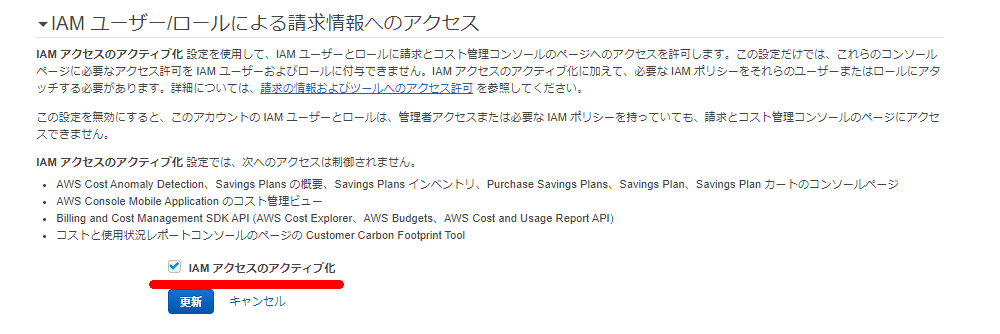

### 画面

### 該当ページ

IAMユーザにAdministratorAccess権限が付与されていてもコスト管理のページは見れない模様

> [アクセス許可の管理の概要 \- AWS 請求](https://docs.aws.amazon.com/ja_jp/awsaccountbilling/latest/aboutv2/control-access-billing.html)
>
> IAM アクセスをアクティベートするだけでは、これらの請求ンソールページに必要な許可は IAM ユーザーとロールに付与されません。IAM アクセスのアクティベートに加えて、必要な IAM ポリシーをこれらのユーザーまたはロールにアタッチする必要があります。詳細については、「[AWS Billing でアイデンティティベースのポリシー (IAM ポリシー) を使用する](https://docs.aws.amazon.com/ja_jp/awsaccountbilling/latest/aboutv2/billing-permissions-ref.html)」を参照してください。
>
> [**IAM アクセスをアクティベートする**] 設定をアクティベートするには、ルートユーザーの認証情報を使用して AWS アカウントにログインしてから、[マイアカウント](https://console.aws.amazon.com/billing/home#/account)ページで設定を選択する必要があります。請求コンソールページへの IAM ユーザーおよびロールのアクセスを許可する各アカウントで、この設定をアクティベートします。AWS Organizations を使用する場合は、コンソールページへの IAM ユーザーとロールのアクセスを許可する各管理アカウントまたはメンバーアカウントでこの設定をアクティベートします。

### 手順

> [アクセス許可の管理の概要 \- AWS 請求](https://docs.aws.amazon.com/ja_jp/awsaccountbilling/latest/aboutv2/control-access-billing.html)
>
> **請求情報とコスト管理コンソールへの IAM ユーザーおよびロールのアクセスをアクティベートするには**
>
> 1. ルートアカウント認証情報 (具体的には、AWS アカウントの作成に使用した E メールアドレスとパスワード) で AWS マネジメントコンソール にサインインします。
> 2. ナビゲーションバーでアカウント名を選択してから、[[マイアカウント](https://console.aws.amazon.com/billing/home#/account)] を選択します。
> 3. [**IAM User and Role Access to Billing Information**] の横で、[**Edit**] を選択します。
> 4. [**Activate IAM Access**] (アクセスのアクティブ化) チェックボックスをオンにして、Billing and Cost Management ページへのアクセスをアクティブ化します。
> 5. **[Update]** (更新) を選択します。

正常にルートユーザ以外でもコスト管理の画面が見れるようになった

