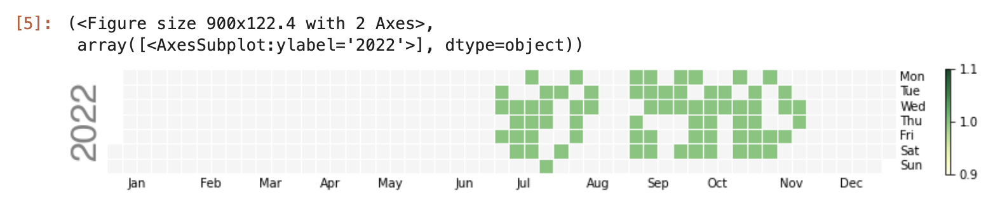

DMM英会話の受講履歴をCalendar Heatmapで可視化するやつをPythonでなんとか作った。Pythonの実務経験ゼロなのでお作法や効率などはどこかに置いています。

スクレイピング部分はこちらのコードを参考にして流用させていただきました。

- [kempei/mfstockupdater: Stock price updater for MoneyForward using Selenium](https://github.com/kempei/mfstockupdater)

スクレイピングはサイト側の規約と負荷に十分に注意しましょう。

### スクレイピング前準備

```python
from logzero import logger
import logzero

import chromedriver_binary
import selenium
from selenium import webdriver
from selenium.webdriver.support.ui import Select
from selenium.webdriver.common.keys import Keys
from selenium.webdriver.common.by import By
from selenium.webdriver.support.ui import WebDriverWait
from selenium.webdriver.support import expected_conditions as ec

import requests

import os, time, datetime
import imaplib, email, re

logger.info("selenium initializing...")
options = webdriver.ChromeOptions()
#options.add_argument("--headless")
options.add_argument("--disable-gpu")
options.add_argument("--window-size=800x900")
options.add_argument("--disable-application-cache")
options.add_argument("--disable-infobars")
options.add_argument("--no-sandbox")
options.add_argument("--hide-scrollbars")
options.add_argument("--v=99")
options.add_argument("--ignore-certificate-errors")
options.add_argument("--homedir=/tmp")
options.add_argument('--user-agent=Mozilla/5.0')
options.add_argument('--disable-dev-shm-usage')
options.add_experimental_option("prefs", {'profile.managed_default_content_settings.images':2})
driver = webdriver.Chrome(options=options)
wait = WebDriverWait(driver, 5)
driver.implicitly_wait(10)
```

#### 関数定義

```python
def send_to_element(xpath, keys):
    element = driver.find_element(by=By.XPATH, value=xpath)
    element.clear()
    logger.debug("[send_to_element] " + xpath)
    element.send_keys(keys)

def send_to_element_direct(element, keys):
    element.clear()
    logger.debug("[send_to_element] " + element.get_attribute('id'))
    element.send_keys(keys)
```

### スクレイピング

事前に環境変数を定義しておく。

> export DMM_ID=xxxxx
>
> export DMM_PASS=xxxx

```python
driver.execute_script("window.open()")
if not 'DMM_ID' in os.environ or not 'DMM_PASS' in os.environ:
    raise ValueError("env DMM_ID and/or DMM_PASS are not found.")
DMM_ID = os.environ['DMM_ID']
DMM_PASS = os.environ['DMM_PASS']

driver.get('https://accounts.dmm.com/service/login/password/')
wait.until(ec.presence_of_all_elements_located)
driver.find_element(by=By.XPATH, value='//input[@name="login_id"]').click()
wait.until(ec.presence_of_all_elements_located)

time.sleep(3)
send_to_element('//input[@type="text"]', DMM_ID)
driver.find_element(by=By.XPATH, value='//input[@type="password"]').click()
wait.until(ec.presence_of_all_elements_located)

time.sleep(3)
send_to_element('//input[@type="password"]', DMM_PASS)
driver.find_element(by=By.XPATH, value='//input[@data-e2e="login_button"]').click()
wait.until(ec.presence_of_all_elements_located)

time.sleep(3)

if driver.find_element(by=By.XPATH, value='//input[@name="searchstr"]'):
    logger.info("successfully logged in.")
```

### レッスン受講履歴の取得

start_yearとend_yearが可変部分。ページ数を取得して必要な分だけループが効率的だと思うが諦め

```python
import datetime

dt_now = datetime.datetime.now()

#必要に応じて変更する
start_year=2022
end_year=2023

target_month=[]

for y in range(start_year,end_year):
    for m in range(1,13):
        aa='{}{}'.format(y,m)
        aa=datetime.datetime.strptime(aa, '%Y%m')

        if aa > dt_now:
            break

        aa=aa.strftime('%Y%m')
        target_month.append(aa)

logger.info("target_month : "+str(target_month))
        
        
resson_date=[]

for m in target_month:
  for i in range(1,5):
    url='https://eikaiwa.dmm.com/lesson/index/{}/?hd={}/'
    url=url.format(i,m)

    driver.get(url)

    if driver.find_elements(by=By.XPATH, value='//header[@id="time"]'):
      resson_times = driver.find_elements(by=By.XPATH, value='//header[@id="time"]')
      for r in resson_times:
        r=r.text.strip('レッスンノート').strip().partition('（')[0]
        r=datetime.datetime.strptime(r, '%Y年%m月%d日')
        r=r.strftime('%Y/%m/%d')
        resson_date.append(r)
    time.sleep(1)

logger.info("resson_date : "+str(resson_date))
```

### calplotでcalendar heatmapを作成

```python
import calplot
import numpy as np; np.random.seed(sum(map(ord, 'calplot')))
import pandas as pd

df_calmap = pd.DataFrame({'Date':resson_date})
df_calmap['Count'] = 1

df_calmap=df_calmap.drop_duplicates()

all_days = pd.date_range('1/1/2022', periods=600, freq='D')
days = pd.to_datetime(df_calmap['Date']).to_list()
e=df_calmap['Count'].to_list()

#print(days)
events = pd.Series(e, index=days)

calplot.calplot(events, cmap='YlGn', colorbar=True, edgecolor=None)
```


