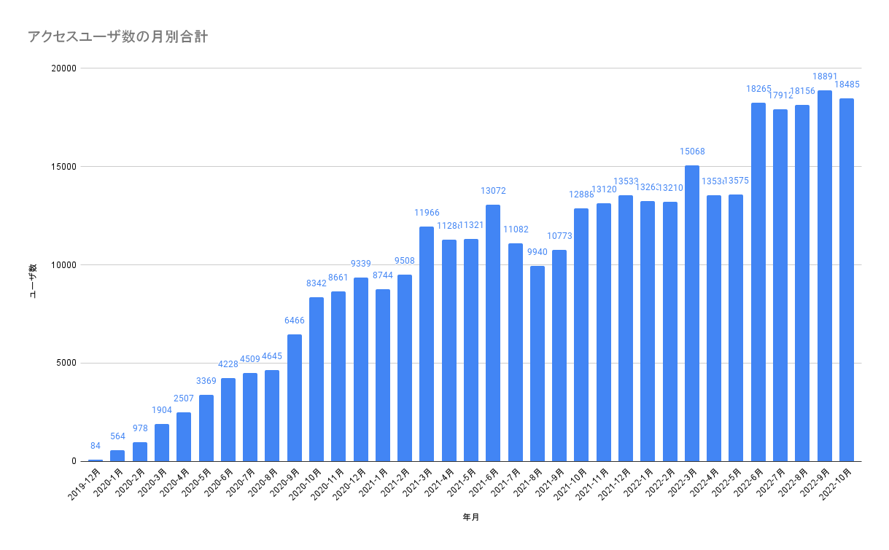

久しぶりにGoogle Analyticsを確認してみた。下記はGAをソースにしてGoogle Spreadsheet でグラフ化。2019年12月にはてなからGithub Pagesに移行した後のデータとなる。メモ代わりのGithub Pages運用がここまでアクセス数が多いとは。平日は700-800PVでセッション数だと1000を超える日もある。HugoのSEOが強いのか、更新頻度が高いからなのか、Github Pagesが強いのか。Githubドメインが強いのか…。

