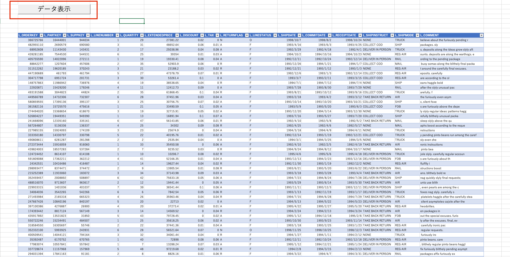

### ExcelからODBC経由でSQLを実行するマクロ
[前回の記事で実施した接続初期設定](https://zatoima.github.io/snowflake-m1-mac-excel-connect/) 自体は完了しているという前提。
約10年振りのExcelマクロ。お試し用のメモです。M1 MacからSnowflakeへExcelで接続し、SQLを実行するマクロと実行ボタンを作成する
QueryTableオブジェクトを使用するので、下記URLを参考に。

> - [QueryTable オブジェクト \(Excel\) \| Microsoft Learn](https://learn.microsoft.com/ja-jp/office/vba/api/excel.querytable)

```vba
Sub 更新()
    Dim uList As ListObject
    Dim uSQL As String
    
    Set uList = ActiveSheet.ListObjects("テーブル_ExternalData_1")

    'ランダムに100行取得するSQLサンプルクエリ
    uSQL = "select * from testdb.public.LINEITEM_SMALL ORDER BY RANDOM() limit 100;"
    
    With uList.QueryTable
        .CommandText = uSQL
        .AdjustColumnWidth = True '列幅を調整する
        .Refresh BackgroundQuery:=False$$
    End With
End Sub
```

データ表示ボタンを用意して、上記のスクリプトが実行されるように設定する。



### 実行時間の簡易計測

limitの数値を変えてから計測を実施。

#### 対象テーブル定義

```sql
CREATE OR replace TABLE LINEITEM_SMALL AS
SELECT
  *
FROM
  SNOWFLAKE_SAMPLE_DATA.TPCH_SF100.LINEITEM
LIMIT
  100000000;
```

#### 計測用のVBA

```
Sub 更新()

    Dim start_time As Double
    Dim fin_time As Double
    
    start_time = Timer

    Dim uList As ListObject
    Dim uSQL As String


'******************ここから処理を記入*******************

    Set uList = ActiveSheet.ListObjects("テーブル_ExternalData_1")
    
    uSQL = "select * from testdb.public.LINEITEM_SMALL ORDER BY RANDOM() limit 100000;"
    
    With uList.QueryTable
        .CommandText = uSQL
        .AdjustColumnWidth = False '列幅を調整する
        .Refresh BackgroundQuery:=False
    End With

'******************ここまで*******************

    fin_time = Timer
    MsgBox "経過時間：" & fin_time - start_time

End Sub
```

### 実行時間
| 取得件数       | VBA実行時間  | Query Profile |
|------------|----------|---------------|
| 100        | 2.38 秒   | 1.7 秒         |
| 1,000      | 2.57 秒   | 1.8 秒         |
| 10,000     | 3.42 秒   | 2.2 秒         |
| 100,000    | 8.39 秒   | 5.4 秒         |
| 1,000,000  | 28.72 秒  | 20 秒          |
| 10,000,000 | 130.85 秒 | 119 秒         |

※なお、Excelの最大行数が`1,048,576`のため、全行は表示出来ていない。

