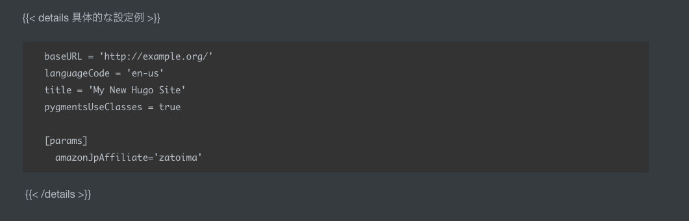

### Amazonの商品ページのshortcake

- [Hugoでわりと楽してわりとかっこよくAmazon商品紹介をする \- ゆーすけべー日記](https://yusukebe.com/posts/2020/amazon-shortcode/)

`.Site.Params.amazonJpAffiliate`となっている場合は`params`を定義した上で記載すれば良い。

```
baseURL = 'http://example.org/'
languageCode = 'en-us'
title = 'My New Hugo Site'
pygmentsUseClasses = true

[params]
  amazonJpAffiliate='zatoima'
```

↓のように使用する。


### 折りたたみ表示のshortcake

- [Hugo の shortcode で折りたたみ\(details タグ\)を使えるようにする – m1yam0t0\.com](https://m1yam0t0.com/posts/2022/09/use-details-in-hugo/)

↓のように使用する。



 

```
baseURL = 'http://example.org/'
languageCode = 'en-us'
title = 'My New Hugo Site'
pygmentsUseClasses = true

[params]
  amazonJpAffiliate='zatoima'
```

 

